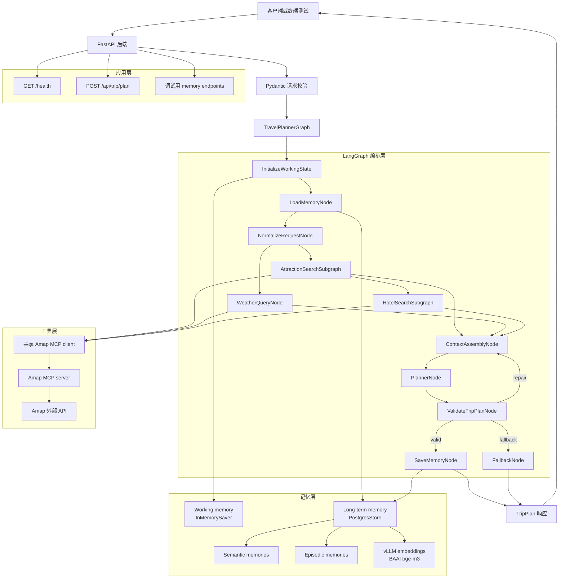

# ZoeyAgent

ZoeyAgent 是一个面向旅行规划场景的 Agent 应用后端设计。当前仓库以设计文档为主，目标是逐步实现一个自托管 Python FastAPI 服务：接收结构化旅行请求，运行 LangGraph 规划流程，调用 Amap 工具获取景点、酒店和天气信息，并返回可由前端直接渲染的 `TripPlan`。

## 设计文档

- [Backend Design](doc/backend_design.md)
- [Agents Design](doc/agents_design.md)
- [Schemas Design](doc/schemas_design.md)
- [Memory Design](doc/memory_design.md)
- [Tools Design](doc/tools_design.md)
- [Example Workflow](doc/example_workflow.md)

## 总体架构

## 实施原则

实施过程应该是递进式的：每一步都在已有结果上继续增加能力，不能为了进入下一步而推翻、重写或回退上一阶段已经跑通的行为。需要调整设计时，应通过兼容层、适配器、迁移脚本或小范围重构向前演进。

## 渐进式实施步骤

1. 建立项目骨架
   - 创建 `backend/app/` 目录、FastAPI 入口、配置模块和基础路由。
   - 先实现 `GET /health`，保证服务可以启动和被测试。
   - 保留后续目录边界：`api`、`models`、`agents`、`services`、`config.py`。
   - 验证方式：启动 FastAPI app，并用 `curl /health` 确认返回 `{"status": "ok"}`。

2. 实现 Pydantic 数据契约
   - 按 `doc/schemas_design.md` 实现 `TripPlanRequest`、`TripPlan`、`DayPlan`、`Attraction`、`Hotel`、`Meal`、`WeatherInfo` 等模型。
   - 加入日期、城市、预算、枚举索引和每日餐食数量校验。
   - 这一阶段只增加 schema 能力，不引入真实 LLM 或外部工具依赖。
   - 验证方式：为请求模型、响应模型和关键 validator 添加单元测试。

3. 打通最小 planning endpoint
   - 实现 `POST /api/trip/plan`。
   - 要求客户端必须传入 `session_id`。
   - 先返回一个固定或 mock 的合法 `TripPlan`，用于验证 API 合同和前端渲染合同。
   - 验证方式：用 `curl` 提交最小合法请求，确认返回值能通过 `TripPlan` 校验。

4. 建立 LangGraph 主流程
   - 创建 `TravelPlanState` 和最小 `TravelPlannerGraph`。
   - 先接入 `InitializeWorkingState`、`NormalizeRequestNode`、`PlannerNode`、`ValidateTripPlanNode`。
   - 工具结果继续使用 mock 数据，确保图编排和验证循环先稳定。
   - 验证方式：通过 `/api/trip/plan` 调用 mock graph，确认 endpoint 不再直接拼响应，而是从 graph 输出 `TripPlan`。

5. 封装 LLM service
   - 在 `backend/app/services/llm.py` 中封装 OpenAI-compatible chat completion。
   - 支持普通非流式调用、function calling/tool calling、stream response 三类入口。
   - 图节点只依赖项目内部 `LLMService`，不直接散落调用 OpenAI SDK。
   - 验证方式：用 mock transport 或 fake client 测试 message、tools、stream chunk 的输入输出形状。

6. 封装 Amap MCP service 和归一化层
   - 在 `backend/app/services/amap_mcp.py` 中建立 Amap MCP client 封装。
   - 实现坐标、评分、价格、天气温度等 provider response normalization。
   - 保证 raw Amap 响应不会直接进入 `PlannerNode`。
   - 验证方式：用 Amap sample response 测试 normalize 结果，不要求一开始连真实 Amap。

7. 接入天气节点
   - 实现 `WeatherQueryNode` 调用 Amap weather 工具。
   - 将结果归一化为 `list[WeatherInfo]`。
   - 天气失败时返回空列表和结构化 observation，不阻断整条规划链路。
   - 验证方式：mock Amap weather response，确认 graph state 中写入 `weather_info`。

8. 实现景点搜索子图
   - 先实现关键词搜索、POI 归一化、去重和基础排序。
   - 再逐步加入 detail search、around search、质量评估和 bounded retry。
   - 子图只输出 `AttractionSearchResult`，不直接生成最终行程。
   - 验证方式：mock POI response，确认输出包含去重后的 `AttractionSearchResult` 和质量信息。

9. 实现酒店搜索子图
   - 基于景点结果选择酒店搜索 anchor。
   - 搜索并排序候选酒店，输出 `HotelSearchResult`。
   - 明确 Amap POI 只能提供候选酒店，不能确认真实房态。
   - 验证方式：mock hotel POI response，确认候选酒店排序、selected hotel 和 ranking reasons 可用。

10. 强化 PlannerNode
    - 将景点、酒店、天气、预算、偏好和 extra requirements 汇总为 planner context。
    - 生成完整 `TripPlan`，包括每日 attractions、meals、hotel、map_points、total_price 和 route summary。
    - 不输出完整路线步骤，不要求 `image_url`。
    - 验证方式：用固定 planner 输入测试每天都有三餐、每日价格、地图点和合理的日期数量。

11. 强化 ValidateTripPlanNode
    - 校验每日三餐、每日价格、日期数量、map points、枚举值和 day-centric response contract。
    - 失败时带着 validation errors 回到 planner 修复。
    - 超过 retry 上限后进入 `FallbackNode`，返回保守可用结果或结构化错误。
    - 验证方式：构造缺餐、日期数量错误、价格为负等坏输出，确认 validator 能拒绝并触发 repair 或 fallback。

12. 接入 working memory
    - 使用 `InMemorySaver`，将 `session_id` 映射为 LangGraph `thread_id`。
    - 实现 `append_working_message` 和 `append_tool_observation` 这类状态更新 helper。
    - 保持 working memory 只服务当前进程和当前 session，不提前承诺持久化。
    - 验证方式：用相同 `session_id` 连续请求，确认进程存活期间 graph state 能被恢复。

13. 接入长期记忆
    - 配置 Postgres、pgvector、LangGraph `PostgresStore` 和本地 vLLM embedding endpoint。
    - 实现 `LoadMemoryNode` 搜索 semantic 和 episodic memories。
    - 实现 `SaveMemoryNode`，只在 `TripPlan` 验证成功后写入长期记忆。
    - 本地未配置 Postgres 时应允许关闭或 mock 长期记忆，避免开发流程被基础设施阻塞。
    - 验证方式：分别测试 memory disabled、mock store、真实 PostgresStore 三种路径。

14. 增加 memory 调试接口
    - 实现 `GET /api/memory/semantic` 和 `GET /api/memory/episodic`。
    - 用于本地开发、终端测试和记忆召回验证。
    - 生产环境上线前应加鉴权或禁用。
    - 验证方式：在 mock store 和真实 store 下分别查询 semantic/episodic memory。

15. 预留编辑和重算能力
    - 保留 `POST /api/trip/recalculate` 路由和 `TripRecalculateRequest`。
    - MVP 可以返回 `501 Not Implemented`。
    - 后续在不破坏 `TripPlan` 合同的前提下增加局部重排、删除景点、重新计算价格和路线 summary。
    - 验证方式：确认 endpoint 存在、返回明确的未实现响应，并不会影响 `/api/trip/plan`。

16. 做端到端验证
    - 用 `curl`、HTTP client 或 pytest 覆盖 health、trip planning、memory search。
    - 测试单城市、多城市、公共交通、自驾、预算为空、工具失败、planner validation retry 等路径。
    - 每轮验证只修复当前发现的问题，不回退已经稳定的 API 合同。

## MVP 边界

第一版不需要实现前端、图片 enrichment、真实酒店库存、完整路线说明、异步任务队列、SSE/WebSocket 进度推送、生产鉴权和完整 recalculation。MVP 的目标是先让后端能够稳定返回一个结构化、可验证、可渲染的 `TripPlan`。
