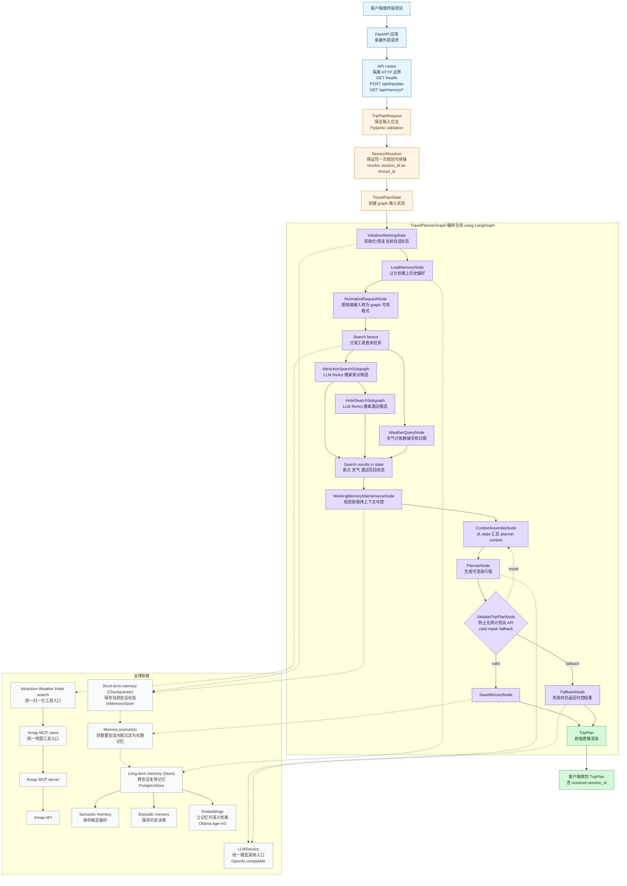
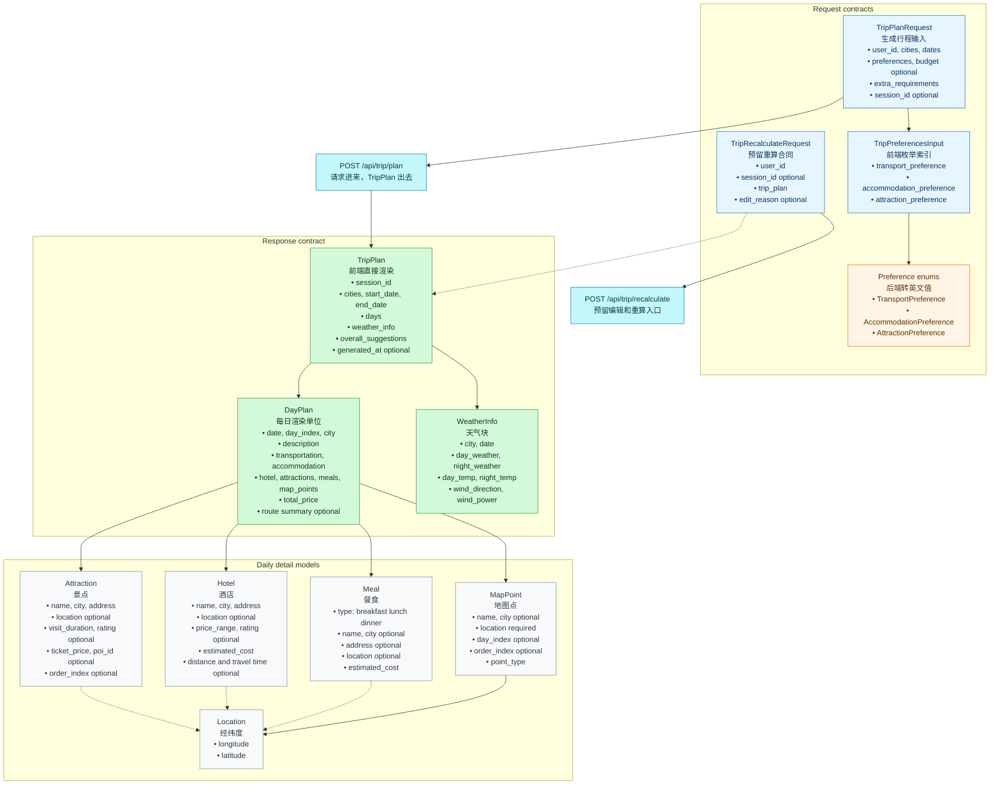
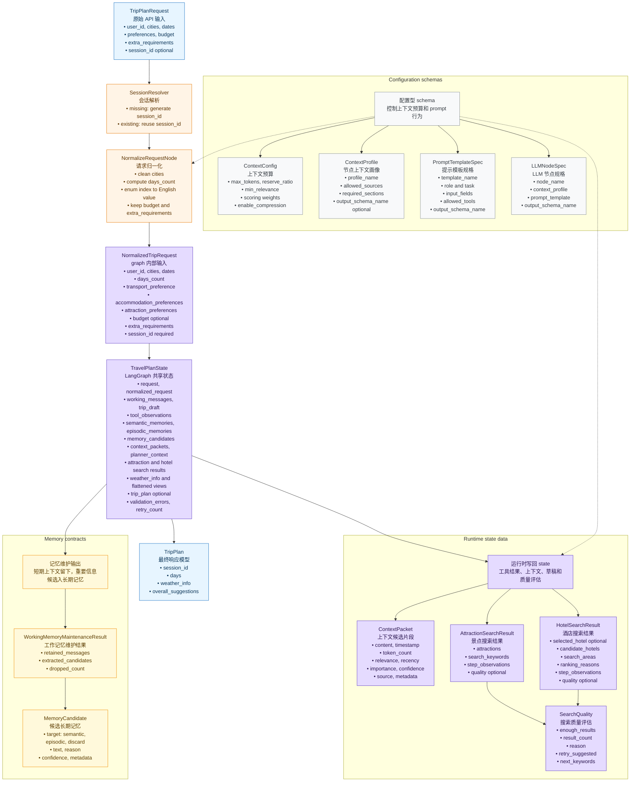

# ZoeyAgent

ZoeyAgent 是一个面向旅行规划场景的 Agent 应用后端设计。当前仓库以设计文档为主，目标是逐步实现一个自托管 Python FastAPI 服务：接收结构化旅行请求，运行 LangGraph 规划流程，调用 Amap 工具获取景点、酒店和天气信息，并返回可由前端直接渲染的 `TripPlan`。

## 设计文档

- [Backend Design](doc/backend_design.md)
- [Agents Design](doc/agents_design.md)
- [Schemas Design](doc/schemas_design.md)
- [Memory Design](doc/memory_design.md)
- [Tools Design](doc/tools_design.md)
- [Example Workflow](doc/example_workflow.md)

## 本地启动

本项目只保留 Docker 启动路径。先确认 Docker Desktop 已启动，Ollama 已在宿主机运行并已拉取 `bge-m3:567m`，然后在项目根目录运行：

```powershell
docker compose up --build
```

前端地图使用 `frontend/.env` 中的 `VITE_AMAP_WEB_JS_KEY`。如果要显示高德地图 canvas 和 marker，请先把你的 Web JS API key 写入：

```text
VITE_AMAP_WEB_JS_KEY=your_amap_web_key
```

服务启动后，前端入口是 `http://127.0.0.1:3000`，后端 API 仍然暴露在 `http://127.0.0.1:8000`。在另一个 PowerShell 里可以调用测试请求：

```powershell
curl.exe -X POST "http://127.0.0.1:8000/api/trip/plan" `
  -H "Content-Type: application/json; charset=utf-8" `
  --data-binary "@backend/tests/fixtures/http_requests/trip-request-beijing-public.json"
```

`backend/.env` 只保留 secrets 和 provider 选择，不写 Windows 路径，也不写容器内网络地址。建议保留：

```text
LLM_BASE_URL=...
LLM_API_KEY=...
LLM_MODEL_ID=gemini-3.1-flash-lite
AMAP_MAPS_API_KEY=...
```

这些值由 `docker-compose.yml` 统一覆盖，不需要放进 `.env`：`HOST`、`PORT`、`POSTGRES_URL`、`MEMORY_ENABLED`、`EMBEDDING_PROVIDER`、`EMBEDDING_BASE_URL`、`EMBEDDING_MODEL`、`EMBEDDING_DIMS`、`AMAP_MCP_COMMAND`、`AMAP_MCP_ARGS`。

HTTP 输入里 `TripPlanRequest.cities` 应传中文城市名，例如 `["北京"]`。当前 Amap MCP 的 POI 搜索对英文城市名不稳定，`["Beijing"]` 可能召回北京以外的 POI；前端展示语言可以自行决定，但传给后端的城市字段应使用高德可稳定识别的中文城市名。

长期记忆调试接口示例：

```powershell
curl.exe -G "http://127.0.0.1:8000/api/memory/semantic" `
  --data-urlencode "user_id=browser-test-001" `
  --data-urlencode "query=轻松历史文化" `
  --data-urlencode "limit=5"

curl.exe -G "http://127.0.0.1:8000/api/memory/episodic" `
  --data-urlencode "user_id=browser-test-001" `
  --data-urlencode "limit=5"
```

端到端测试请求样例放在 `backend/tests/fixtures/http_requests/`，例如 `trip-request-beijing-public.json`、`trip-request-beijing-driving.json` 和 `trip-recalculate-request.json`。运行本地合同测试：

```powershell
docker compose exec api python -m pytest tests/test_e2e_validation.py
```

前端是 React/Vite 应用，生产容器用 Nginx 托管静态 build，并把 `/api/*` 代理到 `api:8000`。前端构建和测试也通过 Docker 运行，避免依赖本机 Node 环境：

```powershell
docker compose build frontend
docker compose run --rm frontend-test
```

## 总体架构



## Pydantic 数据结构

公共 API 和前端渲染合同：



Graph 和 memory 内部合同：



## 组件职责速览

**HTTP 边界**

- FastAPI 应用：承接 HTTP 请求，负责路由注册、应用生命周期和依赖注入边界。
- API routes：只处理 HTTP 入参、`session_id` 解析、调用 graph 和返回响应，不直接承担规划逻辑。
- `TripPlanRequest`：表示前端提交的原始规划表单，例如城市、日期、偏好索引、预算和可选 `session_id`。
- `TripPlanRequest.cities`：前端应传中文城市名，例如 `["北京"]`，因为 Amap POI 搜索对英文城市名召回不稳定，可能返回其他城市的景点。
- `SessionResolver`：把可选 `session_id` 变成 graph 必需的非空 `thread_id`；例如首次请求生成 UUID，后续请求复用前端传回的值。

**Graph 运行现场**

- `TravelPlanState`：保存一次 graph run 的完整运行现场，包括请求、工具结果、记忆召回、上下文、草稿、最终计划和校验状态。
- Working memory：保存当前 session 的临时上下文，只服务会话连续性；例如用户刚说“不要太赶”和最近的工具调用摘要。
- `working_messages`：保存当前 session 中对后续规划有用的消息片段，不保存完整长期历史。
- `tool_observations`：保存工具调用过程的简短摘要；例如“Amap 搜索北京历史文化返回 18 个 POI，保留 9 个”。
- `attraction_search_result`：保存景点搜索的结构化候选结果，供酒店搜索和 Planner 使用；例如景点列表、关键词、质量评估。
- `hotel_search_result`：保存酒店搜索的结构化候选结果，供 Planner 选择住宿；例如 selected hotel、candidate hotels、ranking reasons。
- `weather_info`：保存天气节点归一化后的天气数据，供 Planner 安排室内外行程。

**记忆系统**

- Long-term memory：保存跨 session 仍然有价值的信息，不保存临时工具原始结果。
- Semantic memory：保存稳定偏好或事实；例如“用户偏好轻松节奏”。
- Episodic memory：保存具体历史决策或事件；例如“用户上次拒绝了离景点太远的酒店”。
- `MemoryExtractionService`：从 working memory overflow 或最终有效行程中抽取候选记忆，并分类为 semantic、episodic 或 discard。
- `LongTermMemoryStore`：通过 LangGraph `PostgresStore` 保存和召回 semantic/episodic memory；例如按 `user_id` 搜索“轻松历史文化行程”相关记忆。
- `EmbeddingService`：封装本地 embedding 调用，当前用 Ollama `bge-m3:567m` 把 memory text 转成 1024 维向量。

**上下文和模型调用**

- `ContextAssembler`：从 state、working memory、长期记忆和工具结果中挑选最有价值的信息，组装给 LLM 的 prompt context。
- `ContextAssemblyNode`：主规划链路里的可替换 adapter，基于 `ContextAssemblyInterface` 为 `PlannerNode` 生成 planner context，不负责调用外部工具。
- `SpecialistContextBuilder`：ReAct 子图内部的 local context adapter，只读取子图需要的主 state 摘要和 local scratchpad，不作为主图级节点出现。
- `LLMService`：封装 OpenAI-compatible 模型调用入口，包括普通调用、tool calling 和 stream。
- `LLMNodeSpec`：描述一个 LLM 节点用哪个 context profile、prompt template 和 output schema，避免 prompt 调用散落在代码里。

**外部工具**

- Amap MCP client：后端统一访问 Amap MCP server 的工具入口，避免每个子图各自启动工具进程。
- Amap MCP server：连接真实 Amap API 的外部工具服务，提供 POI、天气、地理编码和路线 summary 能力。

**规划节点**

- `AttractionSearchSubgraph`：LLM ReAct 风格的景点搜索子图，只负责计划搜索动作、调用归一化 Amap 服务、评估质量和写回景点候选，不生成最终行程。
- `WeatherQueryNode`：只负责按城市和日期查询天气，不需要 LLM。
- `HotelSearchSubgraph`：LLM ReAct 风格的酒店搜索子图，基于景点位置、预算、交通方式和住宿偏好搜索酒店候选，不确认真实房态。
- `PlannerNode`：使用 planner context 生成可渲染的 `TripPlan` 草稿。
- `ValidateTripPlanNode`：校验 `TripPlan` 是否满足 day-centric 合同，例如日期数量、day index、价格和 map points；餐食规划暂时不作为强校验条件。
- `SaveMemoryNode`：只在 `TripPlan` 校验成功后抽取长期记忆候选，并在长期记忆开启时写入 `PostgresStore`，避免从无效计划生成 memory。
- `FallbackNode`：在多次 repair 失败后返回保守可控的结果或结构化错误，避免 graph 无限重试。
- `TripPlan`：最终返回给前端直接渲染的响应模型，包含 resolved `session_id`、每日行程、天气和整体建议。

容易混淆的关系：

- `TravelPlanState` 是完整运行现场，Working memory 是其中负责当前会话连续性的部分。
- `attraction_search_result` 和 `tool_observations` 来自同一批工具调用，但前者是结构化候选数据，后者是过程摘要。
- ReAct 子图有自己的 local scratchpad，例如局部计划、动作、观察、候选和 retry 计数；主 `TravelPlanState` 只接收压缩后的结果和摘要 observation。
- ReAct 子图不共享主 `ContextAssemblyNode`；它们通过 local context builder 构造自己的 LLM messages，避免把完整 planner context 带进局部搜索。
- Working memory 可以被提升为 Semantic/Episodic memory，但只有长期有价值的内容才会被保存。

## 实施原则

实施过程应该是递进式的：每一步都在已有结果上继续增加能力，不能为了进入下一步而推翻、重写或回退上一阶段已经跑通的行为。需要调整设计时，应通过兼容层、适配器、迁移脚本或小范围重构向前演进。

**Specialist 子图共同约束**

- Specialist 子图是 bounded ReAct 风格：LLM 只负责局部 plan/action 决策，工具调用必须经过项目内部 service，规则 evaluator 负责质量判断和 retry 边界。
- 子图拥有自己的 local scratchpad，例如 local plan、attempted keywords、local observations、partial candidates、quality 和 retry count。
- 子图使用自己的 local context builder 组装 LLM messages；它不是主 graph 里的 `ContextAssemblyNode`，也不会读取完整 planner context。
- 子图可以共用同一个 `LLMService` API wrapper，但每个子图和 `PlannerNode` 都使用各自独立的 `messages`，不会共享 LLM 对话历史或 session。
- 子图不直接读取完整 planner context，不生成最终 `TripPlan`，也不直接写 long-term memory。
- 子图写回主 state 时只返回结构化结果和简短 observation，避免把完整 ReAct scratchpad 塞进 `TravelPlanState`。

## 渐进式实施步骤

1. 建立项目骨架
   - 创建 `backend/app/` 目录、FastAPI 入口、配置模块和基础路由。
   - 先实现 `GET /health`，保证服务可以启动和被测试。
   - 保留后续目录边界：`api`、`schemas`、`agents`、`memory`、`services`、`config.py`。
   - 验证方式：启动 FastAPI app，并用 `curl /health` 确认返回 `{"status": "ok"}`。

2. 实现 Pydantic 数据契约
   - 按 `doc/schemas_design.md` 实现 `TripPlanRequest`、`TripPlan`、`DayPlan`、`Attraction`、`Hotel`、`Meal`、`WeatherInfo` 等模型。
   - 将模型按边界拆分到 `schemas/trip.py`、`schemas/domain.py`、`schemas/graph.py`、`schemas/memory.py`，避免后续阶段在一个大文件里堆叠。
   - 加入日期、城市、预算、枚举索引和每日餐食数量校验。
   - 这一阶段只增加 schema 能力，不引入真实 LLM 或外部工具依赖。
   - 验证方式：为请求模型、响应模型和关键 validator 添加单元测试。

3. 打通最小 planning endpoint
   - 实现 async `POST /api/trip/plan`。
   - 首次请求可以不传 `session_id`；后端生成新的 `session_id`，并在 `TripPlan.session_id` 中返回。
   - 如果前端已经拿到 `session_id`，后续同一 planning session 必须继续传回该值。
   - 先返回一个受控的合法 `TripPlan` 测试数据，用于验证 API 合同和前端渲染合同。
   - 验证方式：用 `curl` 提交不带 `session_id` 的最小合法请求，确认返回值能通过 `TripPlan` 校验且包含后端生成的 `session_id`。

4. 建立 LangGraph 主流程
   - 创建 `TravelPlanState` 和最小 `TravelPlannerGraph`。
   - 先接入 `InitializeWorkingState`、`NormalizeRequestNode`、`PlannerNode`、`ValidateTripPlanNode`。
   - 工具结果继续使用受控测试数据，确保图编排和验证循环先稳定。
   - 保持 graph 调用入口为 async，后续可以直接替换成 `graph.ainvoke(...)`。
   - 验证方式：通过 `/api/trip/plan` 调用测试 graph，确认 endpoint 不再直接拼响应，而是从 graph 输出 `TripPlan`。

5. 建立应用生命周期、依赖注入和错误边界
   - 在 `config.py` 中集中管理 settings、graph、checkpointer、store、Amap MCP client 和 LLM client。
   - 在 FastAPI startup/shutdown 中预留初始化和关闭外部资源的生命周期。
   - 引入结构化错误边界，例如 `GRAPH_EXECUTION_FAILED`、`TOOL_CALL_FAILED`、`PLAN_VALIDATION_FAILED`。
   - MVP 可以先保留 FastAPI 默认校验错误，但 graph/tool/planner 异常需要开始收口到统一错误形状。
   - 验证方式：用 dependency override 覆盖 graph 成功、graph 抛错、配置缺失三类路径。

6. 封装 LLM service 和 LLM 节点基础设施
   - 在 `services/llm_service.py` 中封装 OpenAI-compatible chat completion。
   - 先实现普通非流式调用和非流式 function calling/tool calling。
   - 保留 stream response 方法签名，但真实 streaming 推迟到 SSE/WebSocket 或进度 UI 阶段。
   - 图节点只依赖项目内部 `LLMService`，不直接散落调用 OpenAI SDK。
   - 建立 `PromptTemplateRegistry`、`BaseLLMNode`、structured output validation 和 retry policy skeleton。
   - 验证方式：用注入式测试 client 覆盖 message、tools 和 deferred stream 行为，并用真实 `.env` 做 LLM smoke test。

7. 实现上下文组装层
   - 实现 reusable `ContextAssembler`，支持 `ContextProfile`、`PromptTemplateSpec` 和 token budget。
   - 将 main graph 的 `ContextAssemblyNode` 做成可替换 adapter，基于 `ContextAssemblyInterface` 在 `PlannerNode` 前执行 Gather、Select、Structure、Compress。
   - 实现 `SpecialistContextBuilder`，让 ReAct 子图内部 LLM 节点通过 local state 和必要主 state 摘要组装 messages。
   - specialist subgraph 不额外画主图级 `ContextAssemblyNode`，但拥有自己的 local context assembly。
   - 验证方式：用固定 state 测试上下文来源过滤、重要性排序、压缩开关、planner context sections、主 context node 可替换性和 specialist local message 构造。

8. 封装 Amap MCP tool 和归一化层
   - 使用 MCP Python client，通过 stdio 连接已安装的 `sugarforever/amap-mcp-server`。
   - 默认启动配置为 `AMAP_MCP_COMMAND=amap-mcp-server`、`AMAP_MCP_ARGS=`，密钥环境变量为 `AMAP_MAPS_API_KEY`。
   - `TripPlanRequest.cities` 面向 Amap 查询时必须使用中文城市名，例如 `北京`；英文城市名可以保留给前端展示层，但不应作为 provider-facing 城市输入。
   - 在 `services/amap_service.py` 中建立共享 Amap MCP client 封装，整个后端通过同一个服务边界调用地图工具。
   - 接入真实 MCP 工具名：`maps_text_search`、`maps_search_detail`、`maps_geo`、`maps_weather`、`maps_direction_walking_by_address`、`maps_direction_driving_by_address`、`maps_direction_transit_integrated_by_address`。
   - 实现坐标、评分、价格、天气温度和 route summary 的 provider response normalization。
   - 当 `maps_text_search` 返回 POI 但缺少经纬度时，先用 `maps_search_detail` 按 POI ID 补全坐标，再用 `maps_geo` 按城市和地址/名称兜底。
   - 增加地图 anchor helper：只从有 `location` 的景点、酒店和餐食生成 `MapPoint`，保证 `DayPlan.map_points` 可被前端直接渲染。
   - direction tool 输出只保留距离、耗时和交通方式，不返回公交站数、换乘细节或 turn-by-turn 路线。
   - 保证 raw Amap 响应不会直接进入 `PlannerNode`。
   - 验证方式：用真实 Amap MCP smoke test 覆盖 POI 搜索、POI detail/geocode 坐标补全、天气和 route summary；单元测试使用从真实响应形状抽出的测试 fixture 防止回归。

9. 接入天气节点
   - 实现 `WeatherQueryNode` 调用 Amap weather 工具。
   - 将结果归一化为 `list[WeatherInfo]`。
   - 天气失败时返回空列表和结构化 observation，不阻断整条规划链路。
   - 验证方式：用真实 Amap weather 响应形状的测试 fixture 和 smoke test 确认 graph state 中写入 `weather_info`。

10. 建立 specialist search 子图基础设施
   - 建立 specialist 子图共同方法论：local task planner、restricted tool executor、step evaluator、bounded retry、rank/deduplicate 和 result write-back。
   - 共同基础设施不定义独立的通用搜索配置 schema；共享的是接口、约束和 helper，具体搜索逻辑保留在各自领域子图中。
   - 子图拥有自己的 local context 和 local scratchpad，不直接读取完整 planner context，也不直接生成最终 `TripPlan`。
   - 子图只通过项目内部 service 调工具，例如 Amap service 或后续其他工具封装，不能直接把 raw provider response 写进 planner。
   - 验证方式：用真实响应形状的测试 fixture 覆盖 retry 上限、quality warning、best-effort result、去重排序和 result write-back。

11. 实现 LLM ReAct 景点搜索子图
   - 实现 `AttractionSearchSubgraph`：LLM 先生成局部搜索计划，再根据 observation 选择 `search_attractions` action。
   - 子图通过 `SpecialistContextBuilder` 构造 plan/action messages，不直接手写完整 prompt context，也不复用主 graph 的 `ContextAssemblyNode`。
   - executor 调用 `AmapMCPService.search_attractions()`，不直接调用 raw MCP；service 内部负责 `maps_text_search`、`maps_search_detail`、`maps_geo` 和 `Attraction` 归一化。
   - 规则 evaluator 基于候选数量、坐标完整度、去重后数量和偏好匹配生成 `SearchQuality`，质量不足时 bounded retry。
   - 子图只写回 `AttractionSearchResult`、扁平 `attractions` 和简短 `tool_observations`，不生成最终行程。
   - 验证方式：用 fake LLM/fake Amap 覆盖 plan/action、去重、排序、retry、非法 LLM 输出和依赖缺失；用真实 Gemini + Amap smoke 确认输出尽量 map-ready 的景点候选。

12. 实现 LLM ReAct 酒店搜索子图
   - 实现 `HotelSearchSubgraph`：LLM 先基于景点结果、城市、预算、交通方式和住宿偏好生成局部酒店搜索计划。
   - 子图同样通过 `SpecialistContextBuilder` 构造 plan/action messages，只读取必要的景点候选摘要和酒店 local scratchpad。
   - LLM 每轮选择受限 action，例如搜索酒店候选、切换景点 anchor、扩大搜索范围或请求 direction summary。
   - executor 只调用项目内部归一化工具，例如 `AmapMCPService.search_hotels()` 和必要的 route summary helper，不直接把 raw Amap 响应交给 Planner。
   - 规则 evaluator 基于候选数量、坐标完整度、到景点 anchor 的距离/耗时、预算线索、评分和交通偏好生成 `SearchQuality`。
   - 明确 Amap POI 只能提供候选酒店，不能确认真实房态；子图只输出 `HotelSearchResult`、扁平 `hotels`、selected hotel 和 ranking reasons。
   - 验证方式：用 fake LLM/fake Amap 覆盖 action、anchor 切换、retry、best-effort、候选排序和工具失败；用真实酒店 POI/detail/geocode 响应形状确认候选酒店可用于后续 Planner。

13. 强化 PlannerNode
   - 将景点、酒店、天气、预算、偏好和 extra requirements 汇总为 planner context。
   - 生成完整 `TripPlan`，包括每日 attractions、meals、hotel、map_points、total_price 和 route summary。
   - 不输出完整路线步骤，不要求 `image_url`。
   - 验证方式：用固定 planner 输入测试每日价格、地图点和合理的日期数量；餐食可为空，等后续 meal 能力接入后再强化。

14. 强化 ValidateTripPlanNode、repair 和 fallback
   - 校验日期数量、每日 `day_index`、每日价格、map points、枚举值和 day-centric response contract；不校验每日三餐。
   - 失败时带着 validation errors 回到 planner 修复。
   - 超过 retry 上限后进入 `FallbackNode`，返回保守可用结果或结构化错误。
   - 验证方式：构造日期数量错误、日期和 `day_index` 不一致、价格为负、map points 缺失等坏输出，确认 validator 能拒绝并触发 repair 或 fallback。

15. 接入 working memory
   - 使用 `InMemorySaver`，将解析后的 `session_id` 映射为 LangGraph `thread_id`，并通过 `graph.compile(checkpointer=checkpointer)` 启用 checkpoint。
   - API 每次只提交当前 `TripPlanRequest`；同一 `thread_id` 的 `working_messages` 和 `tool_observations` 从 checkpoint 恢复。
   - 实现 `maintain_working_messages` 和 `maintain_tool_observations` 这类统一状态更新 helper。
   - working memory 超过 50 条消息时触发 overflow policy，保留最新 50 条。
   - 保持 working memory 只服务当前进程和当前 session，不提前承诺持久化。
   - 验证方式：用相同 `session_id` 连续请求，确认进程存活期间 graph state 能被恢复。

16. 实现 MemoryExtractionService
   - 将工作记忆 overflow 和最终成功计划的记忆抽取统一到 `memory/extraction.py`。
   - 抽取 `MemoryCandidate`，分类为 semantic、episodic 或 discard。
   - 对候选记忆做去重、置信度过滤和写入前校验；这一阶段只产出候选，不写入长期 store。
   - overflow 时在裁掉旧 working memory 前抽取 semantic/episodic 候选；final valid `TripPlan` 后通过 `SaveMemoryNode` 抽取本轮成功计划候选。
   - 验证方式：用固定 working messages、overflow items 和 final `TripPlan` 测试分类、discard、dedup 和 dropped_count。

17. 接入长期记忆
   - 配置 Postgres、pgvector、LangGraph `PostgresStore` 和本地 embedding endpoint；MVP 使用 Ollama `bge-m3:567m`，并保留 OpenAI-compatible/vLLM 入口。
   - 实现 `EmbeddingService` 和 `LongTermMemoryStore`，让 `PostgresStore` 对 `text` 字段建立 embedding index。
   - 实现 `LoadMemoryNode`，在规划前按 `user_id` 搜索 semantic 和 episodic memories 并写入 `TravelPlanState`。
   - 扩展 `SaveMemoryNode`，只在 `TripPlan` 验证成功后把 `MemoryExtractionService` 产出的候选写入长期记忆。
   - 本地未配置 Postgres 时可通过 `MEMORY_ENABLED=false` 关闭长期记忆，避免开发流程被基础设施阻塞。
   - 验证方式：分别测试 memory disabled、测试 store wrapper、真实 PostgresStore + pgvector + Ollama 三种路径。

18. 增加 memory 调试接口
   - 实现 `GET /api/memory/semantic` 和 `GET /api/memory/episodic`。
   - 用于本地开发、终端测试和记忆召回验证。
   - 返回 `memory_type`、`user_id`、`query`、`limit`、`count` 和 `items`，便于终端直接检查召回结果。
   - 生产环境上线前应加鉴权或禁用。
   - 验证方式：在测试 store 和真实 store 下分别查询 semantic/episodic memory。

19. 预留编辑和重算能力
   - 保留 `POST /api/trip/recalculate` 路由和 `TripRecalculateRequest`。
   - MVP 当前返回结构化 `501 Not Implemented`，错误码为 `TRIP_RECALCULATION_NOT_IMPLEMENTED`。
   - 后续在不破坏 `TripPlan` 合同的前提下增加局部重排、删除景点、重新计算价格和路线 summary。
   - 验证方式：确认 endpoint 存在、返回明确的未实现响应，并不会影响 `/api/trip/plan`。

20. 做端到端验证
   - 在 `backend/tests/fixtures/http_requests/` 下保存可复用 JSON 请求样例，避免端到端验证依赖手工复制 payload。
   - 用 pytest + FastAPI TestClient 覆盖 health、trip planning、memory search 和 reserved recalculate。
   - 测试单城市、多城市、公共交通、自驾、预算为空、工具失败、planner validation retry 等路径。
   - 每轮验证只修复当前发现的问题，不回退已经稳定的 API 合同。

## MVP 边界

第一版不需要实现前端、图片 enrichment、真实酒店库存、完整路线说明、异步任务队列、SSE/WebSocket 进度推送、生产鉴权和完整 recalculation。MVP 的目标是先让后端能够稳定返回一个结构化、可验证、可渲染的 `TripPlan`。
Zoey's trip planner agent
