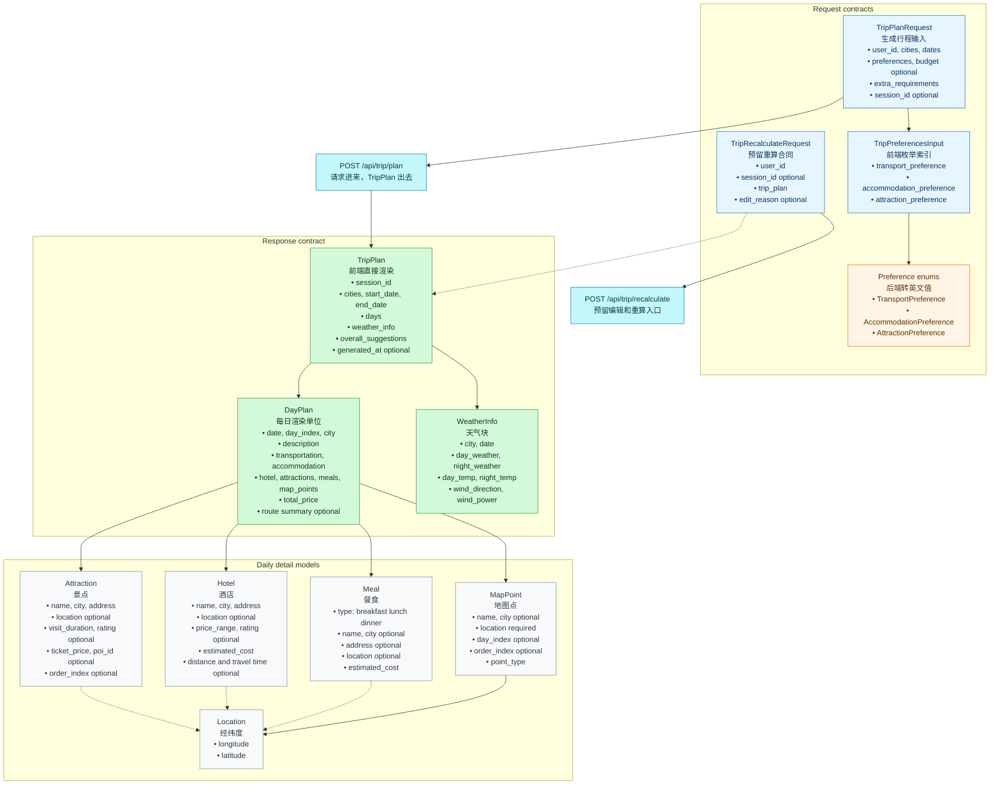
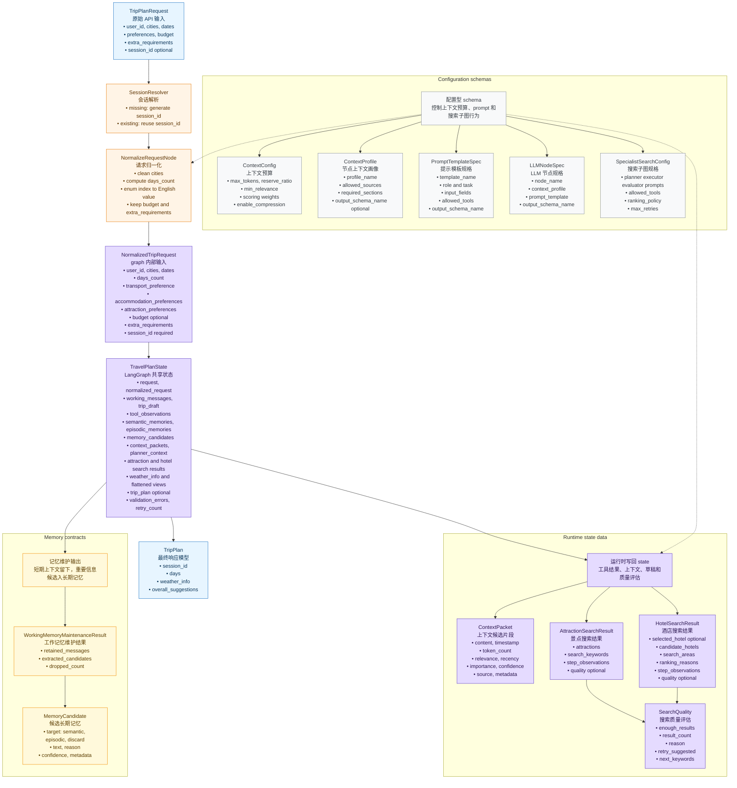

# ZoeyAgent

ZoeyAgent 是一个面向旅行规划场景的 Agent 应用后端设计。当前仓库以设计文档为主，目标是逐步实现一个自托管 Python FastAPI 服务：接收结构化旅行请求，运行 LangGraph 规划流程，调用 Amap 工具获取景点、酒店和天气信息，并返回可由前端直接渲染的 `TripPlan`。

## 设计文档

- [Backend Design](doc/backend_design.md)
- [Agents Design](doc/agents_design.md)
- [Schemas Design](doc/schemas_design.md)
- [Memory Design](doc/memory_design.md)
- [Tools Design](doc/tools_design.md)
- [Example Workflow](doc/example_workflow.md)

## 总体架构

## Pydantic 数据结构

公共 API 和前端渲染合同：

Graph 和 memory 内部合同：

## 组件职责速览

| 组件 | 核心作用 |
| --- | --- |
| FastAPI 应用 | 承接 HTTP 请求，负责路由注册、应用生命周期和依赖注入边界。 |
| API routes | 只处理 HTTP 入参、`session_id` 解析、调用 graph 和返回响应，不直接承担规划逻辑。 |
| `TripPlanRequest` | 表示前端提交的原始规划表单，例如城市、日期、偏好索引、预算和可选 `session_id`。 |
| `SessionResolver` | 把可选 `session_id` 变成 graph 必需的非空 `thread_id`；例如首次请求生成 UUID，后续请求复用前端传回的值。 |
| `TravelPlanState` | 保存一次 graph run 的完整运行现场，包括请求、工具结果、记忆召回、上下文、草稿、最终计划和校验状态。 |
| Working memory | 保存当前 session 的临时上下文，只服务会话连续性；例如用户刚说“不要太赶”和最近的工具调用摘要。 |
| `working_messages` | 保存当前 session 中对后续规划有用的消息片段，不保存完整长期历史。 |
| `tool_observations` | 保存工具调用过程的简短摘要；例如“Amap 搜索北京历史文化返回 18 个 POI，保留 9 个”。 |
| `attraction_search_result` | 保存景点搜索的结构化候选结果，供酒店搜索和 Planner 使用；例如景点列表、关键词、质量评估。 |
| `hotel_search_result` | 保存酒店搜索的结构化候选结果，供 Planner 选择住宿；例如 selected hotel、candidate hotels、ranking reasons。 |
| `weather_info` | 保存天气节点归一化后的天气数据，供 Planner 安排室内外行程。 |
| Long-term memory | 保存跨 session 仍然有价值的信息，不保存临时工具原始结果。 |
| Semantic memory | 保存稳定偏好或事实；例如“用户偏好轻松节奏”。 |
| Episodic memory | 保存具体历史决策或事件；例如“用户上次拒绝了离景点太远的酒店”。 |
| `MemoryExtractionService` | 从 working memory overflow 或最终有效行程中抽取候选记忆，并分类为 semantic、episodic 或 discard。 |
| `ContextAssembler` | 从 state、working memory、长期记忆和工具结果中挑选最有价值的信息，组装给 LLM 的 prompt context。 |
| `ContextAssemblyNode` | 在主规划链路中为 `PlannerNode` 生成 planner context，不负责调用外部工具。 |
| `LLMService` | 封装 OpenAI-compatible 模型调用入口，包括普通调用、tool calling 和 stream。 |
| `LLMNodeSpec` | 描述一个 LLM 节点用哪个 context profile、prompt template 和 output schema，避免 prompt 调用散落在代码里。 |
| Amap MCP client | 后端统一访问 Amap MCP server 的工具入口，避免每个子图各自启动工具进程。 |
| Amap MCP server | 连接真实 Amap API 的外部工具服务，提供 POI、天气、地理编码和路线 summary 能力。 |
| `AttractionSearchSubgraph` | 只负责搜索、去重、排序和评估景点候选，不生成最终行程。 |
| `WeatherQueryNode` | 只负责按城市和日期查询天气，不需要 LLM。 |
| `HotelSearchSubgraph` | 只负责基于景点位置、预算、交通方式和住宿偏好搜索酒店候选，不确认真实房态。 |
| `PlannerNode` | 使用 planner context 生成可渲染的 `TripPlan` 草稿。 |
| `ValidateTripPlanNode` | 校验 `TripPlan` 是否满足 day-centric 合同，例如日期数量、每日三餐、价格和 map points。 |
| `SaveMemoryNode` | 只在 `TripPlan` 校验成功后保存长期记忆，避免把无效计划写入 memory。 |
| `FallbackNode` | 在多次 repair 失败后返回保守可控的结果或结构化错误，避免 graph 无限重试。 |
| `TripPlan` | 最终返回给前端直接渲染的响应模型，包含 resolved `session_id`、每日行程、天气和整体建议。 |

容易混淆的关系：

- `TravelPlanState` 是完整运行现场，Working memory 是其中负责当前会话连续性的部分。
- `attraction_search_result` 和 `tool_observations` 来自同一批工具调用，但前者是结构化候选数据，后者是过程摘要。
- Working memory 可以被提升为 Semantic/Episodic memory，但只有长期有价值的内容才会被保存。

## 实施原则

实施过程应该是递进式的：每一步都在已有结果上继续增加能力，不能为了进入下一步而推翻、重写或回退上一阶段已经跑通的行为。需要调整设计时，应通过兼容层、适配器、迁移脚本或小范围重构向前演进。

## 渐进式实施步骤

1. 建立项目骨架
   - 创建 `backend/app/` 目录、FastAPI 入口、配置模块和基础路由。
   - 先实现 `GET /health`，保证服务可以启动和被测试。
   - 保留后续目录边界：`api`、`core`、`schemas`、`agents`、`memory`、`tools`。
   - 验证方式：启动 FastAPI app，并用 `curl /health` 确认返回 `{"status": "ok"}`。

2. 实现 Pydantic 数据契约
   - 按 `doc/schemas_design.md` 实现 `TripPlanRequest`、`TripPlan`、`DayPlan`、`Attraction`、`Hotel`、`Meal`、`WeatherInfo` 等模型。
   - 将模型按边界拆分到 `schemas/trip.py`、`schemas/domain.py`、`schemas/graph.py`、`schemas/memory.py`，避免后续阶段在一个大文件里堆叠。
   - 加入日期、城市、预算、枚举索引和每日餐食数量校验。
   - 这一阶段只增加 schema 能力，不引入真实 LLM 或外部工具依赖。
   - 验证方式：为请求模型、响应模型和关键 validator 添加单元测试。

3. 打通最小 planning endpoint
   - 实现 async `POST /api/trip/plan`。
   - 首次请求可以不传 `session_id`；后端生成新的 `session_id`，并在 `TripPlan.session_id` 中返回。
   - 如果前端已经拿到 `session_id`，后续同一 planning session 必须继续传回该值。
   - 先返回一个固定或 mock 的合法 `TripPlan`，用于验证 API 合同和前端渲染合同。
   - 验证方式：用 `curl` 提交不带 `session_id` 的最小合法请求，确认返回值能通过 `TripPlan` 校验且包含后端生成的 `session_id`。

4. 建立 LangGraph 主流程
   - 创建 `TravelPlanState` 和最小 `TravelPlannerGraph`。
   - 先接入 `InitializeWorkingState`、`NormalizeRequestNode`、`PlannerNode`、`ValidateTripPlanNode`。
   - 工具结果继续使用 mock 数据，确保图编排和验证循环先稳定。
   - 保持 graph 调用入口为 async，后续可以直接替换成 `graph.ainvoke(...)`。
   - 验证方式：通过 `/api/trip/plan` 调用 mock graph，确认 endpoint 不再直接拼响应，而是从 graph 输出 `TripPlan`。

5. 建立应用生命周期、依赖注入和错误边界
   - 在 `core/config.py`、`core/dependencies.py` 中集中管理 settings、graph、checkpointer、store、Amap MCP client 和 LLM client。
   - 在 FastAPI startup/shutdown 中预留初始化和关闭外部资源的生命周期。
   - 引入结构化错误边界，例如 `GRAPH_EXECUTION_FAILED`、`TOOL_CALL_FAILED`、`PLAN_VALIDATION_FAILED`。
   - MVP 可以先保留 FastAPI 默认校验错误，但 graph/tool/planner 异常需要开始收口到统一错误形状。
   - 验证方式：用 fake dependency 覆盖 graph 成功、graph 抛错、配置缺失三类路径。

6. 封装 LLM service 和 LLM 节点基础设施
   - 在 `agents/llm.py` 中封装 OpenAI-compatible chat completion。
   - 支持普通非流式调用、function calling/tool calling、stream response 三类入口。
   - 图节点只依赖项目内部 `LLMService`，不直接散落调用 OpenAI SDK。
   - 建立 `PromptTemplateRegistry`、`BaseLLMNode`、structured output validation 和 retry policy skeleton。
   - 验证方式：用 mock transport 或 fake client 测试 message、tools、stream chunk 的输入输出形状。

7. 实现上下文组装层
   - 实现 reusable `ContextAssembler`，支持 `ContextProfile`、`PromptTemplateSpec` 和 token budget。
   - 实现 main graph 的 `ContextAssemblyNode`，在 `PlannerNode` 前执行 Gather、Select、Structure、Compress。
   - specialist subgraph 内部 LLM 节点使用 `ContextAssembler`，不为每个子节点额外画一个主图级 `ContextAssemblyNode`。
   - 验证方式：用固定 state 测试上下文来源过滤、重要性排序、压缩开关和 planner context sections。

8. 封装 Amap MCP tool 和归一化层
   - 在 `tools/amap.py` 中建立共享 Amap MCP client 封装，整个后端只启动或连接一个 Amap MCP server。
   - 实现坐标、评分、价格、天气温度、geocode/regeocode 和 route summary 的 provider response normalization。
   - direction tool 输出只保留距离、耗时和交通方式，不返回公交站数、换乘细节或 turn-by-turn 路线。
   - 保证 raw Amap 响应不会直接进入 `PlannerNode`。
   - 先用 sample response 和 fake MCP client，不要求一开始连真实 Amap。
   - 验证方式：用 Amap sample response 测试 normalize 结果，不要求一开始连真实 Amap。

9. 接入天气节点
   - 实现 `WeatherQueryNode` 调用 Amap weather 工具。
   - 将结果归一化为 `list[WeatherInfo]`。
   - 天气失败时返回空列表和结构化 observation，不阻断整条规划链路。
   - 验证方式：mock Amap weather response，确认 graph state 中写入 `weather_info`。

10. 建立 specialist search 子图基础设施
   - 实现 `SpecialistSearchConfig` 驱动的共享子图方法论。
   - 抽出 local task planner、restricted tool executor、step evaluator、bounded retry、rank/deduplicate 和 result write-back 的基础件。
   - 子图拥有自己的 local context，不直接读取完整 planner context，也不直接生成最终 `TripPlan`。
   - 验证方式：用 fake tool 和 fake evaluator 测试 retry 上限、quality warning、best-effort result。

11. 实现景点搜索子图
   - 先实现关键词搜索、POI 归一化、去重和基础排序。
   - 再逐步加入 detail search、around search、质量评估和 bounded retry。
   - 子图只输出 `AttractionSearchResult`，不直接生成最终行程。
   - 验证方式：mock POI response，确认输出包含去重后的 `AttractionSearchResult` 和质量信息。

12. 实现酒店搜索子图
   - 基于景点结果选择酒店搜索 anchor。
   - 搜索并排序候选酒店，输出 `HotelSearchResult`。
   - 使用 geocode、around search 和 direction summary 评估酒店到主要活动区域的距离、时间和交通方式。
   - 当 `transport_preference = driving` 时，将停车便利性或附近停车证据作为高优先级 ranking signal。
   - 明确 Amap POI 只能提供候选酒店，不能确认真实房态。
   - 验证方式：mock hotel POI response，确认候选酒店排序、selected hotel 和 ranking reasons 可用。

13. 强化 PlannerNode
   - 将景点、酒店、天气、预算、偏好和 extra requirements 汇总为 planner context。
   - 生成完整 `TripPlan`，包括每日 attractions、meals、hotel、map_points、total_price 和 route summary。
   - 不输出完整路线步骤，不要求 `image_url`。
   - 验证方式：用固定 planner 输入测试每天都有三餐、每日价格、地图点和合理的日期数量。

14. 强化 ValidateTripPlanNode、repair 和 fallback
   - 校验每日三餐、每日价格、日期数量、map points、枚举值和 day-centric response contract。
   - 失败时带着 validation errors 回到 planner 修复。
   - 超过 retry 上限后进入 `FallbackNode`，返回保守可用结果或结构化错误。
   - 验证方式：构造缺餐、日期数量错误、价格为负等坏输出，确认 validator 能拒绝并触发 repair 或 fallback。

15. 接入 working memory
   - 使用 `InMemorySaver`，将解析后的 `session_id` 映射为 LangGraph `thread_id`。
   - 实现 `append_working_message` 和 `append_tool_observation` 这类状态更新 helper。
   - working memory 超过 50 条消息时触发 overflow policy，保留最新 50 条。
   - 保持 working memory 只服务当前进程和当前 session，不提前承诺持久化。
   - 验证方式：用相同 `session_id` 连续请求，确认进程存活期间 graph state 能被恢复。

16. 实现 MemoryExtractionService
   - 将工作记忆 overflow 和最终成功计划的记忆抽取统一到 `memory/extraction.py`。
   - 抽取 `MemoryCandidate`，分类为 semantic、episodic 或 discard。
   - 对候选记忆做去重、置信度过滤和写入前校验。
   - 验证方式：用固定 working messages 和 final `TripPlan` 测试分类、discard、dedup 和 dropped_count。

17. 接入长期记忆
   - 配置 Postgres、pgvector、LangGraph `PostgresStore` 和本地 vLLM embedding endpoint。
   - 实现 `LoadMemoryNode` 搜索 semantic 和 episodic memories。
   - 实现 `SaveMemoryNode`，只在 `TripPlan` 验证成功后通过 `MemoryExtractionService` 写入长期记忆。
   - 本地未配置 Postgres 时应允许关闭或 mock 长期记忆，避免开发流程被基础设施阻塞。
   - 验证方式：分别测试 memory disabled、mock store、真实 PostgresStore 三种路径。

18. 增加 memory 调试接口
   - 实现 `GET /api/memory/semantic` 和 `GET /api/memory/episodic`。
   - 用于本地开发、终端测试和记忆召回验证。
   - 生产环境上线前应加鉴权或禁用。
   - 验证方式：在 mock store 和真实 store 下分别查询 semantic/episodic memory。

19. 预留编辑和重算能力
   - 保留 `POST /api/trip/recalculate` 路由和 `TripRecalculateRequest`。
   - MVP 可以返回 `501 Not Implemented`。
   - 后续在不破坏 `TripPlan` 合同的前提下增加局部重排、删除景点、重新计算价格和路线 summary。
   - 验证方式：确认 endpoint 存在、返回明确的未实现响应，并不会影响 `/api/trip/plan`。

20. 做端到端验证
   - 用 `curl`、HTTP client 或 pytest 覆盖 health、trip planning、memory search。
   - 测试单城市、多城市、公共交通、自驾、预算为空、工具失败、planner validation retry 等路径。
   - 每轮验证只修复当前发现的问题，不回退已经稳定的 API 合同。

## MVP 边界

第一版不需要实现前端、图片 enrichment、真实酒店库存、完整路线说明、异步任务队列、SSE/WebSocket 进度推送、生产鉴权和完整 recalculation。MVP 的目标是先让后端能够稳定返回一个结构化、可验证、可渲染的 `TripPlan`。
Zoey's trip planner agent
