# Background Knowledge

在阅读 ZoeyAgent 的实现之前，我们需要先补上一些背景知识。这个项目并不是简单地“调用一次大模型生成行程”，而是把智能体范式、工具协议、记忆系统、上下文工程和结构化数据合同组合在一起，形成一个可以运行、可以验证、可以继续扩展的应用。

本章不会复述所有理论细节，而是围绕一个问题展开：这些技术为什么会出现在 ZoeyAgent 中，它们分别解决了什么问题，又是如何贡献到旅行规划这个具体场景里的。

## 1. Agent 范式：让模型不只是回答，而是行动

在最简单的 LLM 应用中，模型接收一段 prompt，然后直接输出答案。这种方式适合单轮问答，但旅行规划不是单轮文本生成。系统需要先查景点，再查酒店和天气，然后根据预算、交通方式、记忆偏好生成计划，最后还要校验结果是否可渲染。

这就是为什么我们需要 Agent 范式。Agent 的核心区别在于，它不是一次性回答，而是在任务过程中进行计划、调用工具、观察结果、调整策略，并最终形成结构化输出。

### ReAct：边想边查，边查边改

ReAct 的全称是 Reasoning and Acting。它把智能体的工作拆成一个循环：

1. Thought：模型判断当前需要做什么。
2. Action：模型选择一个受限工具动作。
3. Observation：工具返回真实结果。
4. 下一轮 Thought：模型根据观察结果修正下一步。

在 ZoeyAgent 中，景点搜索和酒店搜索都采用 bounded ReAct 风格。这里的 bounded 很重要：LLM 不是想调用什么就调用什么，而只能选择项目允许的 action，例如 `search_attractions` 或 `search_hotels`。真实工具调用必须经过 Amap service，结果还要经过 evaluator 去重、排序和质量判断。

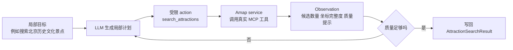

一个简单例子是：用户要求“北京，一天，历史文化，轻松行程”。景点子图第一次可能搜索“北京 历史文化 景点”，如果返回结果中坐标缺失或候选太少，下一轮 action 可以换关键词，例如“北京 博物馆 故宫 天坛”。这样系统不是盲目相信第一次搜索结果，而是根据 observation 做有限重试。

### Plan-and-Solve：先规划结构，再逐步执行

Plan-and-Solve 的思想是先把复杂任务拆成清晰步骤，再逐步完成。它不像 ReAct 那样每一步都临场调整，而是强调全局结构和目标一致性。

ZoeyAgent 的主流程更接近这种思想。LangGraph 不是让一个节点随意决定下一步，而是把规划任务拆成固定主线：初始化、加载记忆、归一化请求、搜索工具、组装上下文、生成计划、校验计划、保存记忆。每一步都有明确输入输出。

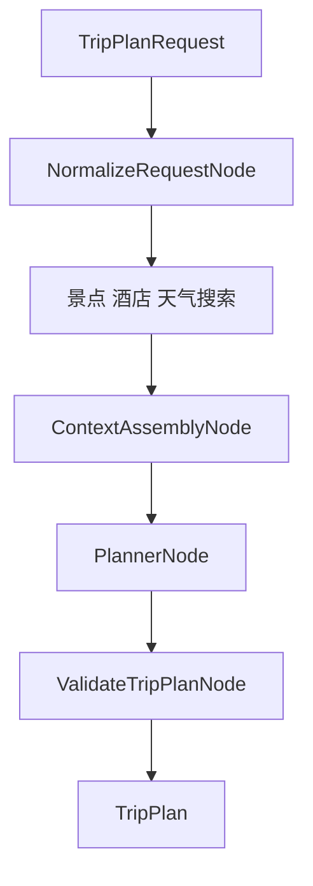

这样做的好处是稳定。旅行规划涉及很多外部数据，如果全部交给一个 ReAct agent 自由探索，很容易出现路线过长、搜索偏题、结果不可渲染等问题。主图用 Plan-and-Solve 式编排锁定大方向，局部搜索再用 ReAct 增加灵活性。

### Reflection：用校验和修复形成小型反思回路

Reflection 的核心思想是“先生成，再审查，再修改”。在 ZoeyAgent 中，我们没有实现完整的多轮自我反思 agent，但使用了更工程化的版本：`ValidateTripPlanNode` 负责审查 `PlannerNode` 生成的计划，如果发现日期数量、地图点、价格或 day index 不符合合同，就把错误带回 Planner 修复。

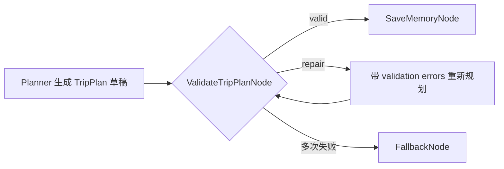

这个设计比让 LLM 自己说“我觉得没问题”更可靠，因为校验规则来自 Pydantic 和业务逻辑，而不是模型主观判断。

## 2. MCP：让 Agent 用统一方式连接外部工具

旅行规划离不开真实世界数据。模型本身不知道某个城市当前有哪些 POI、天气 API 返回什么、路线大概需要多久。我们需要让智能体访问外部工具。

传统做法是为每个 API 手写一个工具适配器。这样一开始很快，但工具多了以后会出现重复问题：每个工具都要处理认证、请求、错误、返回格式和生命周期。MCP 的价值就在这里：它像一个标准接口，让智能体以统一方式发现和调用外部工具。

在 ZoeyAgent 中，我们使用 `sugarforever/amap-mcp-server` 连接高德地图能力。后端通过 MCP Python client 以 stdio 方式启动和调用 MCP server，再由 `AmapMCPService` 把 raw response 归一化成项目内部模型。

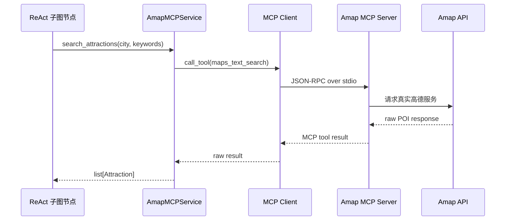

这里需要区分 MCP 和 function calling。Function calling 是模型能力，解决“模型如何表达我要调用哪个函数、参数是什么”。MCP 是工具通信协议，解决“工具如何被发现、连接和执行”。在本项目中，LLM 可以通过结构化 action 表达局部意图，但真正访问 Amap 的过程由 MCP service 完成。

一个简单例子是天气查询。模型不需要知道高德天气接口的字段细节，只需要系统中有一个 `WeatherQueryNode`。节点调用 Amap service，service 调用 `maps_weather`，最后返回 `WeatherInfo`。Planner 看到的是统一天气模型，而不是 provider 原始响应。

## 3. 记忆系统：让规划不只服务一次请求

如果智能体每次请求都从零开始，它就很难体现个性化。用户今天说“我不喜欢太赶”，下一次又要重复说一遍；用户上次拒绝了离景点太远的酒店，系统下次仍可能推荐同类酒店。

因此 ZoeyAgent 使用两层记忆：short-term memory 和 long-term memory。

### Short-term memory：当前 session 的运行上下文

Short-term memory 服务同一个 planning session。它保存当前会话里对后续规划有用的信息，例如用户补充的要求、最近工具调用摘要、搜索质量警告等。在实现上，它跟随 LangGraph checkpointer，以 `session_id` 对应的 `thread_id` 恢复 state snapshot。

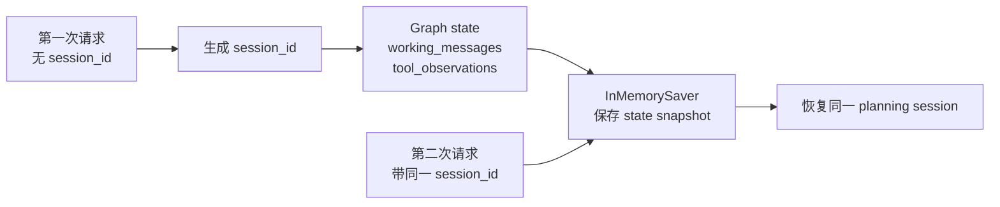

一个简单例子是：用户第一次请求北京一日游，系统搜索到故宫、天坛、景山。用户第二次补充“不要太赶”。同一个 `session_id` 下，working memory 可以让 graph 知道这是对同一规划的延续，而不是完全新的请求。

### Long-term memory：跨 session 的偏好和历史经验

Long-term memory 保存跨 session 仍然有价值的信息。它分为两类：

- Semantic memory：稳定偏好或事实，例如“用户偏好历史文化景点”。
- Episodic memory：具体历史事件，例如“用户上次拒绝了离景点太远的酒店”。

ZoeyAgent 使用 Postgres + pgvector + LangGraph `PostgresStore` 保存长期记忆。文本会先通过 bge-m3 embedding 转成向量，再写入 pgvector。召回时，系统可以按语义相似度找到相关记忆，而不只依赖关键词完全匹配。

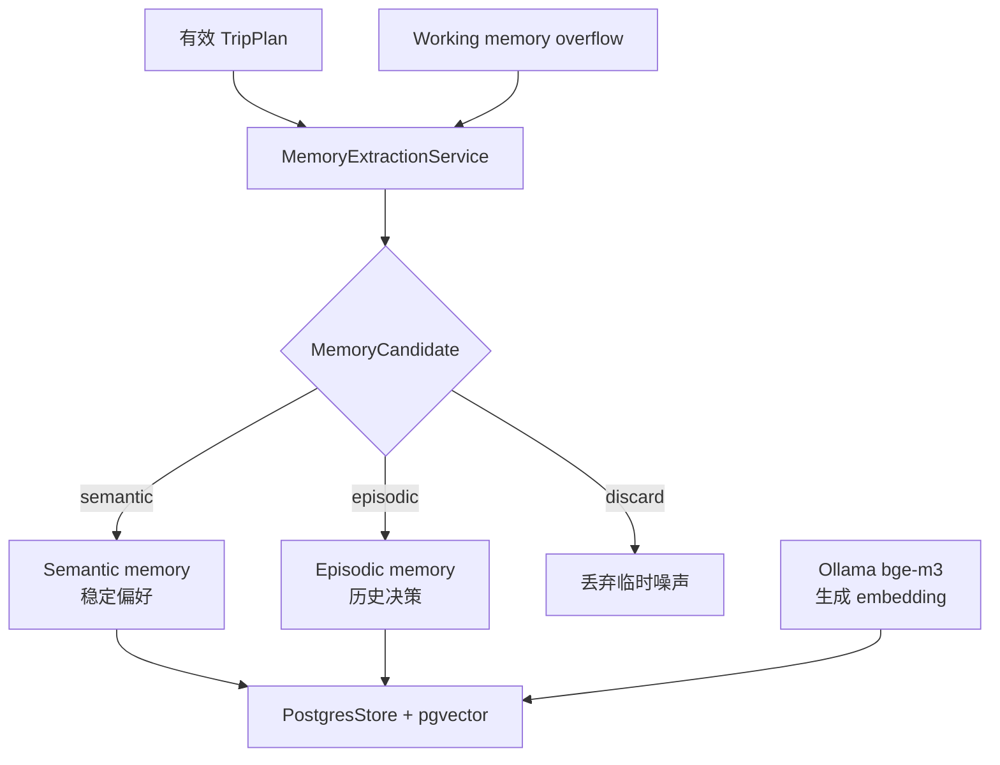

一个简单例子是：最终计划中多次体现用户选择“轻松节奏、历史文化、公共交通”。`MemoryExtractionService` 可以把“用户偏好轻松历史文化行程”抽成 semantic memory。下次用户只说“帮我规划南京两天”，系统也能召回这个偏好。

## 4. Embedding 与 pgvector：让记忆可以按语义召回

长期记忆如果只用普通字符串搜索，会遇到一个问题：用户表达不同，但意思相近。例如“不要太赶”“轻松一点”“少走路”并不共享完全相同的关键词，但它们在旅行规划中表达的偏好相似。

Embedding 的作用是把文本转换成向量，让相似语义在向量空间中距离更近。pgvector 则是在 Postgres 中提供 vector column 和相似度检索能力。它不是替代关系型数据库，而是在 SQL 表里增加语义检索能力。

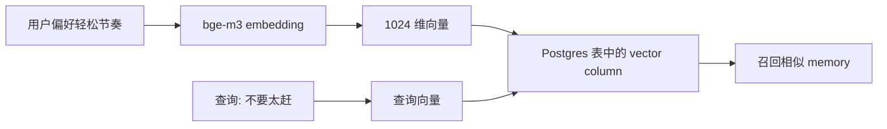

在本项目中，Ollama 运行 `bge-m3:567m`，后端通过 embedding service 请求本地 embedding endpoint。这样长期记忆可以在 Docker 本地环境中运行，不依赖额外云向量服务。

## 5. 上下文工程：让模型看到该看的信息

提示词工程关注“怎么写 prompt”。上下文工程关注更大的问题：在每一次模型调用之前，哪些信息应该进入上下文窗口，哪些信息应该被压缩，哪些信息应该留在外部工具或记忆里。

这对 ZoeyAgent 很关键。Graph state 里可能有用户请求、天气、景点候选、酒店候选、工具摘要、长期记忆、校验错误和 retry 信息。如果把所有内容都塞给 Planner，模型不仅会更慢，还可能被无关信息干扰。

ZoeyAgent 使用 `ContextAssembler` 执行类似 GSSC 的流程：

1. Gather：收集候选上下文，例如请求、记忆、工具结果。
2. Select：根据相关性、重要性和预算选择内容。
3. Structure：整理成 Planner 容易理解的上下文分区。
4. Compress：在超出 token budget 时压缩低优先级内容。

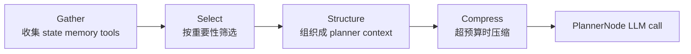

一个简单例子是：Planner 需要知道“用户偏好轻松节奏”和“故宫、天坛、景山有坐标”，但不需要知道 Amap raw response 的完整字段，也不需要读取所有失败搜索日志。ContextAssembler 会把高价值内容留下，把噪声挡在外面。

Specialist 子图也有自己的 local context builder。景点搜索不需要读取完整 planner context，只需要城市、偏好、已尝试关键词、上一轮 observation 和质量提示。这样局部 agent 保持专注，主 Planner 也不会被子图 scratchpad 污染。

## 6. Pydantic 数据合同：让 AI 输出变成应用数据

LLM 擅长生成内容，但应用需要稳定结构。旅行计划最终要被前端渲染成每日卡片、地图 marker、天气块和预算信息。如果模型今天输出“第一天去故宫”，明天输出“Day 1: Palace Museum”，前端就无法稳定消费。

Pydantic 的作用是把这些输出约束成明确模型。`TripPlanRequest` 约束输入，`TripPlan` 约束输出，`Attraction`、`Hotel`、`WeatherInfo`、`MapPoint` 约束领域数据，`TravelPlanState` 和内部 schema 约束 graph 运行状态。

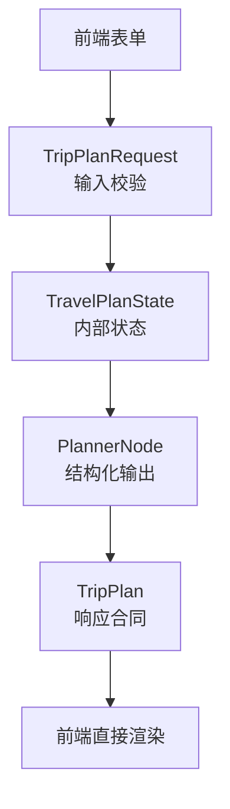

一个简单例子是天气温度。Amap provider 可能返回字符串形式的温度，系统需要统一转成整数，才能稳定展示和校验。再比如地图点，前端只接受带经纬度的 `MapPoint`，所以后端必须在生成 `DayPlan.map_points` 时过滤掉没有 `location` 的对象。

Pydantic 不只是类型提示，它也是 Agent 系统的安全边界。LLM 可以尝试生成计划，但只有通过 schema 和 validator 的结果才能出 API。

## 7. LangGraph：把一次规划变成可恢复的状态机

Agent 应用常常不是一条直线。它可能需要在校验失败后回到 Planner，也可能在工具失败后继续走 fallback，还可能根据 `session_id` 恢复同一个会话。LangGraph 的价值在于把这些步骤组织成显式 graph，而不是写成一大段嵌套 if/else。

在 ZoeyAgent 中，`TravelPlannerGraph` 是主编排层。每个节点只负责一类工作，所有节点通过 `TravelPlanState` 读写状态。checkpointer 则让同一个 `thread_id` 的状态可以在进程内恢复。

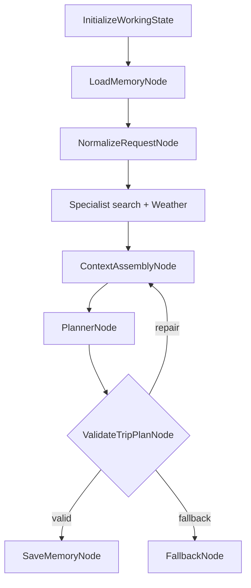

一个简单例子是 validation repair。Planner 第一次生成的计划如果缺少地图点，validator 会把错误写入 state，graph 再回到 context assembly，让下一次 Planner 调用看到“上一次失败原因：map_points missing”。这比直接返回 500 更接近真实产品需要的鲁棒性。

## 8. Docker：让复杂依赖可以被复现

这个项目依赖的不只是 Python 包。它还需要 Postgres、pgvector、前端构建环境、Nginx 代理、Amap MCP server、宿主机 Ollama embedding endpoint 等。如果完全依赖本机环境，换一台机器就可能出现 Python 版本、Node 版本、数据库扩展或路径配置问题。

Docker 的作用是把运行环境固定下来。ZoeyAgent 保留 Docker-only 启动路径：API、Postgres、pgvector、前端静态服务和 Nginx 代理都由 `docker-compose.yml` 编排。`.env` 只保留 secrets 和 provider 选择，容器网络地址和运行命令交给 Compose 管理。

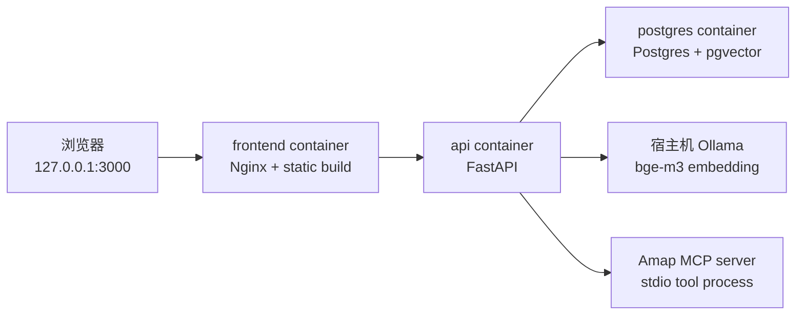

一个简单例子是前端请求。浏览器访问 `127.0.0.1:3000`，Nginx 托管 React build，并把 `/api/*` 代理到 `api:8000`。前端不需要知道 Docker 内部服务名，后端也不需要硬编码 Windows 路径。

## 9. 这些技术如何组合成 ZoeyAgent

最后，我们把这些背景知识串起来看一次完整调用。

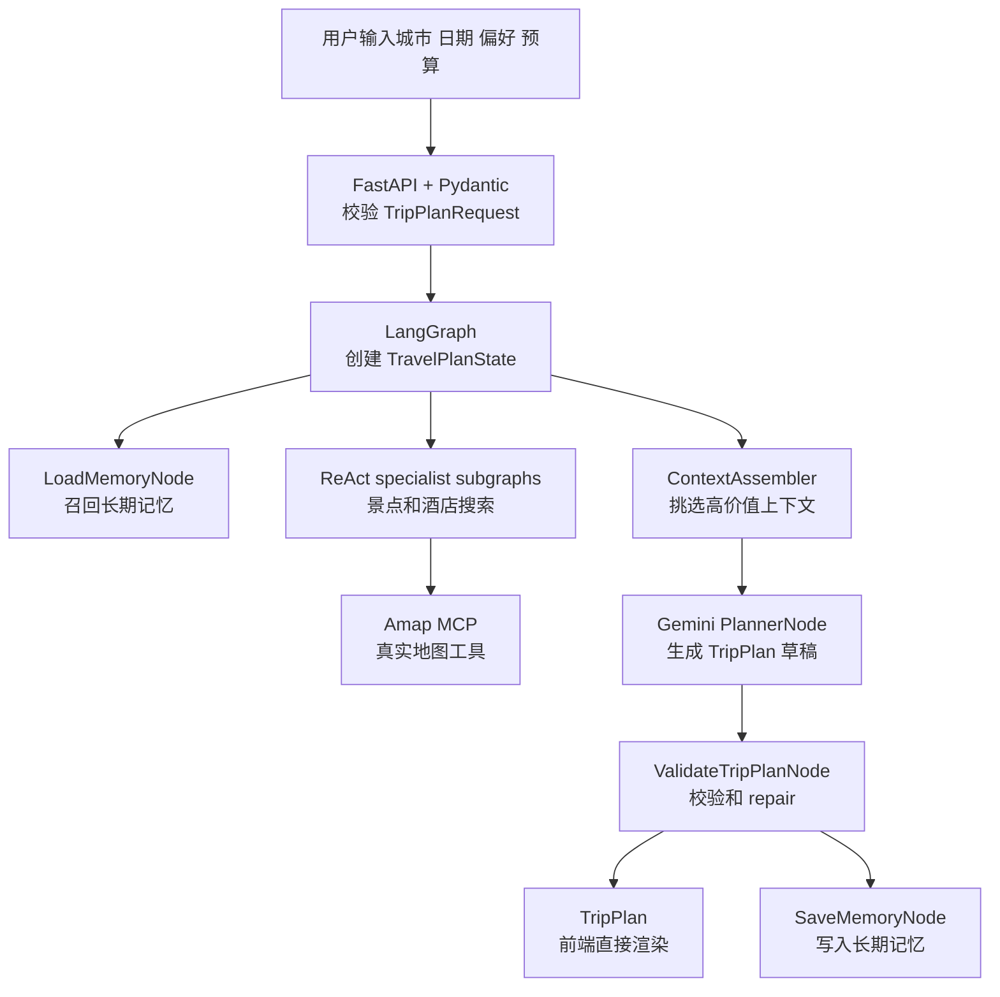

可以看到，每个技术都不是为了“显得高级”而存在：

- ReAct 让局部搜索可以根据真实 observation 调整。
- Plan-and-Solve 式主图让整体规划保持稳定步骤。
- MCP 让外部地图工具通过统一协议接入。
- Memory 让系统能保留当前 session 和跨 session 的偏好。
- Embedding + pgvector 让长期记忆可以按语义召回。
- Context engineering 让 LLM 只看到高价值信息。
- Pydantic 让 AI 输出变成前端可渲染的数据合同。
- LangGraph 让流程具备状态、分支、repair 和 fallback。
- Docker 让整套依赖可以被本地复现。

这就是 ZoeyAgent 的核心思路：把 LLM 放在适合它的位置上，让它负责需要语言理解和规划的部分；把真实数据、状态管理、校验、记忆和运行环境交给工程组件。这样构建出来的智能旅行助手，才不只是一次 prompt demo，而是一个可以继续演进的 Agent 应用。
