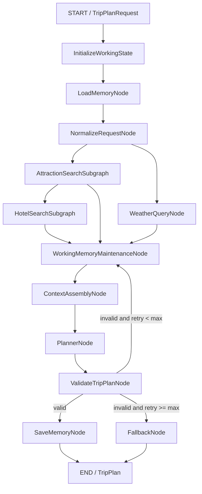
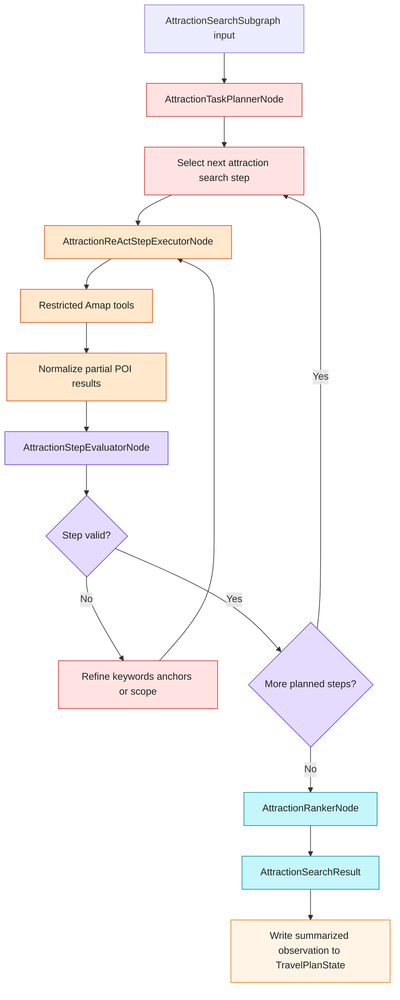
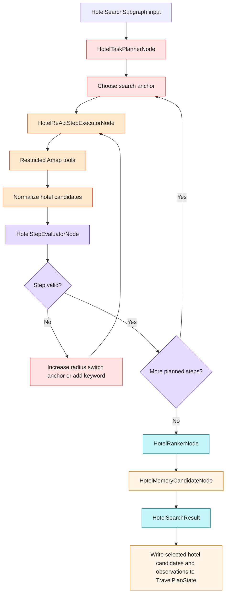

# Agents Design

This document describes the agents-layer design for a travel planning assistant built as a self-hosted Python web app.

The goal is to generate a complete, structured travel plan from a front-end form, while keeping the agents workflow understandable, testable, and easy to extend.

## Background

The product flow starts on a web page where the user enters:

- Destination cities
- Travel dates
- Indexed travel preferences
- Budget
- Transportation preference
- Accommodation preference
- Extra requirements

After the user clicks "start planning", the backend receives this form as a structured request. The agents layer then gathers required information from external tools, uses memory for personalization, generates a travel plan, validates it, and returns a structured response that the front end can render.

The backend resolves the planning `session_id` before graph execution. If the first request omits it, the backend generates one; if it is present, the backend reuses it. The graph should always receive a non-empty resolved `session_id`, and the final `TripPlan` should return that same value.

The result page needs enough structured data to show:

- Trip overview
- Per-day price totals
- Per-day attraction maps
- Daily itinerary
- Weather information
- Hotel recommendation
- Meal suggestions
- Editable attraction cards

The agents layer should therefore not return loose prose. It should return a validated, day-centric `TripPlan` object.

External provider access is defined in `tools_design.md`. The agents layer should consume normalized tool results, not raw Amap or Unsplash provider responses.

## Design Direction

Use one LangGraph state machine instead of several independent agents.

The original conceptual design had four agents:

- `AttractionSearchAgent`
- `WeatherQueryAgent`
- `HotelAgent`
- `PlannerAgent`

This design keeps the same functional responsibilities, but implements them as LangGraph nodes or subgraphs:

- `AttractionSearchSubgraph`
- `WeatherQueryNode`
- `HotelSearchSubgraph`
- `PlannerNode`

This is a better fit because LangGraph models the workflow as shared state plus directed edges. Each node reads from and writes to the same `TravelPlanState`, and Pydantic models define the shape of the data moving through the graph.

## Core Architecture



`WorkingMemoryMaintenanceNode` is shown as a conceptual checkpoint before context assembly. In implementation, working memory maintenance should primarily be enforced by helper functions around state updates, such as `append_working_message(...)` and `append_tool_observation(...)`. The conceptual node remains in the diagram to make the context hygiene boundary visible before `PlannerNode`.

## Why Hotel Search Depends on Attraction Search

Hotel recommendations should consider where the user will actually spend time.

The hotel node needs:

- Main attraction locations
- Preferred transportation
- Accommodation type
- Budget
- Distance to major itinerary areas

For that reason, `HotelSearchSubgraph` runs after `AttractionSearchSubgraph`, rather than fully in parallel with it.

Weather lookup can still run in parallel with attraction search because it only depends on destination cities and dates.

## State Design

LangGraph passes a shared state through the workflow. The state stores the original request, normalized request, memory results, tool results, generated plan, and validation status.

Representative shape:

```python
class TravelPlanState(TypedDict):
    request: TripPlanRequest
    normalized_request: NormalizedTripRequest

    working_messages: list
    trip_draft: dict
    tool_observations: list
    memory_candidates: list[MemoryCandidate]

    semantic_memories: list
    episodic_memories: list

    context_packets: list[ContextPacket]
    planner_context: str

    attraction_search_result: AttractionSearchResult
    attractions: list[Attraction]
    weather_info: list[WeatherInfo]
    hotel_search_result: HotelSearchResult
    hotels: list[Hotel]

    trip_plan: TripPlan | None
    validation_errors: list[str]
    retry_count: int
```

`attractions` and `hotels` are convenience flattened views derived from the richer subgraph results. The richer `AttractionSearchResult` and `HotelSearchResult` preserve step observations, quality checks, selected hotel, candidate hotels, and ranking reasons.

## Pydantic Role

Pydantic is used at three levels:

1. FastAPI request and response validation
2. LangGraph node input/output contracts
3. LLM structured output validation

Important models:

- `TripPlanRequest`
- `NormalizedTripRequest`
- `Location`
- `Attraction`
- `Hotel`
- `Meal`
- `WeatherInfo`
- `DayPlan`
- `TripPlan`

The front end and backend should share the same conceptual data shape. The backend returns a validated `TripPlan`, and the front end renders that directly into overview cards, per-day maps, daily itinerary sections, weather blocks, and per-day price totals.

## Node Responsibilities

### LoadMemoryNode

Purpose: load personalization context.

Input:

- `user_id`
- `TripPlanRequest`

Output:

- `semantic_memories`
- `episodic_memories`

Responsibilities:

- Retrieve long-term travel preferences from semantic memory.
- Retrieve related historical travel decisions from episodic memory.
- Provide context such as preferred travel pace, hotel preferences, rejected options, and previously confirmed choices.
- Use `PostgresStore.search(...)` for semantic recall over long-term memory. The store embeds the query with `BAAI/bge-m3` through the local vLLM embedding API and performs `pgvector` similarity search in Postgres.

### NormalizeRequestNode

Purpose: convert raw user input into a normalized planning request.

Input:

- `TripPlanRequest`
- `semantic_memories`
- `episodic_memories`

Output:

- `NormalizedTripRequest`

Responsibilities:

- Validate date range and trip length.
- Normalize budget and convert frontend enum indexes into English enum values for transportation, accommodation, and attraction preferences.
- Validate `cities` as a non-empty list of city strings.
- Merge explicit request fields with known user preferences.
- Identify missing or ambiguous planning inputs.
- Preserve long `extra_requirements`, but provide shorter task-specific excerpts to local subgraphs when possible.
- Preserve provider-returned text fields such as `city`, `name`, `address`, and `description` as-is.

### WorkingMemoryMaintenanceNode

Purpose: keep active working memory bounded and promote important overflow content before it is dropped.

Input:

- `working_messages`
- `trip_draft`
- `tool_observations`
- Existing semantic and episodic memories

Output:

- Updated `working_messages`
- Optional `memory_candidates`
- Optional semantic/episodic memory writes through `MemoryExtractionService`

Responsibilities:

- Conceptually verify that working memory is bounded before `ContextAssemblyNode`.
- In implementation, enforce the same policy through state-update helpers such as `append_working_message(...)` and `append_tool_observation(...)`.
- If `working_messages` exceeds 50 messages, take the oldest overflow messages.
- Use `MemoryExtractionService` to extract semantic/episodic candidates from the overflow messages.
- Deduplicate and write approved long-term candidates to `PostgresStore`.
- Remove overflow messages from `working_messages` after extraction.

This node does not summarize working memory and does not search working memory with BM25, TF-IDF, embeddings, or `pgvector`. Working memory remains checkpointed graph state loaded by `thread_id`.

Implementation policy:

```text
append_working_message(state, message)
  -> append message
  -> if len(working_messages) > 50:
       overflow = oldest messages beyond the 50-message limit
       MemoryExtractionService extracts semantic/episodic candidates
       approved candidates are written to PostgresStore
       working_messages keeps only the latest 50 messages
```

This makes working memory maintenance a reusable helper policy rather than a planning step that every graph branch must explicitly call.

### AttractionSearchSubgraph

Purpose: find suitable attractions through a local Plan-and-Solve workflow.

Input:

- Cities
- Attraction preferences
- Extra requirements
- Trip length

Output:

- `AttractionSearchResult`

Responsibilities:

- Create a local attraction-search plan before calling tools.
- Break attraction search into smaller tasks such as keyword generation, POI search, nearby expansion, detail enrichment, quality evaluation, and ranking.
- Use bounded ReAct executors for tool-heavy subtasks.
- Call Amap POI/search-detail/around-search tools through the shared Amap MCP integration defined in `tools_design.md`.
- Evaluate each step before moving forward.
- Replan with alternate keywords, nearby anchors, or wider search scope when results are too few or too weak.
- Merge, deduplicate, and rank attraction candidates.
- Return normalized `Attraction` candidates and a summarized observation to `TravelPlanState`.

Internal workflow:

```text
AttractionTaskPlannerNode
  -> AttractionReActStepExecutorNode
  -> AttractionStepEvaluatorNode
  -> if invalid: replan/refine and retry
  -> if valid and more steps: execute next step
  -> AttractionRankerNode
  -> AttractionSearchResult
```

Diagram:



Example local plan:

```text
1. Convert user attraction preferences into English enum intent and provider search keywords.
2. Search primary POIs for each city.
3. If result quality is low, retry with alternate keywords such as museums, historic sites, parks, food streets, shopping districts, art districts, or leisure areas.
4. Enrich important candidates with POI detail or around-search when useful.
5. Rank by preference match, coordinate completeness, rating, estimated visit value, and itinerary diversity.
```

Each executable step can use a controlled ReAct loop:

```text
Plan step
  -> choose restricted Amap tool
  -> call tool
  -> observe result
  -> normalize partial output
  -> evaluate step validity
  -> retry/replan within max retries when invalid
```

This subgraph is agentic inside a narrow boundary. It can plan, execute, evaluate, and replan locally, but it does not own the final itinerary or write long-term memory directly.

Local context:

`AttractionSearchSubgraph` should use a local prompt/context scope, not the full planner context. It can receive only:

- Cities or the current city being searched
- Preferences
- Extra requirements
- Relevant attraction-related semantic memories
- Relevant attraction-related episodic memories
- Previous attraction search attempts
- Current result quality

It should not receive full hotel details, full weather reports, the complete TripPlan schema, or all working messages.

### WeatherQueryNode

Purpose: get weather for the trip dates.

Input:

- Cities
- Start date
- End date

Output:

- `list[WeatherInfo]`

Responsibilities:

- Call the Amap weather tool through the shared Amap MCP integration defined in `tools_design.md`.
- Query weather per destination city when the request contains multiple cities.
- Normalize API response into `WeatherInfo`, including the city for each weather record.
- Convert temperature strings into integers when needed.

This node does not need an LLM or ReAct loop.

### HotelSearchSubgraph

Purpose: find suitable hotels through a local Plan-and-Solve workflow.

Input:

- Cities
- Accommodation preferences
- Budget
- Transportation preference
- Attractions

Output:

- `HotelSearchResult`

Responsibilities:

- Create a local hotel-search plan before calling tools.
- Search around itinerary anchors such as selected attractions, dinner areas, transport-convenient spots, business districts, or transit hubs.
- Use Amap tools through the shared Amap MCP integration.
- Filter and rank by distance, price, rating, hotel level, transportation convenience, and parking suitability.
- Use lightweight direction-tool summaries when useful: distance, estimated time, and transport mode only.
- Treat parking as high-priority when `transport_preference = driving`; check hotel parking evidence or nearby parking lots when possible.
- Check whether the hotel can logically fit the itinerary stay period. True availability requires a future booking provider; Amap POI alone should produce `candidate_hotels`, not guaranteed available rooms.
- Recommend a top hotel while preserving other qualified candidates in working memory / tool observations.
- Return normalized hotel candidates, selected hotel, ranking reasons, and a summarized observation to `TravelPlanState`.

Internal workflow:

```text
HotelTaskPlannerNode
  -> HotelReActStepExecutorNode
  -> HotelStepEvaluatorNode
  -> if invalid: replan/refine and retry
  -> if valid and more steps: execute next step
  -> HotelRankerNode
  -> HotelMemoryCandidateNode
  -> HotelSearchResult
```

Diagram:



Example local plan:

```text
1. Choose hotel search anchors from attractions, dinner areas, or transport-convenient areas.
2. Search hotels near anchors and aim for about 10 viable candidates per relevant city/area.
3. Score candidates by distance, estimated travel time, transport mode, price, rating, hotel level, transit convenience, and parking suitability.
4. Check whether the stay date range fits the itinerary structure. If a real availability API is absent, mark candidates as POI candidates rather than confirmed availability.
5. Select top 1 hotel for planning and keep other qualified candidates as working-memory/tool-observation candidates.
```

Example step-level ReAct/evaluator loop for hotel radius search:

```text
Executor:
  -> use geocode / known attraction coordinates
  -> choose search radius
  -> call around-search or text-search
  -> optionally call direction tool for summary distance time and mode
  -> normalize hotels

Evaluator:
  -> valid if enough hotels, locations are present, distance is computable, and required driving/parking checks were attempted
  -> invalid if too few candidates, hotels are too far, parking evidence is missing for driving trips, or candidate data is too sparse

Repair:
  -> increase radius
  -> switch anchor
  -> add business district / transit hub keyword
  -> retry within max retries
```

Local context:

`HotelSearchSubgraph` should use a local prompt/context scope. It can receive only:

- Cities or the current city/area being searched
- Accommodation preference
- Budget
- Transportation preference
- Selected attraction clusters
- Relevant hotel-related semantic memories
- Relevant hotel-related episodic memories
- Previous hotel search attempts

It should not receive full conversation history, full attraction descriptions, meal suggestions, or the full TripPlan schema.

Memory policy:

- Keep selected hotel and candidate hotels in working memory / tool observations for the current graph run.
- Do not write every hotel candidate directly to semantic or episodic memory.
- Long-term memory writes happen through `MemoryExtractionService`, usually after successful validation in `SaveMemoryNode`.
- Semantic memory is appropriate for stable preferences such as "user prefers hotels with parking".
- Episodic memory is appropriate for confirmed or rejected trip decisions such as "for this Beijing trip, hotel A was selected and hotel B was rejected".

## Specialist Subgraph Pattern

`AttractionSearchSubgraph` and `HotelSearchSubgraph` should be treated as local Plan-and-Solve specialist subgraphs. They are not fully independent open-ended agents, but they are allowed to plan, execute, evaluate, and repair their own narrow search tasks.

Shared pattern:

```text
SpecialistSearchSubgraph
  -> local input schema
  -> local task planner
  -> restricted tool set
  -> per-step ReAct executor
  -> per-step evaluator
  -> bounded retry/replan loop
  -> rank/deduplicate
  -> memory candidate preparation for working memory
  -> Pydantic output schema
  -> summarized observation back to TravelPlanState
```

The main graph remains the global Plan-and-Solve controller. Specialist subgraphs are allowed to reason iteratively within their narrow domain, but they should not own final itinerary synthesis or direct long-term memory writes.

Implementation should use a shared methodology with domain-specific local implementations. This avoids duplicated behavior rules without forcing attraction and hotel search into one universal runner or config schema.

Reusable pieces:

- `ContextAssembler`
- `PromptTemplateRegistry`
- `BaseLLMNode`
- `BaseReActStepExecutor`
- retry policy
- step observation format
- `SearchQuality`
- working-memory write helpers
- subgraph result write-back helpers

Domain-specific pieces:

- task planner prompt
- step executor prompt
- evaluator rules or evaluator prompt
- ranking policy
- allowed tools
- output schema
- memory candidate rules

The attraction and hotel subgraphs should use the same structure with domain-specific prompts, tools, evaluator rules, ranking policy, and output schema. Shared code should live in small interfaces and helpers such as context builders, retry policy, observation formatting, and result write-back, while the domain-specific ReAct loops remain inside their own subgraph modules.

Recommended internal state for each specialist subgraph:

```text
local_goal
local_plan
current_step
step_attempts
tool_observations
partial_candidates
quality_checks
retry_count
final_result
```

Each subgraph should have explicit max retry limits. If a step cannot be made valid, the subgraph should return the best available candidates plus structured quality warnings instead of blocking the whole trip planner indefinitely.

## Context Assembly Design

Context assembly has two layers:

- `ContextAssemblyNode`: the explicit main-graph node used before `PlannerNode`.
- `ContextAssembler`: a reusable class/service used inside every LLM node, including specialist subgraph LLM nodes.

Core rule:

```text
Every LLM node
  -> ContextAssembler
  -> PromptTemplate
  -> LLM call
  -> Structured output validation
  -> State update
```

Deterministic or rule-only nodes do not need `ContextAssembler`. Examples:

- `WeatherQueryNode`
- pure rule `StepEvaluatorNode`
- pure tool normalization nodes

### ContextAssemblyNode

Purpose: build the optimized planner context immediately before `PlannerNode`.

Input:

- `TripPlanRequest`
- `NormalizedTripRequest`, including original city strings and English preference enum values
- Working memory
- Trip draft
- Tool observations
- Semantic memories
- Episodic memories
- Attractions
- Weather
- Hotels
- Validation errors during repair loops

Output:

- `context_packets`
- `planner_context`

Responsibilities:

- Gather candidate context from graph state.
- Score optional context packets.
- Select the highest-value packets under the token budget.
- Structure the planner prompt into stable sections.
- Compress lower-priority sections only when needed.

`ContextAssemblyNode` implements a GSSC pipeline:

```text
Gather -> Select -> Structure -> Compress
```

Recommended sections:

```text
[Role & Planning Rules]
[User Request]
[Known User Preferences]
[Relevant Past Decisions]
[Current Trip Draft]
[Attraction Candidates]
[Weather]
[Hotel Candidates]
[Validation Errors]  # only on repair
[Output Schema]
```

This explicit node is mainly for the main planner path. Specialist subgraphs should not draw a separate `ContextAssemblyNode` before every sub-node. Instead, their LLM nodes should call the reusable `ContextAssembler` internally with a local context profile and prompt template.

### ContextAssembler

Purpose: reusable context engineering service for all LLM nodes.

It implements the same GSSC mechanism as `ContextAssemblyNode`, but with node-specific context profiles and prompt templates.

Example profiles:

```text
global_planner
attraction_task_planner
attraction_step_executor
attraction_step_evaluator
hotel_task_planner
hotel_step_executor
hotel_step_evaluator
repair_replan
```

Each LLM node configures:

- `context_profile`
- `prompt_template`
- `output_schema`
- `allowed_tools`

Specialist subgraph examples:

- `AttractionTaskPlannerNode` uses `ContextAssembler(profile="attraction_task_planner")`.
- `AttractionReActStepExecutorNode` uses `ContextAssembler(profile="attraction_step_executor")`.
- `HotelTaskPlannerNode` uses `ContextAssembler(profile="hotel_task_planner")`.
- `HotelReActStepExecutorNode` uses `ContextAssembler(profile="hotel_step_executor")`.
- If a step evaluator is LLM-based, it uses the matching evaluator profile.
- If a step evaluator is pure rules, it does not call the LLM and does not need `ContextAssembler`.

LangGraph fit:

- `ContextAssembler` does not need to be a LangGraph node.
- LangGraph nodes can be implemented as callables/classes that receive state and return state updates.
- A node can internally call `ContextAssembler`, a prompt template, an LLM, and an output validator before returning its state update.
- A compiled specialist subgraph can still be attached to the parent graph; if its local state differs from parent state, use a wrapper node to map state in and out.

Memory scoring:

```text
semantic_score = relevance * 0.65 + confidence * 0.25 + recency * 0.10

episodic_score = relevance * 0.50 + recency * 0.25 + importance * 0.20 + trip_match * 0.05
```

Compression is prompt-time only. It should not create persistent session summaries. It should compress or trim low-priority context such as old working messages, low-score episodic memories, large tool observations, or oversized candidate lists.

### PlannerNode

Purpose: generate the complete travel plan.

Input:

- `NormalizedTripRequest`
- `semantic_memories`
- `episodic_memories`
- `AttractionSearchResult`
- `list[WeatherInfo]`
- `HotelSearchResult`
- `planner_context`

Output:

- Draft `TripPlan`

Responsibilities:

- Arrange attractions across days.
- Consider weather, pace, transportation, budget, and user preferences.
- Include hotel and meal suggestions.
- Generate exactly three meal objects for each day: one `breakfast`, one `lunch`, and one `dinner`.
- Place map markers in `DayPlan.map_points`, derived from that day's attractions, hotel, and meals after coordinate enrichment.
- Do not create `MapPoint` entries for objects without valid coordinates; those objects can remain in `attractions`, `hotel`, or `meals`, but they are not map-renderable.
- Leave `Attraction.image_url` unset unless a future photo enrichment service is enabled; photo links are deferred for MVP day-trip output.
- Use route summary fields such as `route_distance_km`, `route_duration_minutes`, and `transit_method` when available from subgraph summaries.
- Do not return full route instructions such as bus line, station count, transfer detail, or turn-by-turn directions.
- Compute `DayPlan.total_price` for each day. The frontend calculates trip-level total by summing daily totals.
- Generate daily descriptions and overall suggestions.
- Return structured output matching the `TripPlan` schema.
- Use the structured `planner_context` assembled by `ContextAssemblyNode`.

This is the main LLM reasoning node.

### ValidateTripPlanNode

Purpose: ensure the generated plan is structurally valid.

Input:

- Draft `TripPlan`

Output:

- Validated `TripPlan`, or validation errors

Responsibilities:

- Validate the LLM output with Pydantic.
- Ensure required fields are present.
- Ensure dates, days, weather entries, daily map points, daily totals, and nested models are coherent.
- Ensure every day contains exactly one `breakfast`, one `lunch`, and one `dinner`.
- Ensure every day has `total_price >= 0`.
- Do not require top-level `budget` or top-level `map_points`; these are intentionally not part of the response contract.
- Ensure enum-like schema fields use English values.
- Ensure provider-returned text fields are not translated or normalized away.
- Route back to `PlannerNode` for repair if validation fails and retry count is below the limit.

### SaveMemoryNode

Purpose: extract and persist useful long-term memory after a successful, validated plan.

Input:

- `TripPlanRequest`
- Final `TripPlan`
- Working memory / graph state
- Existing semantic and episodic memories

Output:

- Memory write status

Responsibilities:

- Read the current graph state, including working messages, trip draft, tool observations, and final plan.
- Extract memory candidates from the completed planning session.
- Classify candidates as semantic memory, episodic memory, or discard.
- Save stable user preferences and reusable facts to semantic memory.
- Save confirmed, rejected, or modified travel decisions to episodic memory.
- Deduplicate against existing long-term memories before writing.
- Use `PostgresStore.put(...)` for long-term memory writes. The store indexes the configured `text` field with Postgres `pgvector` by embedding it with `BAAI/bge-m3` through the local vLLM embedding API.
- Avoid saving transient working memory unless it has long-term value.

Implementation note:

`SaveMemoryNode` should reuse the same `MemoryExtractionService` as `WorkingMemoryMaintenanceNode`. The shared service handles extraction, classification, deduplication, and writes. The nodes differ only in trigger and input scope:

- `WorkingMemoryMaintenanceNode`: triggered by overflow and processes old working messages.
- `SaveMemoryNode`: triggered after successful validation and processes the completed graph state plus final `TripPlan`.

Promotion rules:

- Stable preference or reusable fact -> semantic memory.
- Concrete event, confirmation, rejection, or modification -> episodic memory.
- Temporary detail, duplicate, or low-value chat content -> discard.

`SaveMemoryNode` should only run after `ValidateTripPlanNode` succeeds. This prevents invalid or incomplete plan data from being written into long-term memory.

### FallbackNode

Purpose: provide a safe response after repeated validation failure.

Input:

- Validation errors
- Existing search results
- Original request

Output:

- Conservative `TripPlan` or error response

Responsibilities:

- Avoid infinite retry loops.
- Return a useful fallback when possible.
- Surface clear failure information when a valid plan cannot be generated.

## API Namespace

### Generate Trip Plan

```http
POST /api/trip/plan
```

Input:

- `TripPlanRequest`

Output:

- `TripPlan`

This endpoint runs the full `TravelPlannerGraph`.

### Recalculate Trip Plan

The edit/recalculate behavior is intentionally deferred, but the namespace and signature are reserved.

```http
POST /api/trip/recalculate
```

Proposed signature:

```python
async def recalculate_trip_plan(
    request: TripRecalculateRequest,
) -> TripPlan:
    ...
```

Expected future use:

- Accept a user-edited `TripPlan`.
- Recalculate per-day price totals.
- Recalculate map route or ordering.
- Apply local changes after the user deletes or reorders attractions.
- Optionally trigger partial replanning later.

No concrete graph implementation is included for this endpoint yet.

## Summary

The agents layer is a LangGraph workflow centered around a shared `TravelPlanState`.

Specialized work is handled by nodes or subgraphs, not by separate independent agents. Attraction and hotel search are implemented as iterative subgraphs because they may need search, evaluation, retry, and ranking. Weather is a simple deterministic node. Planning is the main LLM node. Validation is handled by Pydantic and can route back to planning for repair.

This structure preserves the original functional intent of the multi-agent design while making it more reliable for a web application: data is structured, node outputs are testable, graph execution is observable, and the final response is a validated `TripPlan` that the front end can render directly.
