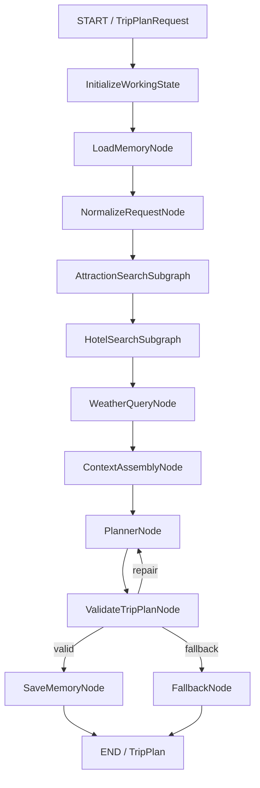
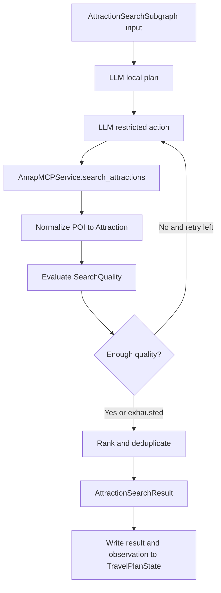
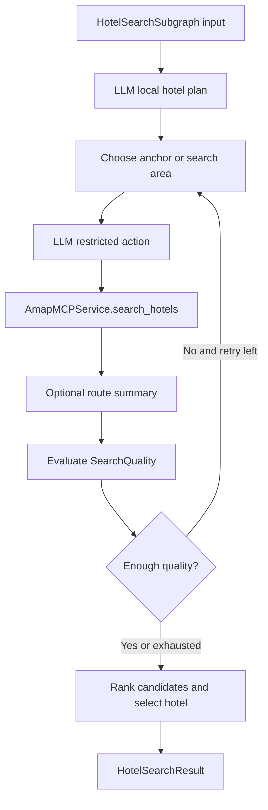

# Agents 设计

这份文档说明 ZoeyAgent 的 agents 层设计。这里的 agents 层不是多个互相独立的聊天机器人，而是一个由 LangGraph 编排的旅行规划状态机。它把一次旅行规划拆成多个节点：记忆召回、请求归一化、景点搜索、酒店搜索、天气查询、上下文组装、Planner 生成、结果校验、记忆保存和 fallback。

设计目标很直接：让系统能从前端表单生成一个结构化、可校验、可渲染的 `TripPlan`，同时保持每个节点职责清楚、容易测试、可以继续扩展。

## 背景

用户在前端输入：

- 目的地城市。
- 旅行日期。
- 交通偏好。
- 住宿偏好。
- 景点偏好。
- 预算。
- 额外要求。

后端把这些字段接收为 `TripPlanRequest`。agents 层随后会调用真实工具、召回长期记忆、生成行程草稿、校验结果，并最终返回 `TripPlan`。

结果页需要展示：

- 行程概览。
- 每日行程。
- 每日地图点。
- 酒店推荐。
- 天气信息。
- 餐食建议。
- 每日价格。
- 可编辑景点卡片。

因此 agents 层不能只返回自然语言文本。它必须返回 day-centric 的结构化模型。

## 设计方向

系统使用一个 LangGraph 主流程，而不是多个完全独立的 Agent。

早期概念里可以把系统拆成：

- 景点搜索 Agent。
- 天气查询 Agent。
- 酒店搜索 Agent。
- 行程规划 Agent。

但在 Web 应用中，更适合把它们实现为共享 `TravelPlanState` 的 graph 节点或 specialist 子图：

- `AttractionSearchSubgraph`
- `HotelSearchSubgraph`
- `WeatherQueryNode`
- `ContextAssemblyNode`
- `PlannerNode`
- `ValidateTripPlanNode`
- `SaveMemoryNode`
- `FallbackNode`

这样每一步的输入输出都能被 Pydantic 模型约束，graph 执行也更容易观察和测试。

## 主流程

当前实现的主流程如下：



需要注意两点：

1. 当前代码中 validation repair 会直接回到 `PlannerNode`，复用 state 中已有的 `planner_context` 和 `validation_errors`。后续如果要让 repair 重新组装上下文，可以再把 repair 边改回 `ContextAssemblyNode`。
2. `WorkingMemoryMaintenanceNode` 在总体架构图中是一个概念边界。实际代码主要通过 `maintain_working_messages(...)` 和 `maintain_tool_observations(...)` 这类 helper 在追加 state 时维护 working memory。

## 为什么酒店搜索依赖景点搜索

酒店推荐不能只看城市名。一个好的酒店候选应该靠近用户真正会活动的区域，例如主要景点、购物区、晚餐区域或交通方便的位置。

因此 `HotelSearchSubgraph` 在 `AttractionSearchSubgraph` 之后运行。它可以使用景点候选作为 anchor，再结合预算、交通偏好和住宿偏好搜索酒店。

天气查询只依赖城市，因此理论上可以和搜索并行。但当前实现为了主流程简单，放在酒店搜索之后执行。

## TravelPlanState

LangGraph 节点通过共享 state 协作。这个 state 不是随意 dict，而是由 `TravelPlanState` 约束字段形状。

代表性字段如下：

```python
class TravelPlanState(TypedDict):
    request: TripPlanRequest
    normalized_request: NormalizedTripRequest

    working_messages: list
    trip_draft: dict
    tool_observations: list
    memory_candidates: list[MemoryCandidate]

    semantic_memories: list
    episodic_memories: list

    context_packets: list[ContextPacket]
    planner_context: str

    attraction_search_result: AttractionSearchResult
    attractions: list[Attraction]
    hotel_search_result: HotelSearchResult
    hotels: list[Hotel]
    weather_info: list[WeatherInfo]

    trip_plan: TripPlan | None
    validation_errors: list[str]
    retry_count: int
```

`attractions` 和 `hotels` 是便捷的扁平视图。更完整的搜索过程、候选质量和排序理由保存在 `AttractionSearchResult` 和 `HotelSearchResult` 中。

## Pydantic 的作用

Pydantic 在 agents 层有三类用途：

1. API 输入输出校验。
2. graph state 和节点输出合同。
3. LLM structured output 校验。

关键模型包括：

- `TripPlanRequest`
- `NormalizedTripRequest`
- `Attraction`
- `Hotel`
- `Meal`
- `WeatherInfo`
- `DayPlan`
- `TripPlan`
- `AttractionSearchResult`
- `HotelSearchResult`
- `SearchQuality`
- `MemoryCandidate`

这样做的好处是：LLM 可以生成内容，但不能随意改变前端合同；工具可以返回真实数据，但必须先归一化成项目内部模型。

## 节点职责

### InitializeWorkingState

用途：初始化当前 graph run 的运行现场。

输入：

- `TripPlanRequest`

输出：

- 初始化后的 working state。

职责：

- 写入原始请求。
- 初始化 `working_messages`。
- 初始化 `tool_observations`。
- 初始化 `memory_candidates`、`context_packets`、`validation_errors` 和 `retry_count`。
- 不调用外部工具。
- 不写长期记忆。

### LoadMemoryNode

用途：在规划前召回个性化上下文。

输入：

- `user_id`
- `TripPlanRequest`

输出：

- `semantic_memories`
- `episodic_memories`

职责：

- 从 semantic memory 中召回稳定偏好。
- 从 episodic memory 中召回历史决策。
- 使用 `PostgresStore.search(...)`。
- 通过本地 embedding provider 和 pgvector 做语义检索。
- 如果长期记忆未启用，返回空列表并让 graph 继续执行。

### NormalizeRequestNode

用途：把前端原始输入转换成 graph 更容易消费的内部请求。

输入：

- `TripPlanRequest`

输出：

- `NormalizedTripRequest`

职责：

- 校验日期范围和旅行天数。
- 把前端 enum index 转成英文值。
- 保留中文城市名，例如 `杭州`。
- 保留 `budget` 和 `extra_requirements`。
- 确保 `session_id` 是 resolved non-empty value。
- 不调用外部工具。

### AttractionSearchSubgraph

用途：搜索和筛选景点候选。

这是 bounded ReAct 风格的 specialist 子图。它有自己的 local scratchpad，但不直接写长期记忆，也不生成最终 `TripPlan`。

输入：

- 城市。
- 景点偏好。
- 日期数量。
- 额外要求。
- 相关记忆摘要。

输出：

- `AttractionSearchResult`
- 扁平 `attractions`
- 简短 `tool_observations`

内部流程：



允许的工具入口：

```text
AmapMCPService.search_attractions(...)
```

service 内部可使用：

```text
maps_text_search
maps_search_detail
maps_geo
```

职责：

- 让 LLM 生成局部搜索计划。
- 让 LLM 在每轮选择受限 action。
- 通过 Amap service 调真实 MCP 工具。
- 对 POI 做坐标补全、归一化、去重和排序。
- 用 `SearchQuality` 判断是否 retry。
- 返回 best-effort 结果，而不是让整个 graph 卡死。

### HotelSearchSubgraph

用途：基于景点 anchor、预算、交通方式和住宿偏好搜索酒店候选。

它同样是 bounded ReAct 风格的 specialist 子图。Amap POI 只能提供候选酒店，不能确认真实房态或实时价格。

输入：

- 城市。
- 景点候选。
- 住宿偏好。
- 交通偏好。
- 预算。
- 相关记忆摘要。

输出：

- `HotelSearchResult`
- 扁平 `hotels`
- selected hotel
- 简短 `tool_observations`

内部流程：



可能使用的 service 能力：

```text
AmapMCPService.search_hotels(...)
AmapMCPService.route_summary(...)
```

service 内部可使用：

```text
maps_text_search
maps_search_detail
maps_geo
maps_direction_walking_by_address
maps_direction_driving_by_address
maps_direction_transit_integrated_by_address
```

职责：

- 基于景点 cluster 或商圈选择酒店搜索 anchor。
- 搜索住宿类 POI。
- 过滤明显不是酒店的结果。
- 根据评分、位置、交通方式、预算和距离做排序。
- 自驾场景下关注停车便利性线索。
- 输出 candidate hotels，而不是 guaranteed available rooms。

### WeatherQueryNode

用途：查询天气。

输入：

- 城市。
- 日期范围。

输出：

- `list[WeatherInfo]`

职责：

- 调用 `maps_weather`。
- 归一化天气、温度、风向和风力。
- 如果 provider 只返回近期天气，不伪造远期天气。
- 工具失败时记录 observation，并让 graph 继续执行。

这个节点不需要 LLM，也不需要 ReAct。

### ContextAssemblyNode

用途：在 Planner 前构建高质量上下文。

输入：

- 原始请求。
- 归一化请求。
- working memory。
- tool observations。
- semantic memories。
- episodic memories。
- 景点结果。
- 酒店结果。
- 天气结果。
- validation errors，如果是 repair 轮次。

输出：

- `context_packets`
- `planner_context`

它执行 GSSC：

```text
Gather -> Select -> Structure -> Compress
```

推荐 sections：

```text
[Role & Planning Rules]
[User Request]
[Known User Preferences]
[Relevant Past Decisions]
[Attraction Candidates]
[Hotel Candidates]
[Weather]
[Tool Observations]
[Validation Errors]
[Output Contract]
```

### PlannerNode

用途：生成 `TripPlan` 草稿。

输入：

- `NormalizedTripRequest`
- `planner_context`
- 景点、酒店、天气和记忆上下文。

输出：

- draft `TripPlan`

职责：

- 安排每日景点。
- 选择酒店。
- 使用天气和交通偏好调整节奏。
- 生成 day-centric `DayPlan`。
- 生成 `map_points`。
- 填充 `total_price`。
- 使用 `route_distance_km`、`route_duration_minutes`、`transit_method` 这类路线摘要。
- 不输出完整路线说明或 raw provider response。
- 餐食能力当前 deferred，不应为了凑三餐编造真实餐厅。

### ValidateTripPlanNode

用途：保证最终出 API 的结果满足业务合同。

输入：

- draft `TripPlan`

输出：

- valid `TripPlan`，或 validation errors。

职责：

- 用 Pydantic 校验 `TripPlan`。
- 校验日期数量和 `day_index`。
- 校验每日 `total_price >= 0`。
- 校验 `map_points.day_index` 不冲突。
- 校验不出现 top-level `budget` 或 top-level `map_points`。
- 校验不输出完整路线说明。
- 当前不强制每日三餐。
- 如果失败且 retry 未超限，路由回 `PlannerNode`。
- 如果 retry 超限，路由到 `FallbackNode`。

### SaveMemoryNode

用途：在有效计划生成后保存长期记忆。

输入：

- 原始请求。
- 归一化请求。
- working memory。
- tool observations。
- 最终 valid `TripPlan`。
- 已有 semantic/episodic memories。

输出：

- memory write status。

职责：

- 调用 `MemoryExtractionService`。
- 抽取 `MemoryCandidate`。
- 分类为 semantic、episodic 或 discard。
- 去重。
- 在长期记忆开启时写入 `PostgresStore`。
- 只在 `ValidateTripPlanNode` 成功后运行。

### FallbackNode

用途：在 Planner 多次 repair 失败后返回保守可控结果。

输入：

- 原始请求。
- 已有景点、酒店、天气候选。
- validation errors。

输出：

- fallback `TripPlan`。

职责：

- 避免无限 retry。
- 基于已有候选拼出可渲染计划。
- 不输出 raw provider response。
- 尽量满足 `TripPlan` 合同。

## Specialist 子图共同约束

景点和酒店子图都遵守同一套边界：

- 它们是 bounded ReAct 风格。
- 它们有自己的 local scratchpad。
- 它们通过 `SpecialistContextBuilder` 构造局部 LLM messages。
- 它们可以共用 `LLMService`，但不共享 LLM 对话历史。
- 它们只能调用项目内部 service，不直接调用 raw MCP。
- 它们不生成最终 `TripPlan`。
- 它们不直接写长期记忆。
- 它们写回主 state 的只有结构化结果和简短 observation。

推荐 local state：

```text
local_plan
attempted_keywords
local_observations
partial_candidates
quality
retry_count
```

如果搜索质量一直不足，子图应该返回 best-effort 结果和 quality warning，而不是阻塞整条规划链路。

## Context Assembly 设计

上下文组装有两层：

- `ContextAssemblyNode`：主 graph 中 Planner 前的显式节点。
- `ContextAssembler` / `SpecialistContextBuilder`：LLM 节点内部使用的可复用上下文构造能力。

主规则：

```text
LLM node
  -> context builder
  -> prompt template
  -> LLM call
  -> structured output validation
  -> state update
```

确定性节点不需要 context builder，例如：

- `WeatherQueryNode`
- 纯规则 evaluator
- provider response normalization

## API Namespace

### Generate Trip Plan

```http
POST /api/trip/plan
```

输入：

```python
TripPlanRequest
```

输出：

```python
TripPlan
```

### Recalculate Trip Plan

```http
POST /api/trip/recalculate
```

当前是预留 endpoint，返回结构化 `501 Not Implemented`。未来可用于局部重排、删除景点、重新计算价格和路线摘要。

## 小结

agents 层是一个围绕 `TravelPlanState` 运行的 LangGraph workflow。主 graph 保持全局规划结构，景点和酒店 specialist 子图负责局部 ReAct 搜索，天气节点保持确定性，Planner 负责生成计划，Validator 负责守住 API 合同，SaveMemoryNode 只在结果有效后写长期记忆。

这种结构把“会思考的 LLM”和“可靠的工程边界”分开：LLM 负责局部决策和行程生成，Pydantic、LangGraph、Amap service、memory store 和 validation 负责让系统稳定运行。
