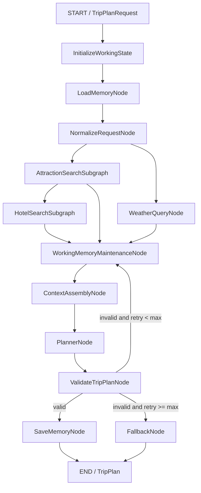

# Agents Design

This document describes the agents-layer design for a travel planning assistant built as a self-hosted Python web app.

The goal is to generate a complete, structured travel plan from a front-end form, while keeping the agents workflow understandable, testable, and easy to extend.

## Background

The product flow starts on a web page where the user enters:

- Destination city
- Travel dates
- Travel preferences
- Budget
- Transportation preference
- Accommodation type
- Extra requirements

After the user clicks "start planning", the backend receives this form as a structured request. The agents layer then gathers required information from external tools, uses memory for personalization, generates a travel plan, validates it, and returns a structured response that the front end can render.

The result page needs enough structured data to show:

- Trip overview
- Budget breakdown
- Attraction map
- Daily itinerary
- Weather information
- Hotel recommendation
- Meal suggestions
- Editable attraction cards

The agents layer should therefore not return loose prose. It should return a validated `TripPlan` object.

External provider access is defined in `tools_design.md`. The agents layer should consume normalized tool results, not raw Amap or Unsplash provider responses.

## Design Direction

Use one LangGraph state machine instead of several independent agents.

The original conceptual design had four agents:

- `AttractionSearchAgent`
- `WeatherQueryAgent`
- `HotelAgent`
- `PlannerAgent`

This design keeps the same functional responsibilities, but implements them as LangGraph nodes or subgraphs:

- `AttractionSearchSubgraph`
- `WeatherQueryNode`
- `HotelSearchSubgraph`
- `PlannerNode`

This is a better fit because LangGraph models the workflow as shared state plus directed edges. Each node reads from and writes to the same `TravelPlanState`, and Pydantic models define the shape of the data moving through the graph.

## Core Architecture



`WorkingMemoryMaintenanceNode` is shown as a conceptual checkpoint before context assembly. In implementation, working memory maintenance should primarily be enforced by helper functions around state updates, such as `append_working_message(...)` and `append_tool_observation(...)`. The conceptual node remains in the diagram to make the context hygiene boundary visible before `PlannerNode`.

## Why Hotel Search Depends on Attraction Search

Hotel recommendations should consider where the user will actually spend time.

The hotel node needs:

- Main attraction locations
- Preferred transportation
- Accommodation type
- Budget
- Distance to major itinerary areas

For that reason, `HotelSearchSubgraph` runs after `AttractionSearchSubgraph`, rather than fully in parallel with it.

Weather lookup can still run in parallel with attraction search because it only depends on city and dates.

## State Design

LangGraph passes a shared state through the workflow. The state stores the original request, normalized request, memory results, tool results, generated plan, and validation status.

Representative shape:

```python
class TravelPlanState(TypedDict):
    request: TripPlanRequest
    normalized_request: NormalizedTripRequest

    working_messages: list
    trip_draft: dict
    tool_observations: list
    memory_candidates: list[MemoryCandidate]

    semantic_memories: list
    episodic_memories: list

    context_packets: list[ContextPacket]
    planner_context: str

    attractions: list[Attraction]
    weather_info: list[WeatherInfo]
    hotels: list[Hotel]

    trip_plan: TripPlan | None
    validation_errors: list[str]
    retry_count: int
```

## Pydantic Role

Pydantic is used at three levels:

1. FastAPI request and response validation
2. LangGraph node input/output contracts
3. LLM structured output validation

Important models:

- `TripPlanRequest`
- `NormalizedTripRequest`
- `Location`
- `Attraction`
- `Hotel`
- `Meal`
- `WeatherInfo`
- `Budget`
- `DayPlan`
- `TripPlan`

The front end and backend should share the same conceptual data shape. The backend returns a validated `TripPlan`, and the front end renders that directly into overview cards, maps, daily itinerary sections, weather blocks, and budget summaries.

## Node Responsibilities

### LoadMemoryNode

Purpose: load personalization context.

Input:

- `user_id`
- `TripPlanRequest`

Output:

- `semantic_memories`
- `episodic_memories`

Responsibilities:

- Retrieve long-term travel preferences from semantic memory.
- Retrieve related historical travel decisions from episodic memory.
- Provide context such as preferred travel pace, hotel preferences, rejected options, and previously confirmed choices.
- Use `PostgresStore.search(...)` for semantic recall over long-term memory. The store embeds the query with `BAAI/bge-m3` through the local vLLM embedding API and performs `pgvector` similarity search in Postgres.

### NormalizeRequestNode

Purpose: convert raw user input into a normalized planning request.

Input:

- `TripPlanRequest`
- `semantic_memories`
- `episodic_memories`

Output:

- `NormalizedTripRequest`

Responsibilities:

- Validate date range and trip length.
- Normalize budget, preferences, accommodation type, and transportation type.
- Merge explicit request fields with known user preferences.
- Identify missing or ambiguous planning inputs.

### WorkingMemoryMaintenanceNode

Purpose: keep active working memory bounded and promote important overflow content before it is dropped.

Input:

- `working_messages`
- `trip_draft`
- `tool_observations`
- Existing semantic and episodic memories

Output:

- Updated `working_messages`
- Optional `memory_candidates`
- Optional semantic/episodic memory writes through `MemoryExtractionService`

Responsibilities:

- Conceptually verify that working memory is bounded before `ContextAssemblyNode`.
- In implementation, enforce the same policy through state-update helpers such as `append_working_message(...)` and `append_tool_observation(...)`.
- If `working_messages` exceeds 50 messages, take the oldest overflow messages.
- Use `MemoryExtractionService` to extract semantic/episodic candidates from the overflow messages.
- Deduplicate and write approved long-term candidates to `PostgresStore`.
- Remove overflow messages from `working_messages` after extraction.

This node does not summarize working memory and does not search working memory with BM25, TF-IDF, embeddings, or `pgvector`. Working memory remains checkpointed graph state loaded by `thread_id`.

Implementation policy:

```text
append_working_message(state, message)
  -> append message
  -> if len(working_messages) > 50:
       overflow = oldest messages beyond the 50-message limit
       MemoryExtractionService extracts semantic/episodic candidates
       approved candidates are written to PostgresStore
       working_messages keeps only the latest 50 messages
```

This makes working memory maintenance a reusable helper policy rather than a planning step that every graph branch must explicitly call.

### AttractionSearchSubgraph

Purpose: find suitable attractions.

Input:

- City
- Preferences
- Extra requirements
- Trip length

Output:

- `list[Attraction]`

Responsibilities:

- Generate POI search keywords from preferences.
- Call Amap POI search through the shared Amap MCP tool defined in `tools_design.md`.
- Evaluate whether results are sufficient.
- Retry with alternate keywords when results are too few or too weak.
- Merge, deduplicate, and rank attractions.

Example internal loop:

```text
Build keyword
-> Search Amap POI
-> Evaluate result count and quality
-> Retry with alternate keyword if needed
-> Merge and rank
```

This subgraph can behave like a controlled ReAct-style search loop, but with explicit retry limits and quality rules.

Local context:

`AttractionSearchSubgraph` should use a local prompt/context scope, not the full planner context. It can receive only:

- City
- Preferences
- Extra requirements
- Relevant attraction-related semantic memories
- Relevant attraction-related episodic memories
- Previous attraction search attempts
- Current result quality

It should not receive full hotel details, full weather reports, the complete TripPlan schema, or all working messages.

### WeatherQueryNode

Purpose: get weather for the trip dates.

Input:

- City
- Start date
- End date

Output:

- `list[WeatherInfo]`

Responsibilities:

- Call the Amap weather tool through the shared Amap MCP integration defined in `tools_design.md`.
- Normalize API response into `WeatherInfo`.
- Convert temperature strings into integers when needed.

This node does not need an LLM or ReAct loop.

### HotelSearchSubgraph

Purpose: find suitable hotels.

Input:

- City
- Accommodation preference
- Budget
- Transportation preference
- Attractions

Output:

- `list[Hotel]`

Responsibilities:

- Search hotels using Amap POI through the shared Amap MCP tool defined in `tools_design.md`.
- Prefer areas close to major attraction clusters.
- Filter by distance, price, and rating when available.
- Retry using alternate areas such as attraction names, business districts, or transit hubs.
- Merge, deduplicate, and rank hotel candidates.

Example internal loop:

```text
Search hotels
-> Evaluate distance, price, rating
-> Refine area if hotels are too far or too weak
-> Search again
-> Merge and rank
```

Local context:

`HotelSearchSubgraph` should use a local prompt/context scope. It can receive only:

- City
- Accommodation preference
- Budget
- Transportation preference
- Selected attraction clusters
- Relevant hotel-related semantic memories
- Relevant hotel-related episodic memories
- Previous hotel search attempts

It should not receive full conversation history, full attraction descriptions, meal suggestions, or the full TripPlan schema.

## Specialist Subgraph Pattern

`AttractionSearchSubgraph` and `HotelSearchSubgraph` should be treated as controlled ReAct-style specialist subgraphs, not as fully independent open-ended agents.

Shared pattern:

```text
SpecialistSearchSubgraph
  -> local input schema
  -> local prompt builder
  -> restricted tool set
  -> local result evaluator
  -> retry/refine loop
  -> rank/deduplicate
  -> Pydantic output schema
  -> summarized observation back to TravelPlanState
```

The main graph remains the Plan-and-Solve controller. Specialist subgraphs are allowed to reason iteratively within their narrow domain, but they should not own global planning or memory writes.

Implementation can use shared helper/factory functions instead of class inheritance. The important part is shared behavior and contracts, not Python inheritance.

### ContextAssemblyNode

Purpose: build the optimized planner context immediately before `PlannerNode`.

Input:

- `TripPlanRequest`
- `NormalizedTripRequest`
- Working memory
- Trip draft
- Tool observations
- Semantic memories
- Episodic memories
- Attractions
- Weather
- Hotels
- Validation errors during repair loops

Output:

- `context_packets`
- `planner_context`

Responsibilities:

- Gather candidate context from graph state.
- Score optional context packets.
- Select the highest-value packets under the token budget.
- Structure the planner prompt into stable sections.
- Compress lower-priority sections only when needed.

`ContextAssemblyNode` implements a GSSC pipeline:

```text
Gather -> Select -> Structure -> Compress
```

Recommended sections:

```text
[Role & Planning Rules]
[User Request]
[Known User Preferences]
[Relevant Past Decisions]
[Current Trip Draft]
[Attraction Candidates]
[Weather]
[Hotel Candidates]
[Validation Errors]  # only on repair
[Output Schema]
```

It should be used before major planner reasoning calls. Specialist subgraphs should use smaller local prompt builders rather than the full global context assembly.

Memory scoring:

```text
semantic_score = relevance * 0.65 + confidence * 0.25 + recency * 0.10

episodic_score = relevance * 0.50 + recency * 0.25 + importance * 0.20 + trip_match * 0.05
```

Compression is prompt-time only. It should not create persistent session summaries. It should compress or trim low-priority context such as old working messages, low-score episodic memories, large tool observations, or oversized candidate lists.

### PlannerNode

Purpose: generate the complete travel plan.

Input:

- `NormalizedTripRequest`
- `semantic_memories`
- `episodic_memories`
- `list[Attraction]`
- `list[WeatherInfo]`
- `list[Hotel]`
- `planner_context`

Output:

- Draft `TripPlan`

Responsibilities:

- Arrange attractions across days.
- Consider weather, pace, transportation, budget, and user preferences.
- Include hotel and meal suggestions.
- Generate daily descriptions and overall suggestions.
- Return structured output matching the `TripPlan` schema.
- Use the structured `planner_context` assembled by `ContextAssemblyNode`.

This is the main LLM reasoning node.

### ValidateTripPlanNode

Purpose: ensure the generated plan is structurally valid.

Input:

- Draft `TripPlan`

Output:

- Validated `TripPlan`, or validation errors

Responsibilities:

- Validate the LLM output with Pydantic.
- Ensure required fields are present.
- Ensure dates, days, weather entries, budget fields, and nested models are coherent.
- Route back to `PlannerNode` for repair if validation fails and retry count is below the limit.

### SaveMemoryNode

Purpose: extract and persist useful long-term memory after a successful, validated plan.

Input:

- `TripPlanRequest`
- Final `TripPlan`
- Working memory / graph state
- Existing semantic and episodic memories

Output:

- Memory write status

Responsibilities:

- Read the current graph state, including working messages, trip draft, tool observations, and final plan.
- Extract memory candidates from the completed planning session.
- Classify candidates as semantic memory, episodic memory, or discard.
- Save stable user preferences and reusable facts to semantic memory.
- Save confirmed, rejected, or modified travel decisions to episodic memory.
- Deduplicate against existing long-term memories before writing.
- Use `PostgresStore.put(...)` for long-term memory writes. The store indexes the configured `text` field with Postgres `pgvector` by embedding it with `BAAI/bge-m3` through the local vLLM embedding API.
- Avoid saving transient working memory unless it has long-term value.

Implementation note:

`SaveMemoryNode` should reuse the same `MemoryExtractionService` as `WorkingMemoryMaintenanceNode`. The shared service handles extraction, classification, deduplication, and writes. The nodes differ only in trigger and input scope:

- `WorkingMemoryMaintenanceNode`: triggered by overflow and processes old working messages.
- `SaveMemoryNode`: triggered after successful validation and processes the completed graph state plus final `TripPlan`.

Promotion rules:

- Stable preference or reusable fact -> semantic memory.
- Concrete event, confirmation, rejection, or modification -> episodic memory.
- Temporary detail, duplicate, or low-value chat content -> discard.

`SaveMemoryNode` should only run after `ValidateTripPlanNode` succeeds. This prevents invalid or incomplete plan data from being written into long-term memory.

### FallbackNode

Purpose: provide a safe response after repeated validation failure.

Input:

- Validation errors
- Existing search results
- Original request

Output:

- Conservative `TripPlan` or error response

Responsibilities:

- Avoid infinite retry loops.
- Return a useful fallback when possible.
- Surface clear failure information when a valid plan cannot be generated.

## API Namespace

### Generate Trip Plan

```http
POST /api/trip/plan
```

Input:

- `TripPlanRequest`

Output:

- `TripPlan`

This endpoint runs the full `TravelPlannerGraph`.

### Recalculate Trip Plan

The edit/recalculate behavior is intentionally deferred, but the namespace and signature are reserved.

```http
POST /api/trip/recalculate
```

Proposed signature:

```python
async def recalculate_trip_plan(
    request: TripRecalculateRequest,
) -> TripPlan:
    ...
```

Expected future use:

- Accept a user-edited `TripPlan`.
- Recalculate budget.
- Recalculate map route or ordering.
- Apply local changes after the user deletes or reorders attractions.
- Optionally trigger partial replanning later.

No concrete graph implementation is included for this endpoint yet.

## Summary

The agents layer is a LangGraph workflow centered around a shared `TravelPlanState`.

Specialized work is handled by nodes or subgraphs, not by separate independent agents. Attraction and hotel search are implemented as iterative subgraphs because they may need search, evaluation, retry, and ranking. Weather is a simple deterministic node. Planning is the main LLM node. Validation is handled by Pydantic and can route back to planning for repair.

This structure preserves the original functional intent of the multi-agent design while making it more reliable for a web application: data is structured, node outputs are testable, graph execution is observable, and the final response is a validated `TripPlan` that the front end can render directly.
