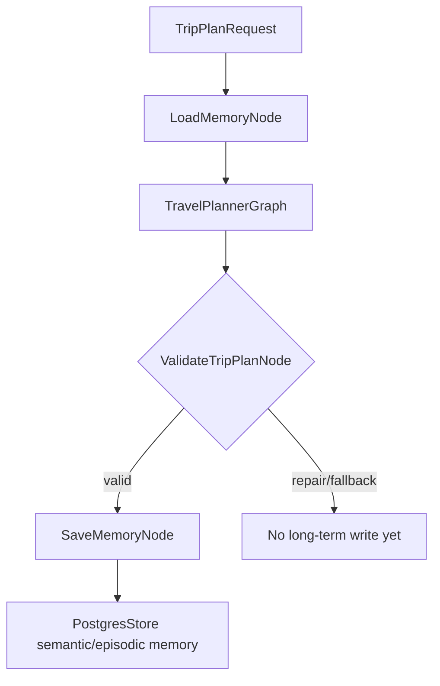

# 记忆设计

这份文档说明 ZoeyAgent 的记忆系统。旅行规划助手如果每次请求都从零开始，就很难体现个性化；但如果把所有对话和工具结果都永久保存，又会产生噪声、隐私和成本问题。因此项目把记忆分成两层：当前 session 的 working memory，以及跨 session 的 long-term memory。

当前 MVP 使用：

- LangGraph state + `InMemorySaver` 保存当前 session 的 checkpoint。
- LangGraph `PostgresStore` + Postgres + pgvector 保存长期记忆。
- Ollama `bge-m3:567m` 作为本地 embedding provider。
- `MemoryExtractionService` 统一处理 overflow 和 final valid plan 的候选记忆抽取。

## 背景

旅行助手需要记忆，主要是因为三个问题：

1. 个性化：记住用户稳定偏好，例如轻松节奏、酒店等级、喜欢历史文化景点。
2. 连续性：记住当前 planning session 中已经发生的事情，例如用户刚补充“不要太赶”。
3. 历史经验：记住具体决策，例如用户上次拒绝了离景点太远的酒店。

这些信息生命周期不同，所以不应该全部放在同一个存储里。

## 记忆类型

当前只实现三类记忆：

| 类型 | 保存内容 | 生命周期 | 后端 |
| --- | --- | --- | --- |
| Working memory | 当前 session 的消息片段、工具摘要、草稿状态 | 当前进程和当前 session | LangGraph state + `InMemorySaver` |
| Semantic memory | 稳定偏好或可复用事实 | 跨 session | `PostgresStore` + pgvector |
| Episodic memory | 具体历史事件或决策 | 跨 session | `PostgresStore` + pgvector |

Perceptual memory 不在 MVP 范围内。

## Working Memory

Working memory 是当前 session 的短期上下文。它回答的是：

- 用户这轮刚说了什么？
- 当前正在规划哪次旅行？
- 已经有哪些工具调用摘要？
- 当前 graph state 里有哪些临时假设？

Working memory 存在 `TravelPlanState` 中，并通过 `InMemorySaver` 做 checkpoint。它不是长期数据库，也不会跨进程持久化。

调用流程：

```text
TripPlanRequest
  -> backend resolves session_id
  -> session_id becomes LangGraph thread_id
  -> graph.ainvoke(..., config={"configurable": {"thread_id": session_id}})
  -> InMemorySaver stores/restores state snapshot for that thread_id
```

如果前端第一次请求没有 `session_id`，后端会生成一个并在 `TripPlan.session_id` 里返回。前端后续同一 planning session 应该带回这个值。

需要注意的是，`InMemorySaver` 保存的是 graph state snapshot。它不是 semantic memory，也不是 episodic memory。它不会自动判断哪些信息值得长期保存。

Working memory 示例：

```json
{
  "working_messages": [
    {
      "role": "user",
      "content": "用户希望行程不要太赶"
    }
  ],
  "tool_observations": [
    "Amap 搜索北京历史文化返回 18 个 POI，保留 9 个"
  ],
  "trip_draft": {}
}
```

## Semantic Memory

Semantic memory 保存稳定偏好或可复用事实。它更像用户画像片段。

命名空间：

```python
(user_id, "semantic_memories")
```

示例：

```json
{
  "text": "用户偏好轻松节奏，不喜欢每天安排太满。",
  "memory_type": "travel_preference",
  "confidence": 0.9
}
```

适合保存：

- 用户偏好轻松旅行。
- 用户喜欢历史文化景点。
- 用户通常选择经济型酒店。
- 用户不喜欢离景点太远的住宿。

不适合保存：

- 某次工具调用返回了多少个 POI。
- 一次临时失败。
- 已经存在的重复偏好。

## Episodic Memory

Episodic memory 保存具体历史事件或决策。它更像“过去发生过什么”。

命名空间：

```python
(user_id, "episodic_memories")
```

示例：

```json
{
  "text": "用户在一次北京旅行规划中拒绝了离主要景点太远的酒店。",
  "event_type": "option_rejected",
  "session_id": "session_001",
  "importance": 0.8
}
```

适合保存：

- 用户确认过一次杭州 4 天游。
- 用户拒绝某家酒店，因为离景点太远。
- 用户把某天从博物馆主题改成自然风光。
- 用户在某次规划中选择了王府井附近住宿。

## PostgresStore 和 pgvector

长期记忆通过 LangGraph `PostgresStore` 写入 Postgres。开启 embedding index 后，`text` 字段会被转成向量并存入 pgvector。

应用代码应使用 Store API：

```python
store.put(namespace, key, value)
store.search(namespace, query=query, limit=limit)
```

不要直接依赖 LangGraph 内部表结构。这样后续升级 LangGraph 或调整 store wrapper 时，业务代码不需要大范围修改。

## EmbeddingService

当前本地 embedding provider 是 Ollama：

```text
Provider: ollama
Base URL from API container: http://host.docker.internal:11434
Model: bge-m3:567m
API: /api/embed
Vector dimension: 1024
Embedded field: text
```

写入和检索必须使用同一个 embedding 模型。如果未来切换到 vLLM 或 OpenAI-compatible embedding endpoint，已有长期记忆需要重新 embedding 并重建索引。

## 向量检索流程

### 写入路径

当 `SaveMemoryNode` 决定保存一条长期记忆时：

1. 创建包含 `text` 字段的 memory item。
2. 调用 `PostgresStore.put(namespace, key, value)`。
3. Store 取出配置好的 embedded field，也就是 `text`。
4. `EmbeddingService` 调用 Ollama `/api/embed`。
5. bge-m3 返回 1024 维向量。
6. Postgres 保存 JSON 文档和 pgvector 向量索引。

示例：

```python
store.put(
    (user_id, "semantic_memories"),
    "pref_relaxed_travel",
    {
        "text": "用户偏好轻松旅行，不喜欢每天安排太满。",
        "memory_type": "travel_preference",
        "confidence": 0.9,
    },
)
```

### 读取路径

当 `LoadMemoryNode` 需要召回长期记忆时：

1. 调用 `PostgresStore.search(namespace, query=..., limit=...)`。
2. query 被同一个 embedding provider 转成向量。
3. Postgres 使用 pgvector 做相似度检索。
4. 返回最相关的 semantic 或 episodic memories。
5. 这些记忆写入 `TravelPlanState`，供 ContextAssembler 和 Planner 使用。

示例：

```python
semantic_memories = store.search(
    (user_id, "semantic_memories"),
    query="这次旅行应该考虑用户哪些偏好？",
    limit=5,
)
```

Working memory 不使用向量检索。它直接存在 graph state 里。

## MemoryExtractionService

系统不会把 working memory 原样复制到长期记忆。所有长期记忆写入前都要经过 `MemoryExtractionService`。

职责：

- 读取 working memory 或最终有效 `TripPlan`。
- 抽取 `MemoryCandidate`。
- 分类为 semantic、episodic 或 discard。
- 做基础去重和置信度过滤。
- 把候选写回 graph state。
- 由 `SaveMemoryNode` 在合适时机写入长期 store。

候选形状：

```python
class MemoryCandidate(BaseModel):
    target: Literal["semantic", "episodic", "discard"]
    text: str
    reason: str
    confidence: float
    metadata: dict = {}
```

## 触发点 1：Working Memory Overflow

Working memory 不应该无限增长。当前策略是保留最新 50 条消息或观察。

当追加消息或工具观察时，统一通过 helper 维护：

```text
maintain_working_messages(state, message)
  -> append message
  -> if len(working_messages) > 50:
       overflow = oldest messages beyond limit
       MemoryExtractionService extracts candidates
       approved candidates are added to memory_candidates
       working_messages keeps latest 50

maintain_tool_observations(state, observation)
  -> append observation
  -> if len(tool_observations) > limit:
       overflow = oldest observations beyond limit
       MemoryExtractionService extracts candidates
       approved candidates are added to memory_candidates
       tool_observations keeps latest limit
```

也就是说，overflow 不是一个独立后台任务自动扫描数据库，而是在每次 append working memory 时由 helper 触发。

## 触发点 2：Final Valid TripPlan

最终有效计划生成后，还会进行一次记忆抽取：

```text
ValidateTripPlanNode valid
  -> SaveMemoryNode
  -> MemoryExtractionService
  -> PostgresStore.put(...)
```

这次抽取很重要，因为有些长期价值只有在计划完成后才明确。例如用户最终选择了哪个酒店、接受了什么节奏、拒绝了什么候选。

它和 overflow 抽取可能有少量重叠，因此 `MemoryExtractionService` 需要做去重。重复候选不应重复写入长期记忆。

## 分类规则

保存为 semantic memory：

- 稳定偏好。
- 可复用事实。
- 对未来旅行规划仍有价值的信息。

示例：

```text
用户偏好轻松节奏。
用户通常选择经济型酒店。
用户喜欢历史文化景点。
```

保存为 episodic memory：

- 具体事件。
- 确认、拒绝或修改过的旅行决策。

示例：

```text
用户确认过北京 3 天游。
用户拒绝了离景点太远的酒店。
用户把第 2 天从博物馆改成自然风光。
```

丢弃：

- 临时加载状态。
- 普通寒暄。
- 重复记忆。
- 没有影响最终计划的工具噪声。

## 与 Agents 层的关系

记忆系统接入 graph 的方式如下：



`LoadMemoryNode` 在规划前读取长期记忆。  
`SaveMemoryNode` 在有效计划后写长期记忆。  
working memory 则贯穿整个 graph run，服务当前 session 的连续性。

## 生命周期

一次请求结束后，Python 局部变量里的当前 state 会被释放；如果启用了 `InMemorySaver`，同一个 `thread_id` 的 snapshot 会留在进程内存中。进程重启后，这些 working memory 会丢失。

长期记忆不同。semantic 和 episodic memories 写入 PostgresStore 后可以跨 session、跨进程重启继续使用。

这个设计是有意的：

- 临时上下文留在 working memory。
- 长期有价值的信息才进入 PostgresStore。
- 不把每次工具调用和所有候选 POI 都永久保存。

## 小结

ZoeyAgent 的记忆系统分为两层：

- Working memory：当前 session 的短期上下文，存在 LangGraph state 和 `InMemorySaver`。
- Long-term memory：跨 session 的偏好和历史决策，存在 PostgresStore + pgvector。

`MemoryExtractionService` 是两者之间的转换层。它会在 working memory overflow 和 final valid plan 后抽取候选记忆，但只有通过分类、去重和置信度过滤的内容才会进入长期记忆。
