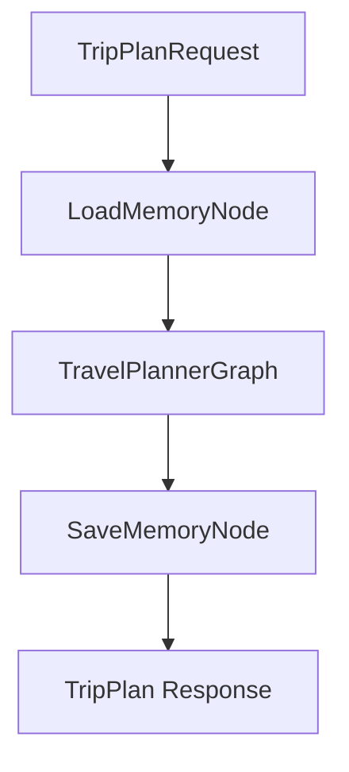

# Memory Design

This document describes the memory design for a travel planning assistant built as a self-hosted Python web app.

The goal is to give the assistant useful continuity across a planning session and across future sessions, without storing every message forever or overcomplicating the MVP.

Target architecture:

- Python web app
- LangGraph agents workflow
- Postgres-backed long-term memory
- Local OpenAI-compatible embedding API served by vLLM with `BAAI/bge-m3`

## Background

The travel assistant receives form input from the front end, generates a structured itinerary, and may later support user edits such as deleting attractions or changing the order of a day plan.

The assistant needs memory for three practical reasons:

1. Personalization: remember stable user preferences such as relaxed travel pace, hotel level, disliked options, and food interests.
2. Continuity: remember important travel decisions such as confirmed routes, rejected hotels, or changed dates.
3. Current-session coherence: keep track of the ongoing conversation, current trip draft, and temporary tool results while one planning session is active.

This design separates short-lived working memory from long-term memory.

Working memory is only for the current session. It is not persisted. If something in working memory becomes important, it can be promoted into semantic or episodic memory.

Long-term memory is stored in LangGraph `PostgresStore` and supports memory-level semantic search using embeddings.

## Design Direction

Use three memory types:

- Working memory
- Semantic memory
- Episodic memory

Do not implement perceptual memory for the MVP.

The memory layer supports the agents workflow, especially these LangGraph nodes:

- `LoadMemoryNode`: retrieves relevant semantic and episodic memories before planning.
- `SaveMemoryNode`: extracts useful long-term memory candidates after a successful plan; durable writes are added in the long-term memory step.

## Scope

This design uses three memory types:

- Working memory
- Semantic memory
- Episodic memory

Perceptual memory is intentionally out of scope.

## Memory Types

| Memory type | Stores | Lifecycle | Backend |
| --- | --- | --- | --- |
| Working memory | Current session messages, trip draft, tool observations | Current session only | LangGraph state + `InMemorySaver` checkpointer |
| Semantic memory | Long-term travel preferences | Long-term | LangGraph `PostgresStore` + embedding index |
| Episodic memory | Confirmed, rejected, or modified travel decisions | Long-term | LangGraph `PostgresStore` + embedding index |

## Working Memory

Working memory is not persisted.

It maintains the current session context inside LangGraph state, with `InMemorySaver` used as the checkpointer.

Recommended setup:

- Working memory backend: LangGraph state + `InMemorySaver`
- `thread_id`: resolved `session_id` or `trip_session_id`
- TTL: handled at the app/session layer

- Current session messages
- Current `trip_draft`
- Temporary tool observations

Important content from working memory can be promoted into semantic or episodic memory.

Working memory is useful for questions like:

- What has the user said in this session?
- What trip is currently being planned?
- What tool results have already been collected?
- What assumptions are currently active?

Working memory is loaded by continuing the LangGraph run with the same `thread_id`. It is not searched through BM25, TF-IDF, embeddings, or `pgvector`.

Loading flow:

```text
session_id / trip_session_id
  -> backend resolves missing session_id by generating a new one
  -> resolved value is used as LangGraph thread_id
  -> InMemorySaver restores the checkpointed TravelPlanState
  -> nodes read working_messages, trip_draft, and tool_observations directly from state
```

The first planning request may omit `session_id`. In that case, the backend returns the generated value in `TripPlan.session_id`. The frontend or backend session layer must keep the resolved `session_id` / `trip_session_id` and pass it back on later calls that belong to the same planning session.

Example:

```json
{
  "messages": [],
  "trip_draft": {
    "destination": "Japan",
    "days": 7,
    "budget": 12000,
    "pace": "relaxed",
    "open_questions": ["departure_city", "exact_dates"]
  },
  "tool_observations": []
}
```

## Semantic Memory

Semantic memory stores stable, reusable user travel preferences.

It should represent facts that are likely to remain useful across future trips.

Namespace:

```python
(user_id, "semantic_memories")
```

Example:

```json
{
  "text": "User prefers relaxed travel and does not like overpacked daily itineraries.",
  "memory_type": "travel_preference",
  "confidence": 0.9,
  "updated_at": "2026-05-17T10:00:00"
}
```

Uses:

- Personalize recommendations
- Avoid repeatedly asking for known preferences
- Reuse preferences across sessions

Examples of semantic memories:

- User prefers relaxed travel.
- User dislikes overpacked daily itineraries.
- User prefers 4-star hotels.
- User likes food-focused trips.
- User avoids red-eye flights.

## Episodic Memory

Episodic memory stores concrete travel decision events.

It should represent something that happened at a specific time or in a specific trip/session.

Namespace:

```python
(user_id, "episodic_memories")
```

Example:

```json
{
  "text": "User confirmed a 7-day Japan trip split as 3 days in Tokyo and 4 days in Osaka.",
  "event_type": "trip_decision_confirmed",
  "trip_id": "japan_2026_may",
  "session_id": "session_001",
  "importance": 0.8,
  "timestamp": "2026-05-17T10:20:00"
}
```

Uses:

- Recall previously confirmed, rejected, or modified choices
- Explain why the current plan is arranged a certain way
- Avoid recommending options the user already rejected

Examples of episodic memories:

- User confirmed Tokyo 3 days and Osaka 4 days for the Japan trip.
- User rejected a hotel because it was too far from the main attractions.
- User changed the travel dates from June 10-16 to June 12-18.
- User removed a museum from the itinerary.

## Postgres Role

Postgres is used through LangGraph `PostgresStore`.

It stores long-term semantic and episodic memories as:

- Namespace
- Key
- JSON document

With an embedding index configured, the store can support semantic search over memory text.

Design decision:

Semantic and episodic memory recall should use `PostgresStore` semantic search, backed by a vectorized embedding index in Postgres using `pgvector`.

The application should interact with memory through LangGraph Store APIs such as `put`, `get`, and `search`, rather than raw SQL against LangGraph's internal tables.

## Embedding Model

Use `BAAI/bge-m3` served locally through vLLM's OpenAI-compatible embeddings API.

Recommended settings:

- Model: `BAAI/bge-m3`
- Serving layer: vLLM
- API style: OpenAI-compatible `/v1/embeddings`
- Vector dimension: `1024`
- Embedded field: `text`

The same embedding model must be used for both writes and searches. If the embedding model changes later, semantic and episodic memories should be re-embedded and the index rebuilt.

## Vector Search Flow

Semantic and episodic memories use the same vector-search flow.

### Write Path

When `SaveMemoryNode` decides to persist a memory:

1. It creates a memory item with a clear `text` field.
2. It calls `PostgresStore.put(namespace, key, value)`.
3. `PostgresStore` extracts the configured embedded field, currently `text`.
4. The `text` value is sent to the local vLLM embedding API.
5. `BAAI/bge-m3` returns a 1024-dimensional embedding vector.
6. `PostgresStore` stores the JSON memory value and updates the Postgres `pgvector` index.

Example semantic memory write:

```python
store.put(
    (user_id, "semantic_memories"),
    "pref_relaxed_travel",
    {
        "text": "User prefers relaxed travel and dislikes overpacked daily itineraries.",
        "memory_type": "travel_preference",
        "confidence": 0.9,
    },
)
```

Example episodic memory write:

```python
store.put(
    (user_id, "episodic_memories"),
    "episode_rejected_far_hotel",
    {
        "text": "User rejected a hotel because it was too far from the main attractions.",
        "event_type": "option_rejected",
        "trip_id": "beijing_2025_11",
        "importance": 0.8,
    },
)
```

### Read Path

When `LoadMemoryNode` needs relevant memories:

1. It calls `PostgresStore.search(namespace, query=..., limit=...)`.
2. `PostgresStore` sends the natural-language query to the same vLLM embedding API.
3. `BAAI/bge-m3` returns a 1024-dimensional query vector.
4. Postgres performs `pgvector` similarity search against the indexed memory vectors.
5. The closest semantic or episodic memories are returned.
6. The retrieved memories are added to `TravelPlanState` for `PlannerNode`.

Example semantic memory search:

```python
semantic_memories = store.search(
    (user_id, "semantic_memories"),
    query="What travel preferences should be considered for this user?",
    limit=5,
)
```

Example episodic memory search:

```python
episodic_memories = store.search(
    (user_id, "episodic_memories"),
    query="Has the user rejected hotels far from attractions before?",
    limit=5,
)
```

Working memory does not use vector search. It remains in LangGraph state with `InMemorySaver`.

## Memory Flow In Agents

Memory connects to the agents graph through two nodes.



`LoadMemoryNode` runs before planning. It searches semantic and episodic memory using the user's request.

`SaveMemoryNode` runs after successful plan validation. In the extraction step, it extracts memory candidates from the current session, classifies them as semantic memory, episodic memory, or discard, deduplicates against existing candidates, and keeps approved candidates in graph state. In the long-term memory step, it is extended to write useful semantic and episodic memories to the right namespace.

## Working Memory Extraction

Working memory is not copied wholesale into long-term memory.

Instead, the system uses a shared `MemoryExtractionService` that can be called by different graph nodes.

Responsibilities:

- Read working memory or completed graph state.
- Extract memory candidates.
- Classify each candidate as semantic memory, episodic memory, or discard.
- Deduplicate candidates against existing memories.
- Return approved candidates for the current graph state. Durable writes to `PostgresStore` belong to the long-term memory step.

Candidate shape:

```python
class MemoryCandidate(BaseModel):
    target: Literal["semantic", "episodic", "discard"]
    text: str
    reason: str
    confidence: float
    metadata: dict = {}
```

### Trigger 1: Working Memory Overflow

Working memory keeps recent context, but it should not grow without bound.

When a new prompt, LLM response, or tool observation is appended:

```text
maintain_working_messages(state, message)
  -> append message
  -> if len(working_messages) > 50:
       overflow_messages = oldest messages beyond the 50-message limit
       MemoryExtractionService extracts semantic/episodic candidates
       approved candidates are added to memory_candidates
       overflow_messages are removed from working_messages
```

This prevents active session state from growing indefinitely while preserving long-term value before old messages are dropped.

This maintenance policy is implemented as a helper around state updates. The agents design may show a conceptual `WorkingMemoryMaintenanceNode` before context assembly, but the actual enforcement should happen whenever working memory is appended.

### Trigger 2: Valid TripPlan

After a successful plan:

```text
ValidateTripPlanNode -> SaveMemoryNode -> MemoryExtractionService
```

The extraction input includes:

- Original request
- Normalized request
- Working messages
- Trip draft
- Tool observations
- Final validated `TripPlan`
- Existing semantic and episodic memories

This final extraction pass captures stable preferences and concrete decisions that only become clear after the validated plan exists.

### Classification Rules

Save to semantic memory when the candidate is a stable preference or reusable fact:

- User prefers relaxed travel.
- User dislikes shopping-focused attractions.
- User usually chooses economy hotels.
- User likes historical and cultural attractions.

Save to episodic memory when the candidate is a concrete event or decision:

- User rejected a hotel because it was too far from attractions.
- User confirmed the Beijing 3-day public-transit itinerary.
- User changed Day 2 from museums to natural scenery.
- User exported the final itinerary.

Discard:

- Temporary loading states
- Routine acknowledgements
- Duplicate memories
- Tool results that did not affect the final plan

## Pipeline

1. User input enters working memory.
2. Retrieve long-term preferences from semantic memory.
3. Retrieve related historical decisions from episodic memory.
4. Build the current context.
5. Let the LLM reason and call tools as needed.
6. Update working memory.
7. Extract, classify, and deduplicate important information:
   - Long-term preference -> semantic memory
   - Concrete confirmed/rejected/modified decision -> episodic memory
   - Temporary or duplicate detail -> discard
8. Keep extracted candidates in graph state for the current step.
9. In the long-term memory step, write approved semantic/episodic memories to `PostgresStore`.
10. Return the response.

## Promotion Rules

Working memory should not be saved wholesale.

Only promote information when it has long-term value.

Promote to semantic memory when the information is a stable preference or reusable fact:

- "I prefer relaxed trips."
- "I do not like red-eye flights."
- "I usually choose economy hotels."

Promote to episodic memory when the information is a concrete event or decision:

- "User confirmed the hotel near Wangfujing."
- "User rejected the first itinerary because it was too rushed."
- "User changed Day 2 from museums to natural scenery."

Do not save temporary or low-value details:

- One-off wording from the current chat
- Temporary loading states
- Tool results that did not influence the final plan
- Duplicate memories already stored with the same meaning

## Relationship to Agents Design

The memory design supports the LangGraph agents design.

In the agents workflow:

- `LoadMemoryNode` retrieves semantic and episodic memories.
- `PlannerNode` uses those memories to personalize the itinerary.
- `SaveMemoryNode` extracts important preferences and decisions as memory candidates; durable writes are handled by the long-term memory step.

Working memory stays inside the active graph state and is discarded when the session ends, except for information promoted into long-term memory.

The `InMemorySaver` checkpointer improves access to active session state during runtime, but it is not durable. If the app restarts or the process crashes, working memory is lost. This is intentional for the MVP because important information is promoted to semantic or episodic memory.

## Summary

Working memory handles only the current session through LangGraph state and `InMemorySaver`; it is not durable.

Semantic memory stores long-term travel preferences in `PostgresStore`.

Episodic memory stores historical travel decision events in `PostgresStore`.

Both semantic and episodic memory use an embedding index for memory-level semantic search.
