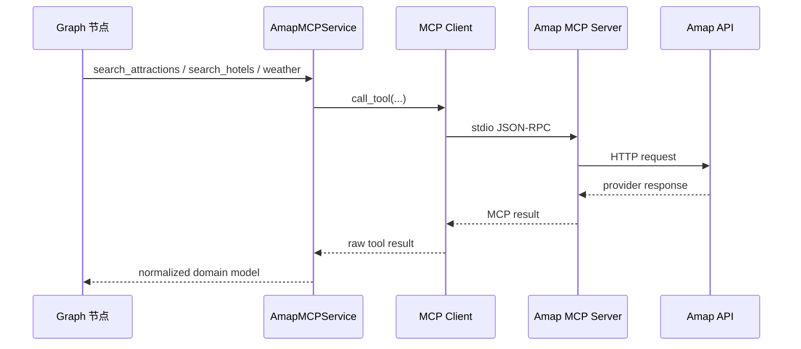

# 工具层设计

这份文档说明 ZoeyAgent 如何接入外部工具。旅行规划需要真实世界数据：景点、酒店、天气、坐标和路线摘要都不能只靠 LLM 编造。工具层的职责就是把外部 provider 的复杂响应封装起来，给 graph 节点返回项目内部可用的 Pydantic 模型。

当前 MVP 使用 Amap MCP。图片 enrichment、完整路线导航和真实酒店库存都暂时 deferred。

## 背景

旅行规划需要这些外部数据：

- Amap POI 搜索提供景点和酒店候选。
- Amap detail/geocode 提供坐标补全。
- Amap weather 提供天气。
- Amap direction tools 提供轻量路线摘要。

外部工具返回的数据形状并不稳定。例如，坐标可能是 `"116.397128,39.916527"` 字符串，也可能需要通过 detail 或 geocode 额外补全。如果这些 raw response 直接进入 Planner，LLM 很容易被 provider 字段干扰，前端也很难稳定渲染。

因此工具层必须尽早归一化。

## 设计方向

使用一个共享的 Amap MCP service：

```text
LangGraph node / specialist subgraph
  -> AmapMCPService
  -> MCP Python client
  -> sugarforever/amap-mcp-server
  -> Amap external API
  -> normalized Pydantic model
```

设计原则：

- graph 节点不直接调用 raw MCP。
- Planner 不直接读取 raw Amap response。
- Amap MCP server 不为每个子图重复启动。
- 所有 Amap 工具调用都经过 `AmapMCPService`。
- 工具失败时写入简短 observation，而不是让整个 graph 崩溃。

## Amap MCP 集成

当前使用 `sugarforever/amap-mcp-server`，通过 stdio 方式连接。

Docker-safe 配置：

```text
AMAP_MCP_COMMAND=amap-mcp-server
AMAP_MCP_ARGS=
AMAP_MAPS_API_KEY=...
```

不要在 `.env` 里写 Windows 本机路径，例如 `C:\Users\...\amap-mcp-server.exe`。Docker 镜像内已经安装 server，容器中直接使用命令名即可。

概念调用路径：



## MVP 使用的 MCP 工具

当前需要支持的真实 MCP 工具名：

```text
maps_text_search
maps_search_detail
maps_geo
maps_weather
maps_direction_walking_by_address
maps_direction_driving_by_address
maps_direction_transit_integrated_by_address
```

未来可考虑的工具：

```text
maps_regeocode
maps_around_search
```

当前实现不要把 `maps_around_search` 当成必须存在的 MVP 工具。酒店和景点的搜索主要通过 text search、detail 和 geocode 完成。

## 城市输入规则

面向 Amap 查询时，`TripPlanRequest.cities` 应传中文城市名，例如：

```json
["北京"]
```

真实测试中，英文城市名例如 `["Beijing"]` 可能召回北京以外的 POI。因此前端可以自行决定 UI 展示语言，但传给后端的 provider-facing 城市字段应使用高德可稳定识别的中文城市名。

## 景点搜索

消费者：

```text
AttractionSearchSubgraph
```

项目内部入口：

```python
AmapMCPService.search_attractions(keywords, city)
```

内部可能调用：

```text
maps_text_search
maps_search_detail
maps_geo
```

归一化目标：

```python
AttractionSearchResult
Attraction
```

工作方式：

1. 子图 LLM 生成受限 action，例如搜索“杭州 自然风光”。
2. executor 调用 `AmapMCPService.search_attractions(...)`。
3. service 调用 `maps_text_search`。
4. 如果 text search 返回 POI ID 但缺坐标，调用 `maps_search_detail`。
5. 如果 detail 仍缺坐标，调用 `maps_geo`。
6. 归一化为 `Attraction`。
7. 子图去重、排序、质量评估，写回 `AttractionSearchResult`。

景点子图不能把 raw MCP response 直接写给 Planner。

## 酒店搜索

消费者：

```text
HotelSearchSubgraph
```

项目内部入口：

```python
AmapMCPService.search_hotels(keywords, city)
AmapMCPService.route_summary(...)
```

内部可能调用：

```text
maps_text_search
maps_search_detail
maps_geo
maps_direction_walking_by_address
maps_direction_driving_by_address
maps_direction_transit_integrated_by_address
```

归一化目标：

```python
HotelSearchResult
Hotel
```

酒店搜索需要基于景点 anchor、预算、交通方式和住宿偏好。自驾场景下，还要关注停车便利性或到主要景点区域的驾车时间。

重要限制：

- Amap POI 可以发现酒店候选。
- Amap POI 不能确认真实房态。
- Amap POI 不能保证实时价格。
- 输出应理解为 `candidate_hotels`，不是 booking guarantee。

酒店 route 字段只保存轻量摘要：

```text
distance_to_main_area_km
estimated_travel_time_minutes
transit_method
```

## 天气查询

消费者：

```text
WeatherQueryNode
```

工具：

```text
maps_weather
```

归一化目标：

```python
list[WeatherInfo]
```

天气节点不需要 LLM，也不需要 ReAct。它只负责调用工具并把结果转成：

```text
city
date
day_weather
night_weather
day_temp
night_temp
wind_direction
wind_power
```

如果 provider 只返回近期天气，不应伪造远期天气。

## Route Summary

direction tools 可以用于轻量路线摘要，但不返回完整路线说明。

可用工具：

```text
maps_direction_walking_by_address
maps_direction_driving_by_address
maps_direction_transit_integrated_by_address
```

允许返回：

```text
route_distance_km
route_duration_minutes
transit_method
```

不返回：

```text
公交线路细节
站点数量
换乘详情
步行/驾车逐步导航
完整 polyline
turn-by-turn instructions
```

如果路线摘要不可用，字段保持 `None`：

```text
route_distance_km = None
route_duration_minutes = None
```

Route summary 不是地图数据。前端地图渲染依赖 `MapPoint.location`，因此地图点仍然必须来自带坐标的景点、酒店或餐食。

## Provider Response Normalization

### 坐标

Amap 可能返回：

```text
"116.397128,39.916527"
```

工具层应转换为：

```python
Location(longitude=116.397128, latitude=39.916527)
```

真实 `maps_text_search` 响应可能只包含：

```text
id
name
address
typecode
```

坐标补全流程：

```text
maps_text_search
  -> if poi_id exists and no location: maps_search_detail(id)
  -> if detail still has no location: maps_geo(address/name, city)
  -> normalized Attraction / Hotel
  -> create MapPoint only if location exists
```

### 评分

provider 评分可能是字符串，也可能缺失。归一化为：

```python
float | None
```

有效范围：

```text
0 <= rating <= 5
```

### 价格

价格可能缺失、文本化或不可解析。归一化为：

```python
int
```

未知价格使用 `0`，表示暂时无法估算，不代表真实免费。

### 图片

`Attraction.image_url` 是未来 enrichment 预留字段。当前 MVP 不调用 Unsplash 或其他图片服务，缺失时保持：

```python
image_url = None
```

## Deferred Image Enrichment

图片 enrichment 当前 deferred。

原因：

- 行程规划不依赖图片。
- 图片工具会增加 LLM/tool 复杂度。
- 结果页可以先展示文本和地图。
- `image_url` 已经作为 nullable slot 预留。

未来可接入：

```python
class ImageEnrichmentService:
    async def get_photo_url(self, query: str) -> str | None:
        ...
```

未来流程：

```text
TripPlan generated
  -> for each attraction without image_url
  -> search image by attraction name + city
  -> set image_url if found
```

## Graph 集成

工具层被这些节点消费：

```text
AttractionSearchSubgraph
  -> AmapMCPService.search_attractions
  -> normalized AttractionSearchResult

HotelSearchSubgraph
  -> AmapMCPService.search_hotels
  -> route summary helper
  -> normalized HotelSearchResult

WeatherQueryNode
  -> AmapMCPService.weather
  -> normalized list[WeatherInfo]
```

Specialist 子图只拿自己需要的工具：

- 景点子图拿景点搜索相关入口。
- 酒店子图拿酒店搜索和路线摘要相关入口。
- 天气节点拿天气入口。

Planner 不直接调用工具。

## 错误处理

工具失败不应该在可 fallback 时让整个 graph 崩溃。

推荐行为：

- 景点搜索失败：返回空候选，记录 tool observation。
- 酒店搜索失败：返回空候选或 best-effort selected hotel，记录 observation。
- 天气失败：返回空 `weather_info`，记录 observation。
- route summary 失败：route 字段保持 `None`。
- 图片 enrichment deferred：`image_url = None`。

写入 working memory 的工具观察应是简短摘要：

```text
Amap 搜索北京历史文化返回 18 个 POI，保留 9 个。
```

不要把完整 raw provider response 写进 working memory。

## 配置

必需：

```text
AMAP_MAPS_API_KEY=...
```

Docker Compose 覆盖：

```text
AMAP_MCP_COMMAND=amap-mcp-server
AMAP_MCP_ARGS=
```

可选/预留：

```text
ENABLE_IMAGE_ENRICHMENT=false
UNSPLASH_ACCESS_KEY=...
```

这些图片相关配置当前不参与 MVP 主链路。

## 测试建议

先单独测试工具层：

```text
搜索北京历史文化景点
查询北京天气
搜索北京经济型酒店
验证 maps_search_detail 是否补全坐标
验证 maps_geo 是否在 detail 缺坐标时兜底
验证 route summary 只返回距离、耗时、交通方式
```

再通过 graph endpoint 测试：

```http
POST /api/trip/plan
```

关键检查：

- 返回合法 `TripPlan`。
- map points 只来自有坐标的对象。
- 不返回完整路线说明。
- 不暴露 raw Amap response。
- 工具失败时 graph 可以继续或 fallback。

## MVP 边界

当前不包含：

- Unsplash/photo enrichment 主链路。
- LLM 可直接调用图片工具。
- 完整路线规划说明。
- 地图 polyline。
- 真实酒店库存。
- 生产级 rate limiting。
- 工具结果缓存。
- MCP server 生命周期 dashboard。

## 小结

工具层的核心职责是把真实 Amap MCP 能力变成项目内部稳定模型。Amap MCP 提供外部数据，`AmapMCPService` 负责调用和归一化，specialist 子图负责局部搜索策略，Planner 只消费干净的 `Attraction`、`Hotel`、`WeatherInfo` 和 route summary。

这样可以让 LLM 使用真实世界数据，同时避免 raw provider response 污染 graph state 和前端合同。
