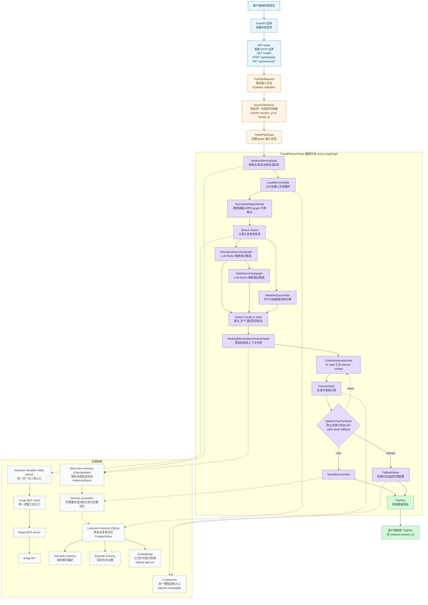
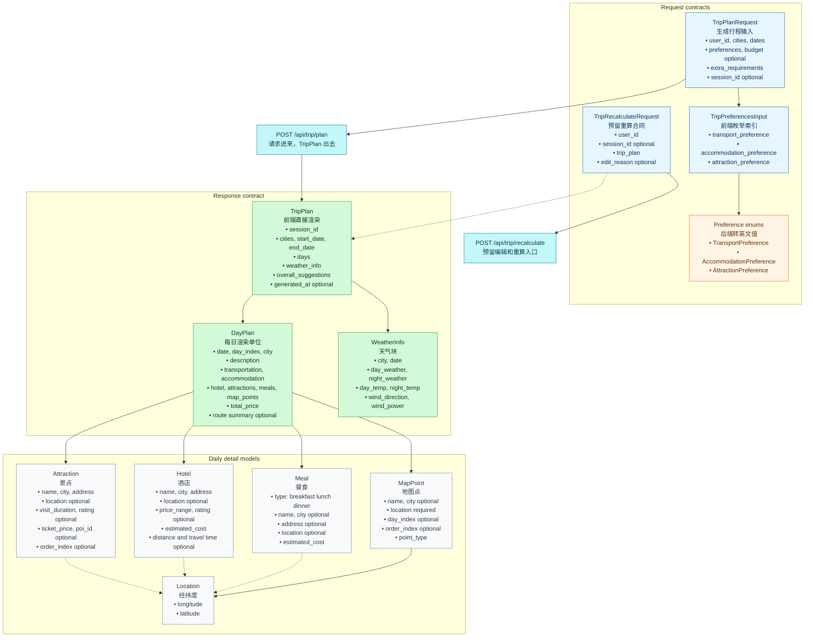
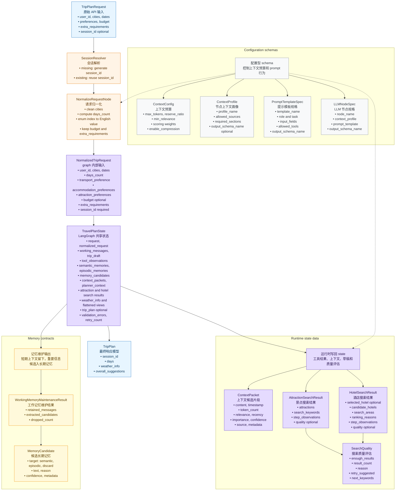

# Walk Through

这份文档是一份面向学习的项目导览。我们会先从整体架构开始，理解一次旅行规划请求是如何在系统中流转的；然后逐层拆解每个组件为什么存在；最后回到 Pydantic 数据结构，看看这些模型如何把前端、后端、智能体、工具和记忆系统连接起来。

## 总体架构

### 为什么这样设计

在构建智能旅行助手时，我们面对的并不是一个简单的“问答”问题。用户只输入城市、日期、预算和偏好，但系统需要完成景点搜索、酒店筛选、天气查询、路线摘要、记忆召回、行程生成和结果校验等一连串工作。如果把所有逻辑都塞进一个大 prompt，短期看起来很快，长期就会很难维护：工具失败时不知道哪里坏了，LLM 输出不稳定时不好修复，前端需要的数据格式也很容易被打破。

因此这个项目采用分层编排的方式。FastAPI 负责 Web 应用最外层的请求入口，LangGraph 负责把一次规划拆成多个可观察的步骤，Amap MCP 负责连接真实地图数据，memory 负责让系统记住用户偏好，Pydantic 则负责把所有输入和输出约束成稳定的数据模型。这样设计的目标不是把架构画得复杂，而是让每一层都只处理自己擅长的问题。

可以把 FastAPI 理解成应用的门口。用户从浏览器或终端提交请求，FastAPI 负责接住它、验证它、创建依赖，然后把任务交给 graph。它不会自己搜索景点，也不会自己拼行程。这样做的好处是 HTTP 边界很清楚，未来不管前端是 React、移动端还是命令行，都可以复用同一个 `POST /api/trip/plan` 合同。

LangGraph 则像一次规划任务的流程图。一次旅行计划不会一步完成，而是会经历初始化、记忆召回、请求归一化、景点搜索、酒店搜索、天气查询、上下文组装、Planner 生成、结果校验和记忆保存。每个节点只做一类事情，节点之间通过 `TravelPlanState` 传递结构化状态。这样我们既能单独测试某个节点，也能在结果不合格时把错误带回 Planner 进行修复。

Amap MCP 被放在工具层，是因为外部 API 的响应往往不适合直接交给 LLM 或前端。比如 POI 搜索、天气、地理编码和路线摘要都有自己的字段格式。项目内部会先通过 Amap service 把这些 raw response 归一化为 `Attraction`、`Hotel`、`WeatherInfo` 和 `MapPoint`，再交给 graph 使用。这样 Planner 看到的是项目自己的领域模型，而不是 provider 的原始 JSON。

记忆系统被拆成 short-term memory 和 long-term memory。短期记忆服务同一个 planning session，例如用户刚刚补充“不要太赶”，或者某次工具调用返回了哪些候选；长期记忆服务跨 session 的偏好复用，例如用户长期喜欢历史文化景点，或者曾经拒绝过离景点太远的酒店。这个拆分能避免把所有临时信息都写进长期记忆，也能让下一次规划更贴近用户。

最后，Pydantic 是整个系统的数据合同。AI 可以生成文本，但应用需要的是稳定结构；外部工具可以返回真实数据，但前端需要的是可渲染字段。Pydantic 的作用就是把这些不稳定来源统一约束起来，让每一层都知道自己接收什么、返回什么、哪里需要校验。

### 一次请求如何被编排

让我们顺着一次真实请求走一遍。用户在前端填写“北京、一天、公共交通、历史文化、预算 1200”后，前端会把这些字段组成 `TripPlanRequest` 发给后端。如果请求里没有 `session_id`，后端会生成一个新的；如果前端已经保存了 `session_id`，后端会继续复用它。这个值会被映射成 LangGraph 的 `thread_id`，用于恢复同一次规划的状态。

进入 graph 后，`InitializeWorkingState` 会把当前请求放入运行现场，`LoadMemoryNode` 会根据 `user_id` 召回长期记忆，`NormalizeRequestNode` 会把前端偏好索引、日期范围和城市信息转换成 graph 更容易使用的格式。到这一步，系统已经从“外部请求”进入了“内部规划状态”。

接下来进入搜索阶段。景点搜索和酒店搜索使用 bounded ReAct 风格的 specialist subgraph：LLM 负责提出局部搜索计划和下一步 action，Amap service 负责真实工具调用，规则 evaluator 负责判断候选是否足够、坐标是否完整、是否需要 retry。天气节点比较简单，它只依赖城市和日期，因此不需要 LLM 参与。

当景点、酒店和天气都写回 state 后，`ContextAssemblyNode` 会开始做一件很关键的事：从大量信息中挑出 Planner 真正需要看的内容。它会综合用户请求、长期记忆、工具摘要、候选结果和上一次 validation errors，组装成 planner context。随后 `PlannerNode` 根据这个上下文生成 `TripPlan` 草稿。

生成草稿并不意味着可以直接返回。`ValidateTripPlanNode` 会检查日期数量、`day_index`、地图点、价格、交通方式、节奏密度等合同要求。如果结果不合格，graph 会把错误带回 `ContextAssemblyNode` 和 `PlannerNode`，让 Planner 带着具体问题重新生成。如果多次修复仍然失败，`FallbackNode` 会根据已有候选拼出一个保守但可控的计划，避免 API 直接失败。

只有最终 `TripPlan` 通过校验后，`SaveMemoryNode` 才会从本轮 working memory 和有效计划中抽取长期记忆候选。也就是说，系统不会把失败计划、工具噪声或临时错误直接写入长期记忆，而是只沉淀对未来规划真正有帮助的信息。

如果你想把这条主线放进一个具体请求里看，可以继续阅读 [示例工作流：杭州自驾旅行规划](doc/example_workflow.md)。它用一条杭州自驾请求展示每个节点会做什么、会调用哪些工具、哪些内容会进入 state，以及什么时候才会保存长期记忆。

如果你想继续拆开每一层看，可以按下面的路径阅读延伸设计文档：[Backend Design](doc/backend_design.md) 解释 FastAPI、依赖注入、生命周期和 API 边界；[Agents Design](doc/agents_design.md) 解释 LangGraph 主流程、specialist ReAct 子图、Planner、Validate 和 Fallback；[Tools Design](doc/tools_design.md) 解释 Amap MCP、坐标补全、route summary 和 provider response normalization；[Memory Design](doc/memory_design.md) 解释 working memory、semantic memory、episodic memory、overflow 抽取和 PostgresStore。

## 组件职责速览

这一节从高层到低层介绍每个组件。阅读时可以带着一个问题：如果没有这个组件，系统会在哪一步变得混乱？这样就能更自然地理解它为什么存在。

### HTTP 边界

**FastAPI 应用** 是整个系统的入口。一个旅行规划应用首先要接收 HTTP 请求、管理启动和关闭过程，并把外部依赖准备好。FastAPI 在这里提供了清晰的应用边界：它注册 `/health`、`/api/trip/plan` 和 memory 调试路由，也负责在生命周期中初始化 graph、Amap client、LLM client 和 memory store。规划逻辑不写在 FastAPI 里，因为这些逻辑需要被测试和复用。

**API routes** 可以理解成 HTTP 世界和 graph 世界之间的翻译层。它们从请求体中读取 `TripPlanRequest`，解析或生成 `session_id`，调用 graph，然后把 `TripPlan` 返回给前端。route 的职责越薄，系统越容易维护；如果 route 里开始搜索景点、拼 prompt 或选择酒店，后面的 graph 就会失去清晰边界。

**TripPlanRequest** 是前端提交的原始表单模型。它记录用户输入的城市、日期、偏好索引、预算、额外要求和可选 `session_id`。在这个项目中，面向 Amap 查询的城市应该使用中文名，例如 `北京`。这是因为高德的 POI 搜索对英文城市名并不稳定，如果传入 `Beijing`，可能召回北京以外的结果。

**SessionResolver** 解决的是“同一次规划如何续接”的问题。第一次请求没有 `session_id` 时，后端会生成新的 UUID；后续请求如果属于同一个 planning session，前端需要把这个值带回来。它会成为 LangGraph 的 `thread_id`，让 checkpointer 能恢复同一次规划的状态。前端不把完整 ID 展示给用户，只在本地保存并自动提交；后端日志会打印 exact ID，方便开发调试。

### Graph 运行现场

**TravelPlanState** 是一次 graph run 的运行现场。你可以把它理解成这次规划任务的工作台：原始请求、归一化请求、工具结果、记忆召回、planner context、草稿计划、最终计划、校验错误和 retry 计数都会放在这里。LangGraph 节点不是互相传一堆零散参数，而是围绕这个 state 逐步读写。

**Working memory** 是当前 session 的短期上下文。它保存的是“接下来规划还可能用得上”的信息，例如用户刚说“不要太赶”，或者刚才 Amap 搜索返回了多少候选。它不是长期用户画像，也不适合保存完整聊天历史。通过 checkpointer，它可以跟随同一个 `thread_id` 在多次请求之间恢复。

**working_messages** 保存对后续规划有用的消息片段。比如“用户偏好轻松节奏”值得保留，而完整 HTTP payload 通常没有必要长期保留。这样做可以让 state 保持可控，不会因为多轮请求不断膨胀。

**tool_observations** 保存工具调用摘要，而不是外部工具的原始响应。比如“Amap 搜索杭州历史文化返回 18 个 POI，保留 9 个”。Planner 需要知道工具发生了什么，但不需要阅读冗长、字段不稳定的 raw JSON。

**attraction_search_result** 是景点搜索可以被后续节点直接消费的结构化结果。它包含候选景点、搜索关键词、质量评估和子图观察。酒店搜索会基于它选择位置 anchor，Planner 会基于它安排每日景点。它和 `tool_observations` 的区别在于：前者是数据，后者是过程说明。

**hotel_search_result** 保存酒店搜索结果，包括 selected hotel、候选酒店、搜索区域和排序理由。需要注意的是，Amap POI 只能提供候选酒店信息，不能确认实时房态或真实价格。因此这里的酒店结果是规划候选，不是预订系统的库存承诺。

**weather_info** 保存归一化后的天气记录。天气查询的 action 空间很小，只需要按城市调用 provider 并转成 `WeatherInfo`。如果 provider 只返回近期天气，而用户选择远期日期，系统不应该编造天气，只能返回真实可用的数据或在前端解释不可用。

### 记忆系统

**Long-term memory** 解决跨 session 复用的问题。Working memory 只服务当前会话，而长期记忆保存那些下次规划仍然有价值的信息，例如用户喜欢轻松节奏、偏好历史文化景点、曾经拒绝过离景点太远的酒店。

**Semantic memory** 保存稳定偏好或事实。它更像用户画像中的片段，例如“用户偏好历史文化景点”或“用户不喜欢太赶的行程”。下一次规划时，这些内容可以被召回，让 Planner 更早贴近用户习惯。

**Episodic memory** 保存具体发生过的事件。它更像一段历史记录，例如“用户上次选择了王府井附近酒店”或“用户上次删除了过远景点”。这类记忆能帮助系统理解过去的决策，而不是只知道抽象偏好。

**MemoryExtractionService** 负责判断哪些短期内容值得沉淀。Working memory overflow 或最终有效 `TripPlan` 都可能产生候选记忆，但不是所有内容都应该保存。这个服务会把候选分类为 semantic、episodic 或 discard，先过滤掉临时噪声，再交给长期记忆层处理。

**LongTermMemoryStore** 是长期记忆的持久化边界。项目使用 LangGraph `PostgresStore`、Postgres 和 pgvector 保存 memory text 与向量。读取时按 `user_id` 和 query 进行语义召回，写入时只保存通过分类和过滤的候选。

**EmbeddingService** 负责把文本转成向量。当前本地实现使用 Ollama `bge-m3:567m`，生成 1024 维 embedding。pgvector 并不是另一个数据库，而是在 Postgres 表中增加 vector column，让系统可以在传统 SQL 数据旁边进行语义相似度搜索。

### 上下文和模型调用

**ContextAssembler** 解决的是“到底应该给 LLM 看什么”。Graph state 里有用户请求、记忆、天气、景点、酒店、工具摘要和错误信息，但 prompt 不能无限长，也不能把无关内容全部塞进去。ContextAssembler 会根据 profile、来源、重要性和 token budget 挑选内容，组装成 Planner 可以使用的上下文。

**ContextAssemblyNode** 是主规划链路里的上下文组装节点。它位于搜索结果之后、Planner 之前，只负责把 state 中的信息整理成 planner context。它不查工具，也不生成行程；它的价值在于让 Planner 面对的是经过筛选的输入，而不是杂乱的运行状态。

**SpecialistContextBuilder** 是 ReAct 子图自己的局部上下文构造器。景点搜索和酒店搜索只需要局部目标、候选、observation 和 retry 信息，不应该读取完整 planner context。这样可以避免局部搜索被全局规划信息干扰，也让子图测试更简单。

**LLMService** 是模型调用的统一入口。项目中的节点不直接散落调用 OpenAI SDK，而是通过这个服务调用 Gemini 或其他 OpenAI-compatible endpoint。这样未来切换模型、替换 fake client、调整 tool calling 行为时，只需要改服务层，而不是到处改节点代码。

**LLMNodeSpec** 描述一个 LLM 节点使用什么上下文、什么 prompt 模板、期望什么输出结构。它让 prompt engineering 从散落字符串变成可配置的工程接口。比如 Planner 可以使用 planner profile 和 `TripPlan` 输出模型，景点子图可以使用 attraction search profile 和 action schema。

### 外部工具

**Amap MCP client** 是后端访问地图工具的统一入口。项目不让每个子图各自启动 MCP server，也不让 Planner 直接调用 provider。统一入口可以集中处理连接生命周期、错误包装、响应归一化和测试替换。

**Amap MCP server** 连接真实高德 API，提供 POI 搜索、POI detail、地理编码、天气和路线摘要能力。MCP 的价值在于把外部工具以统一协议暴露出来；项目内部再通过 Amap service 把 raw response 转成 Pydantic domain models。

### 规划节点

**AttractionSearchSubgraph** 是景点搜索专家。它采用 bounded ReAct 风格：LLM 负责局部计划和 action 决策，Amap service 负责真实搜索，规则 evaluator 负责质量判断、去重、排序和 retry。它只输出景点候选，不生成最终行程。

**WeatherQueryNode** 是确定性工具节点。天气查询不需要 ReAct，因为它只需要按城市调用 weather tool，再把结果转成 `WeatherInfo`。如果天气工具失败，它会记录 observation，并让后续规划继续进行。

**HotelSearchSubgraph** 是酒店搜索专家。它基于景点 anchor、预算、交通方式和住宿偏好搜索候选酒店，并过滤非住宿 POI。它不确认真实房态，缺失价格时只能提供估算成本。

**PlannerNode** 是主 LLM 规划节点。它读取 planner context，生成可渲染的 `TripPlan` 草稿。Planner 可以安排每日景点、酒店、地图点、价格和路线摘要，但不应该输出 raw tool response 或完整 turn-by-turn 路线。

**ValidateTripPlanNode** 是结果出 API 前的防线。LLM 可以生成内容，但最终结果必须满足日期数量、day index、map points、价格、session_id 和节奏密度等业务规则。失败时 graph 会把 validation errors 带回 Planner 进行 repair，而不是直接把坏计划返回给前端。

**SaveMemoryNode** 只在 `TripPlan` 校验成功后运行。它从有效结果和 working memory 中抽取长期记忆候选，并在长期记忆开启时写入 store。这样可以避免把失败计划、错误路线或临时噪声沉淀成用户记忆。

**FallbackNode** 是最后的可控出口。当 Planner 多次 repair 失败时，它会根据已有 state 里的景点、酒店和天气候选拼出一个保守结果。这个结果可能不如 Planner 生成的自然，但它能保证 API 不会无限重试，也不会直接崩溃。

**TripPlan** 是前端最终消费的响应模型。它包含 resolved `session_id`、每日行程、天气、酒店、地图点、价格和整体建议。前端可以直接渲染这个模型，不需要再从多个字段里重新拼装行程。

### 容易混淆的关系

- `TravelPlanState` 是完整运行现场，Working memory 是其中负责当前会话连续性的部分。
- `attraction_search_result` 和 `tool_observations` 来自同一批工具调用，但前者是结构化候选数据，后者是过程摘要。
- ReAct 子图有自己的 local scratchpad，例如局部计划、动作、观察、候选和 retry 计数；主 `TravelPlanState` 只接收压缩后的结果和摘要 observation。
- ReAct 子图不共享主 `ContextAssemblyNode`；它们通过 local context builder 构造自己的 LLM messages，避免把完整 planner context 带进局部搜索。
- Working memory 可以被提升为 Semantic/Episodic memory，但只有长期有价值的内容才会被保存。

## Pydantic 数据结构

公共 API 和前端渲染合同：

Graph 和 memory 内部合同：

### API 和前端渲染合同如何支撑架构

第一个 Pydantic 图关注的是系统对外暴露的数据合同。构建 Web 应用时，前端和后端最容易出问题的地方就是字段不一致：前端以为某个字段一定存在，后端却可能返回空；后端以为日期已经合法，前端却传来了错误格式。`TripPlanRequest` 和 `TripPlan` 的作用，就是把入口和出口先固定下来。

`TripPlanRequest` 表示用户在前端填写的原始表单。它保留城市、日期、预算、交通偏好、住宿偏好、景点偏好和额外要求。这个模型越清晰，API route 就越薄，因为 route 不需要猜测用户传了什么，也不需要手写大量字段检查。

`TripPlan` 是最终返回给前端的模型。它不是一段自然语言总结，而是一个可以直接渲染的结构化行程。前端可以按 `days` 展示每日安排，按 `weather_info` 展示天气，按 `map_points` 在地图上打点，按 `total_price` 展示预算。这样前端不需要再理解 Planner 的推理过程，只需要消费稳定合同。

这里最重要的设计是 day-centric。旅行计划天然是按天阅读的，所以 `DayPlan` 成为前端渲染的基本单位。当天的景点、酒店、餐食、地图点、价格和路线摘要都放在同一个对象里。这样用户看的是“第 1 天怎么走”，而不是一堆需要前端重新拼接的散乱列表。

`Location` 和 `MapPoint` 则服务地图可视化。外部 provider 可能把坐标写成字符串，也可能放在不同字段里；后端统一归一成 `Location` 后，再生成 `MapPoint`。前端地图只需要读取经纬度，不需要知道这些坐标最初来自 POI detail、geocode 还是其他工具。

`Attraction`、`Hotel`、`Meal` 和 `WeatherInfo` 是领域模型。它们把真实工具数据、LLM 生成结果和前端展示连接起来。比如 Amap 返回的是 POI，但系统内部会把它转换成 `Attraction` 或 `Hotel`；天气 provider 返回的是 forecast，但最终进入响应的是 `WeatherInfo`。这让上层规划逻辑不用关心每个 provider 的原始格式。

这一部分的详细字段、校验规则和 request/response/internal schema 分层，可以继续看 [Schemas Design](doc/schemas_design.md)。

### Graph 和 memory 内部合同如何支撑架构

第二个 Pydantic 图关注的是系统内部的数据流转。一个常见误区是把前端请求直接传给所有 graph 节点使用。这样做在原型里可行，但随着节点变多，很多字段会不够用。例如 graph 需要知道一共有几天、偏好索引对应什么英文值、`session_id` 是否已经解析完成、哪些字段已经清洗过。这就是 `NormalizedTripRequest` 存在的原因。

`TravelPlanState` 是 LangGraph 的共享状态。它把一次规划过程中产生的所有中间结果放在同一个结构里：请求、归一化请求、working memory、工具观察、长期记忆召回、上下文片段、景点结果、酒店结果、天气、草稿计划、最终计划和校验错误。这样每个节点都可以读写自己负责的字段，而不是依赖隐含的 dict 约定。

`AttractionSearchResult` 和 `HotelSearchResult` 是 specialist 子图写回主 graph 的结果。ReAct 子图内部可以有自己的 scratchpad，但主 graph 不需要保存完整思考过程，只需要保存后续节点能用的候选、排序理由、质量评估和简短 observation。这样既保留了可解释性，也避免 state 变得过重。

`SearchQuality` 是子图进行 bounded retry 的关键。搜索不是调用一次工具就结束，因为可能候选太少、坐标缺失、结果和偏好不匹配。把质量判断结构化后，子图就能明确知道是否 retry、下一轮关键词是什么、为什么当前结果还不够好。

`MemoryCandidate` 和 `WorkingMemoryMaintenanceResult` 负责连接短期记忆和长期记忆。Working memory overflow 或最终有效计划都会产生一些候选内容，但这些内容需要先判断是否值得保存。比如“用户喜欢历史文化”可能是 semantic memory，“用户上次拒绝了远离景点的酒店”可能是 episodic memory，而一次临时工具失败通常应该 discard。

`ContextProfile`、`PromptTemplateSpec` 和 `LLMNodeSpec` 是 prompt 基础设施的配置合同。随着系统里 LLM 节点越来越多，我们不希望每个节点都手写 prompt、手写输出模型、手写上下文选择逻辑。通过这些配置型 schema，项目可以明确某个节点应该看哪些信息、使用哪个模板、返回什么结构，从而让 context engineering 变成可测试的工程能力。

## 详细设计文档

上面的内容帮助我们从整体到局部理解系统如何工作。如果你想继续深入某一层，可以阅读下面的设计文档。它们更像每个模块的详细讲义：后端文档解释 API 和生命周期，Agent 文档解释 graph 与节点，schemas 文档解释数据合同，memory 文档解释短期和长期记忆，tools 文档解释 Amap MCP 的封装方式，workflow 文档则串起一次完整规划流程。

- [Backend Design](doc/backend_design.md)
- [Agents Design](doc/agents_design.md)
- [Schemas Design](doc/schemas_design.md)
- [Memory Design](doc/memory_design.md)
- [Tools Design](doc/tools_design.md)
- [Example Workflow](doc/example_workflow.md)
