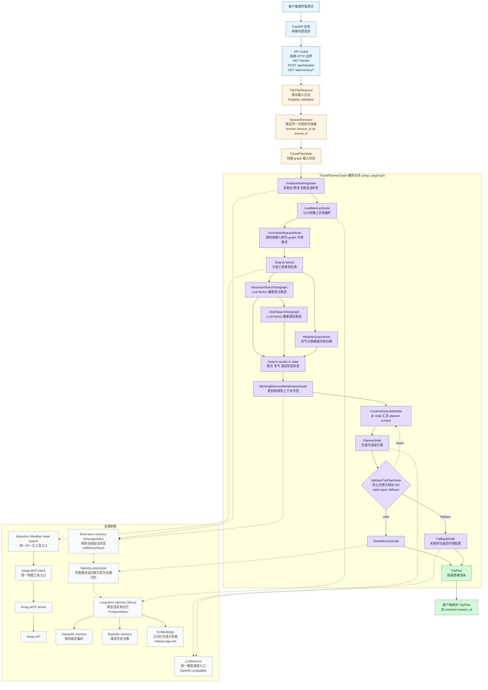
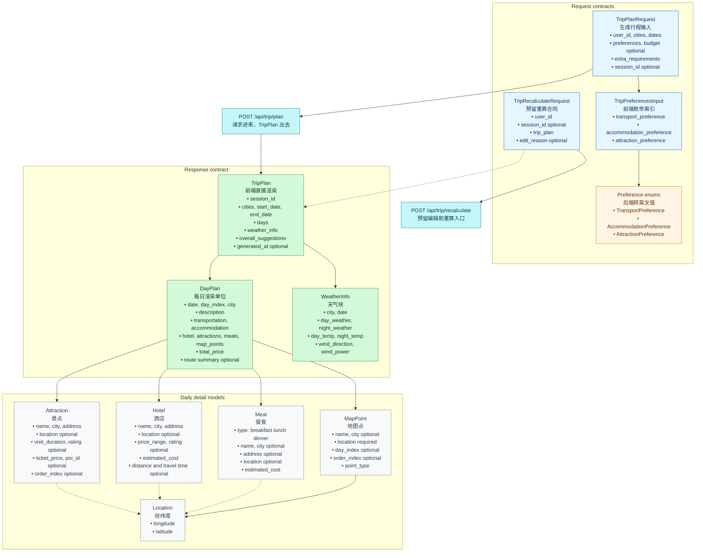
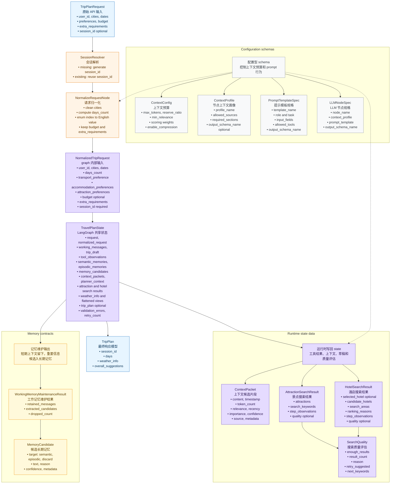

# Walk Through

这份文档是 ZoeyAgent 的教学导览。阅读顺序是自上而下：先看整体工作流，再看每个组件为什么存在，最后看 Pydantic 数据结构如何把这些组件连接成稳定系统。

## 总体架构

### 为什么这样设计

这个系统采用分层编排，而不是让一个大 prompt 直接完成全部旅行规划。原因是旅行计划需要同时处理 HTTP 合同、用户偏好、地图工具、天气、酒店、长期记忆、LLM 生成和结果校验。如果这些能力都混在一个节点里，系统很难测试，也很难判断错误来自哪里。

FastAPI 负责最外层的 HTTP 边界。它只处理请求、依赖注入、错误包装和响应返回，不直接承担旅行规划逻辑。这样 API 层保持薄而稳定，后续前端、终端测试或其他客户端都可以复用同一个 `POST /api/trip/plan` 合同。

LangGraph 负责把一次规划拆成可观察的节点。每个节点只做一类事情：初始化会话、加载长期记忆、归一化请求、搜索景点、搜索酒店、查询天气、组装上下文、调用 Planner、校验结果、保存记忆。节点之间通过 `TravelPlanState` 传递结构化状态，因此每一步都可以单独测试，也可以在失败时保留足够的上下文用于 repair 或 fallback。

Amap MCP 被放在工具层，是为了把外部 provider 的细节隔离起来。景点搜索、酒店搜索、天气和路线摘要都经过同一个 Amap service 归一化后再进入 graph。Planner 不直接看 raw Amap response，只看 `Attraction`、`Hotel`、`WeatherInfo`、`MapPoint` 这些项目内部模型。

Memory 被拆成 short-term 和 long-term 两类。Short-term memory 通过 LangGraph checkpointer 保存当前 session 的运行状态，服务同一次规划的连续性；Long-term memory 通过 PostgresStore + pgvector 保存跨 session 的稳定偏好和历史决策，服务下一次规划的召回。

Pydantic 是所有层之间的合同语言。前端请求、工具结果、graph state 片段、LLM structured output 和最终 `TripPlan` 都用 Pydantic 模型约束形状。这样 LLM 可以生成内容，但不能随意改变 API 合同；外部工具可以返回真实数据，但必须经过归一化和校验后才能影响最终行程。

### 一次请求如何被编排

一次请求先进入 FastAPI route。后端会解析或生成 `session_id`，把它作为 LangGraph 的 `thread_id`，然后创建初始 `TravelPlanState`。`InitializeWorkingState` 会记录当前请求，`LoadMemoryNode` 会按 `user_id` 召回长期记忆，`NormalizeRequestNode` 会把前端表单转成 graph 更容易消费的格式。

搜索阶段由 specialist subgraph 完成。景点和酒店搜索是 bounded ReAct 风格：LLM 只负责局部 plan/action 决策，真正的工具调用必须经过 Amap service，规则 evaluator 负责去重、排序、质量判断和 retry。天气查询不需要 LLM，因为它只依赖城市和 provider 返回值。

所有搜索结果写回 state 后，`ContextAssemblyNode` 会从用户请求、记忆、工具摘要、候选结果和 validation errors 中挑选最重要的信息，形成 `PlannerNode` 的 prompt context。`PlannerNode` 生成 `TripPlan` 草稿，`ValidateTripPlanNode` 再校验日期、day index、地图点、价格和节奏密度。如果校验失败，graph 会带着错误回到 context assembly 和 planner 做 repair；超过上限则进入 fallback，返回保守可控的行程。

只有最终 `TripPlan` 通过校验后，`SaveMemoryNode` 才会从本轮 working memory 和有效计划中抽取长期记忆候选。这样可以避免把失败计划、无效路线或工具噪声写进长期记忆。

## 组件职责速览

这一节按从高层到低层的顺序解释每个组件。重点不是背名字，而是理解它们为什么存在、解决什么问题，以及在这个项目里怎么协作。

### HTTP 边界

**FastAPI 应用** 是系统的入口层。FastAPI 的价值在于把 HTTP 请求、生命周期和依赖注入集中到一个清晰边界里。在这个项目中，它负责注册 `/health`、`/api/trip/plan` 和 memory 调试路由，并在 startup/shutdown 中准备 graph、Amap client、LLM client 和 memory store。它不直接写旅行规划逻辑，因为规划逻辑需要被 graph 测试、终端测试和未来其他入口复用。

**API routes** 是 HTTP 和 graph 之间的 adapter。它们把 `TripPlanRequest` 从请求体里读出来，解析或生成 `session_id`，调用 graph，然后把 `TripPlan` 返回给前端。这个边界的核心原则是薄：route 不搜索景点、不拼 prompt、不选酒店，只负责把外部请求变成内部 graph run。

**TripPlanRequest** 是前端提交的原始表单合同。它保留用户输入的城市、日期、偏好索引、预算、额外要求和可选 `session_id`。我们要求 `cities` 面向 Amap 查询时使用中文城市名，例如 `北京`，因为 Amap 的 POI 搜索对英文城市名召回不稳定。

**SessionResolver** 不是一个复杂服务，而是一条重要规则：如果前端没有传 `session_id`，后端生成新的 UUID；如果前端已经有 `session_id`，后续请求必须传回同一个值。这个值会成为 LangGraph 的 `thread_id`，让 checkpointer 能恢复同一 session 的状态。前端不会向用户展示完整 ID，只保存并自动带回；后端会在终端日志里打印 exact ID 方便调试。

### Graph 运行现场

**TravelPlanState** 是一次 graph run 的完整运行现场。LangGraph 的节点不会互相传一堆零散参数，而是读写同一个 state。这个 state 里有原始请求、归一化请求、工具结果、记忆召回、planner context、草稿计划、最终计划、校验错误和 retry 计数。它让每个节点都能只关心自己需要的字段。

**Working memory** 是当前 session 的短期上下文。它不是长期用户画像，而是为了让同一次规划连续起来，例如用户刚说“不要太赶”、刚才 Amap 搜索返回了多少候选、某次工具调用失败了什么。它由 `working_messages` 和 `tool_observations` 承载，并通过 checkpointer 跟随 `thread_id` 恢复。

**working_messages** 保存对后续规划有用的用户消息片段。它不保存完整聊天历史，避免 state 无限膨胀。比如“用户偏好轻松节奏”适合留下，“某次请求的完整 HTTP payload”通常不适合长期保留。

**tool_observations** 保存工具调用摘要，而不是 raw provider response。比如“Amap 搜索杭州历史文化返回 18 个 POI，保留 9 个”。这样 Planner 能理解工具发生了什么，但不会被冗长、脏、不稳定的外部 JSON 淹没。

**attraction_search_result** 是景点搜索的结构化结果。它包含候选景点、搜索关键词、质量评估和子图观察。酒店搜索会依赖它选择 anchor，Planner 会依赖它安排每日景点。它和 `tool_observations` 的区别是：前者是可消费的数据，后者是过程摘要。

**hotel_search_result** 是酒店搜索的结构化结果。它包含 selected hotel、候选酒店、搜索区域和排序理由。Amap POI 只能提供候选酒店，不能确认真实房态或实时价格，所以这里保存的是可用于规划的候选，不是 booking guarantee。

**weather_info** 保存归一化后的天气记录。天气节点不需要 LLM，因为它只是查询 provider 并转换成 `WeatherInfo`。如果 provider 只返回近期预报，而用户选择远期日期，系统不应该伪造天气，只能如实返回可用 provider 数据或在后续 UI 中解释不可用。

### 记忆系统

**Long-term memory** 解决跨 session 复用的问题。Working memory 只能服务当前会话，进程重启或 session 结束后不适合承担用户画像。长期记忆保存真正有复用价值的信息，例如用户偏好轻松节奏、上次拒绝离景点太远的酒店。

**Semantic memory** 保存稳定偏好或事实。它更像“用户画像片段”，例如“用户偏好历史文化景点”和“用户不喜欢太赶的行程”。Planner 在下一次请求中召回这些内容，可以更早地贴近用户偏好。

**Episodic memory** 保存具体历史事件或决策。它更像“过去发生过什么”，例如“用户上次选择了王府井附近酒店”或“用户上次删除了过远景点”。这类记忆帮助系统避免重复犯同类错误。

**MemoryExtractionService** 负责把 working memory overflow 和最终有效 `TripPlan` 里有价值的内容抽成 `MemoryCandidate`。它会分类为 semantic、episodic 或 discard。这样系统不会把所有临时工具噪声都写入长期记忆，而是先经过候选筛选。

**LongTermMemoryStore** 是长期记忆的持久化边界。项目用 LangGraph `PostgresStore`、Postgres 和 pgvector 保存 memory text 与向量。读取时按 `user_id` 和 query 做语义召回，写入时只保存通过分类和过滤的候选。

**EmbeddingService** 负责把文本转成向量。当前本地路径使用 Ollama `bge-m3:567m`，输出 1024 维 embedding。pgvector 不是替代 Postgres，而是在传统 SQL 表里增加 vector column，让系统可以按语义相似度搜索 memory。

### 上下文和模型调用

**ContextAssembler** 解决“给 LLM 看什么”的问题。Graph state 里有很多信息，但 prompt 不能无限长，也不能把无关内容都塞给 Planner。ContextAssembler 会按 profile、来源、重要性和 token budget 选择内容，组装成 planner context。

**ContextAssemblyNode** 是主规划链路里的 adapter。它位于搜索结果之后、Planner 之前，只负责把 state 里的信息整理成 Planner 能消费的上下文。它不查外部工具，也不生成 `TripPlan`。

**SpecialistContextBuilder** 是 ReAct 子图自己的 local context builder。景点搜索和酒店搜索不应该读取完整 planner context，因为它们只需要局部目标、候选、observation 和 retry 信息。这个设计避免局部搜索被全局 prompt 污染，也让子图更容易测试。

**LLMService** 封装 OpenAI-compatible 模型调用。Graph 节点不直接散落调用 SDK，而是统一通过这个服务做普通 chat completion、function/tool calling 和 structured output 解析。这样后续切换 Gemini、OpenAI-compatible endpoint 或 mock client 时，不需要改每个节点。

**LLMNodeSpec** 描述一个 LLM 节点应该使用哪个 context profile、prompt template 和 output schema。它的作用是把 prompt 调用配置化，避免 prompt 名称、输出模型和上下文策略散落在业务代码里。

### 外部工具

**Amap MCP client** 是后端访问地图工具的统一入口。项目不让每个子图各自启动 MCP server，也不让 Planner 直接调用 provider。这样可以统一处理连接生命周期、错误包装、响应归一化和测试替换。

**Amap MCP server** 连接真实高德 API，提供 POI 搜索、POI detail、地理编码、天气和路线摘要能力。MCP 的价值是把外部工具以统一协议暴露出来；项目内部再用 Amap service 把 raw response 转成 Pydantic domain models。

### 规划节点

**AttractionSearchSubgraph** 是 bounded ReAct 风格的景点搜索专家。LLM 负责局部 plan/action 决策，Amap service 负责真实搜索，规则 evaluator 负责质量判断、去重、排序和 retry。它只输出景点候选，不生成最终行程。

**WeatherQueryNode** 是确定性工具节点。天气查询不需要 ReAct，因为 action 空间很小：按城市调用 weather tool，归一化为 `WeatherInfo`，失败时记录 observation 并继续规划。

**HotelSearchSubgraph** 是 bounded ReAct 风格的酒店搜索专家。它基于景点 anchor、预算、交通方式和住宿偏好搜索候选酒店，并过滤非住宿 POI。它不确认真实房态，缺失价格时只能提供估算成本。

**PlannerNode** 是主 LLM 规划节点。它读取 planner context，生成可渲染的 `TripPlan` 草稿。Planner 可以安排每日景点、酒店、地图点、价格和路线摘要，但不应该输出 raw tool response 或完整 turn-by-turn 路线。

**ValidateTripPlanNode** 是防线。LLM 可以生成内容，但必须通过日期数量、day index、map points、价格、session_id 和节奏密度等业务校验。失败时 graph 会把 validation errors 带回 Planner repair，而不是直接把坏计划给前端。

**SaveMemoryNode** 只在 `TripPlan` 校验成功后运行。它从有效结果和 working memory 中抽取长期记忆候选，再在长期记忆开启时写入 store。这样可以避免把失败计划和无效偏好写进长期记忆。

**FallbackNode** 是最后的可控出口。当 Planner 多次 repair 失败时，它会根据已有 state 里的景点、酒店、天气候选拼一个保守结果，避免 graph 无限重试或 API 直接崩溃。

**TripPlan** 是前端最终消费的响应模型。它包含 resolved `session_id`、每日行程、天气、酒店、地图点、价格和整体建议。前端直接渲染这个模型，不需要再包一层 response wrapper。

### 容易混淆的关系

- `TravelPlanState` 是完整运行现场，Working memory 是其中负责当前会话连续性的部分。
- `attraction_search_result` 和 `tool_observations` 来自同一批工具调用，但前者是结构化候选数据，后者是过程摘要。
- ReAct 子图有自己的 local scratchpad，例如局部计划、动作、观察、候选和 retry 计数；主 `TravelPlanState` 只接收压缩后的结果和摘要 observation。
- ReAct 子图不共享主 `ContextAssemblyNode`；它们通过 local context builder 构造自己的 LLM messages，避免把完整 planner context 带进局部搜索。
- Working memory 可以被提升为 Semantic/Episodic memory，但只有长期有价值的内容才会被保存。

## Pydantic 数据结构

公共 API 和前端渲染合同：

Graph 和 memory 内部合同：

### API 和前端渲染合同如何支撑架构

第一个 Pydantic 图展示的是公共 API 与前端渲染合同。`TripPlanRequest` 是系统入口，保证前端传入的城市、日期、偏好索引和预算是后端可理解的格式。`TripPlan` 是系统出口，保证前端拿到的数据可以直接渲染成概览、每日行程、酒店、天气、地图点和预算。

这里的关键设计是 day-centric。前端不需要自己推断某个景点属于哪一天，也不需要从散乱列表里拼地图点；`DayPlan` 已经把当天的景点、酒店、餐食、map points、价格和路线摘要放在一起。这样前端只要按 `days` 渲染即可，后端则负责把复杂规划结果整理成稳定 UI 合同。

`Location` 和 `MapPoint` 是地图可视化的核心。Amap provider 可能在不同工具里返回不同形状的坐标，后端统一归一成 `Location`，再从有坐标的景点、酒店和餐食生成 `MapPoint`。这让前端地图不必知道 provider 细节，只需要读取经纬度。

`WeatherInfo`、`Attraction`、`Hotel` 和 `Meal` 是领域模型。它们把外部工具、LLM 输出和前端展示连接起来。比如酒店搜索拿到的是 Amap POI，但 Planner 和前端看到的是 `Hotel`；天气工具返回 provider forecast，但最终进入 `TripPlan.weather_info` 的是 `WeatherInfo`。

### Graph 和 memory 内部合同如何支撑架构

第二个 Pydantic 图展示的是 graph 内部合同。`TripPlanRequest` 不直接等于 graph 内部输入，因为 graph 需要更适合节点消费的字段，例如 `days_count`、英文枚举值、resolved `session_id` 和归一化偏好。因此 `NormalizeRequestNode` 会把原始请求转成 `NormalizedTripRequest`。

`TravelPlanState` 是这些内部模型的容器。它让 LangGraph 节点可以按字段读写，而不是传递松散 dict。景点子图写入 `AttractionSearchResult`，酒店子图写入 `HotelSearchResult`，上下文组装写入 `ContextPacket` 和 `planner_context`，最终 Planner 写入 `TripPlan`。

`SearchQuality` 是 specialist 子图的控制信号。ReAct 子图不只是“搜索一次就结束”，它需要判断候选够不够、坐标是否完整、是否需要 retry、下一轮关键词是什么。把这些判断结构化后，测试可以直接断言质量逻辑，而不是只能观察最终文本。

`MemoryCandidate` 和 `WorkingMemoryMaintenanceResult` 是记忆系统的内部合同。Working memory overflow 或最终有效计划都会产生候选记忆，但并不是所有内容都值得长期保存。候选先被分类为 semantic、episodic 或 discard，再由长期记忆 store 决定是否写入。

`ContextProfile`、`PromptTemplateSpec` 和 `LLMNodeSpec` 是 prompt 基础设施的配置合同。它们让系统可以明确某个 LLM 节点使用什么上下文、什么模板、期望什么输出模型。这样 prompt engineering 不只是散落字符串，而是可测试、可替换的工程接口。

## 详细设计文档

- [Backend Design](doc/backend_design.md)
- [Agents Design](doc/agents_design.md)
- [Schemas Design](doc/schemas_design.md)
- [Memory Design](doc/memory_design.md)
- [Tools Design](doc/tools_design.md)
- [Example Workflow](doc/example_workflow.md)
